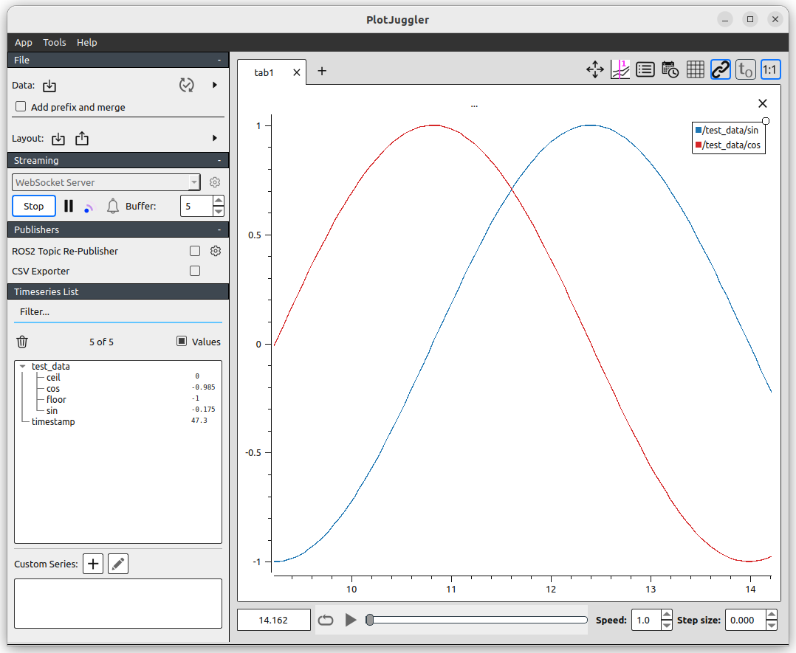
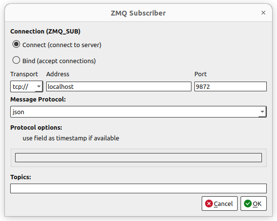
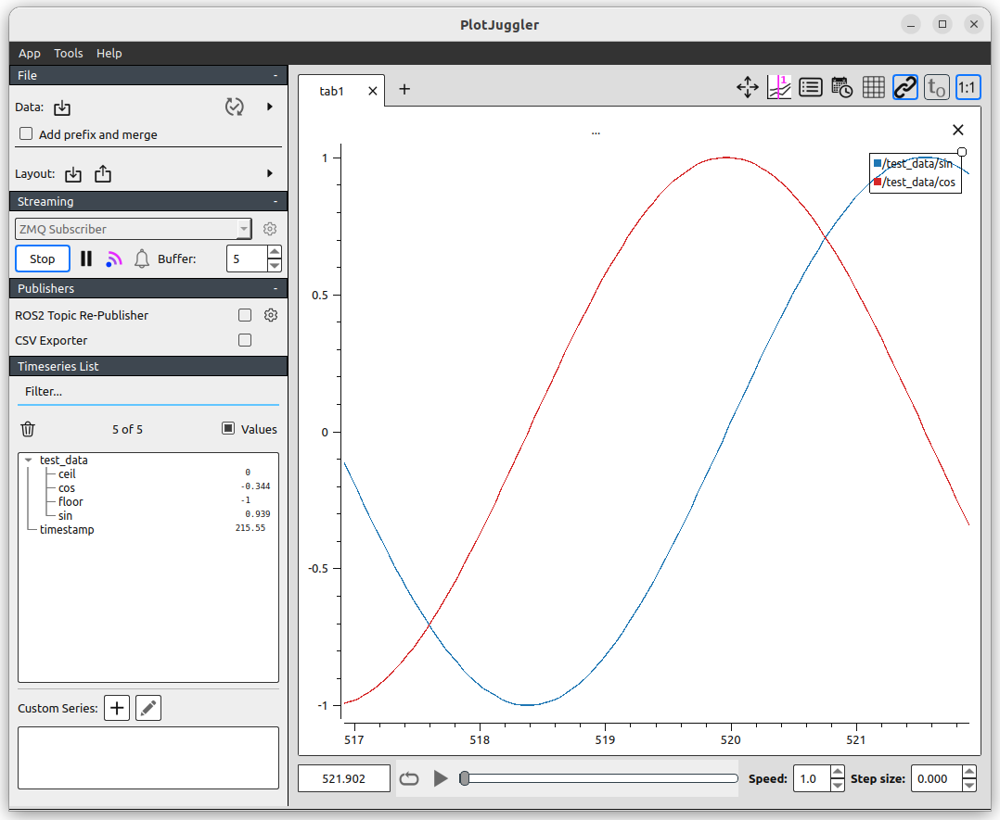
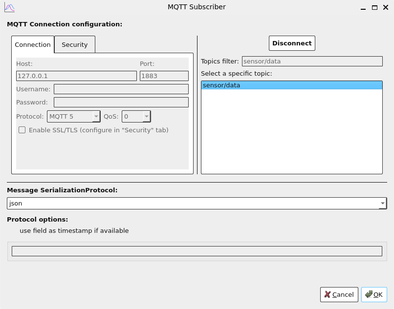
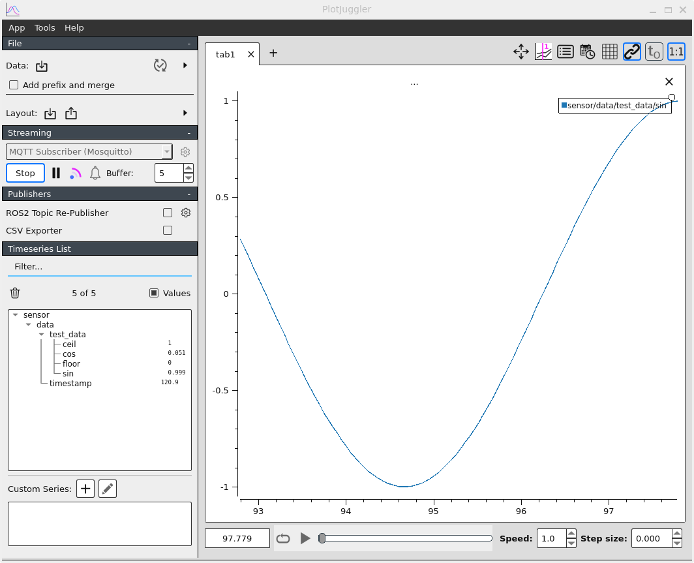

---
tags:
    - ros
    - plot
    - plotjugller
---

# PlotJuggler
[PlotJuggler github](https://github.com/PlotJuggler)

## Install
### ROS Package

```bash
# The install method from snap include ROS2, zmq, websocket and MQTT
sudo snap install plotjuggler
#
#sudo apt install ros-humble-plotjuggler-ros
```


---

## Plugins 
### Websocket

<details>
    <summary>code</summary>

```bash
pip install websocket-client
```

```python
--8<-- "docs/ROS/ros_eco/rviz_rqt/plotjuggler/code/websocket_demo.py"
```
</details>


#### Usage
Config plotjuggle to websocket listener that get json data
  


---

### ZMQ

<details>
    <summary>code</summary>

```bash
pip install websocket-client
```

```python
--8<-- "docs/ROS/ros_eco/rviz_rqt/plotjuggler/code/zmq_demo.py"
```
</details>

#### usage





---

### MQTT

#### Prerequisites

Install mqtt broker on ubuntu machine

```bash
sudo apt install mosquitto mosquitto-clients
```

```bash
sudo systemctl status mosquitto
```
##### Test mqtt broker
- Without authentication

```bash title="terminal 1, subscriber"
mosquitto_sub -t "hello/topic"
```

```bash title="terminal 2, publisher"
mosquitto_pub -t 'hello/topic' -m 'hello MQTT'
```

#### Install

```bash
sudo snap install plotjuggler
```

#### Python code

<details>
    <summary>Python code</summary>

```bash
pip install paho-mqtt numpy
```

```python
--8<-- "docs/ROS/ros_eco/rviz_rqt/plotjuggler/code/mqtt_demo.py"
```
</details>

### usage





