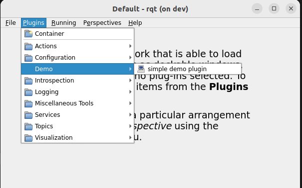

---
tags:
  - ros
  - rqt
  - custom
  - plugin
---

# RQT Custom plugin

Create Simple RQT python plugin

## Prerequisite

```bash
sudo apt install ros-humble-rqt 
sudo apt install ros-humble-qt-gui 
```

## Code

- Create ros2 ament_cmake package

```
├── CMakeLists.txt
├── demo_control
│   ├── __init__.py
│   ├── rqt_demo.py
│   └── rqt_plugin.py
├── package.xml
├── plugin.xml
└── resource
   └── Demo.ui

```

```xml title="CMakeLists.txt" linenums="1" hl_lines="7"
<exec_depend>rqt_gui</exec_depend>
<exec_depend>rqt_gui_py</exec_depend>
<exec_depend>python3-pyqt5</exec_depend>

<export>
<build_type>ament_cmake</build_type>

<rqt_gui plugin="${prefix}/plugin.xml"/> <!--(1)--> 
</export>

```

1.  Register plugin


```xml title="plugin.xml"
<library path="src">
<class name="demo" type="demo_control.rqt_plugin.DemoPlugin" base_class_type="rqt_gui_py::Plugin">
    <description>
        Demo rqt plugin
    </description>
    <qtgui>
        <group>
            <label>Demo</label>
        </group>
        <label>simple demo plugin</label>
        <icon type="theme">system-help</icon>
        <statustip>Simple demo plugin.</statustip>
    </qtgui>
</class>
</library>
```

### CMakeLists
- Copy `plugin.xml` and `resource` folder into project shared

```CMakeLists
cmake_minimum_required(VERSION 3.8)
project(g_stream_control)

if(CMAKE_COMPILER_IS_GNUCXX OR CMAKE_CXX_COMPILER_ID MATCHES "Clang")
  add_compile_options(-Wall -Wextra -Wpedantic)
endif()

# find dependencies
find_package(ament_cmake REQUIRED)
find_package(ament_cmake_python REQUIRED)

ament_python_install_package(${PROJECT_NAME})

set(PLUGIN
  g_stream_control/rqt_plugin.py
)


install(PROGRAMS
    ${PLUGIN}
DESTINATION lib/${PROJECT_NAME}
)

install(FILES
    plugin.xml
  DESTINATION share/${PROJECT_NAME}
)

install(DIRECTORY
  resource
DESTINATION share/${PROJECT_NAME}
)

ament_package()

```

---

#### Plugin
- Load widget
- Init ros


```python
#!/usr/bin/env python3


import rclpy
from rclpy.node import Node
from qt_gui.plugin import Plugin
from std_srvs.srv import SetBool, Trigger
from g_stream_interface.srv import Preset
from .rqt_demo import DemoWidget
from rcl_interfaces.srv import SetParameters
from rcl_interfaces.msg import Parameter, ParameterValue
from functools import partial

class DemoPlugin(Plugin):
    def __init__(self, context):
        super(DemoPlugin, self).__init__(context)

        # load ui
        self._widget = DemoWidget()
        self.setObjectName('RQTDemo')

        # init ros node
        self.node = context.node if context.node else rclpy.create_node("my_rqt_plugin")
```

#### Widget
- Load `ui` file
  
```python title="rqt_demo.py"
import os
from ament_index_python import get_resource
from python_qt_binding import loadUi
from python_qt_binding.QtWidgets import QWidget


class DemoWidget(QWidget):
    def __init__(self):
        super(DemoWidget, self).__init__()

        _, package_path = get_resource('packages', 'demo_control')
        ui_file = os.path.join(package_path, 'share', 'demo_control', 'resource', 'Demo.ui')
        loadUi(ui_file, self)

```

---

#### ui

```xml title="Demo.ui"
<?xml version="1.0" encoding="UTF-8"?>
<ui version="4.0">
 <class>TopicWidget</class>
 <widget class="QWidget" name="TopicWidget">
  <property name="geometry">
   <rect>
    <x>0</x>
    <y>0</y>
    <width>731</width>
    <height>412</height>
   </rect>
  </property>
  <property name="windowTitle">
   <string>Demo plugin</string>
  </property>
  <widget class="QWidget" name="verticalLayoutWidget">
   <property name="geometry">
    <rect>
     <x>170</x>
     <y>60</y>
     <width>160</width>
     <height>251</height>
    </rect>
   </property>
   <layout class="QVBoxLayout" name="verticalLayout">
    
    <item>
     <widget class="QPushButton" name="pushButton">
      <property name="text">
       <string>Demo</string>
      </property>
     </widget>
    </item>
   </layout>
  </widget>
 </widget>
 <resources/>
 <connections/>
</ui>

```

---
### Usage

```bash
# -v verbose
# --force-discover force a rediscover of plugins
rqt --force-discover -v
```

