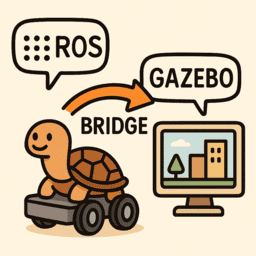
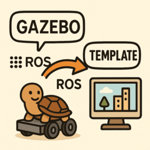

---
tags:
    - ros
    - gazebo
    - harmonic
    - bridge
    - jazzy
---

# ROS2 Gazebo harmonic integration

     

            <a href="jazzy_bridge">
            
            
Bridge
</a>
        

    

       <a href="jazzy_interface">
            
            
Interface
</a>
    

    

        <a href="project_template">
            
            
Project
</a>
    

   
   

