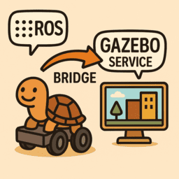

---
tags:
    - ros
    - gazebo
    - harmonic
    - bridge
    - jazzy
---

# ROS2 Gazebo harmonic integration

<div class="grid-container">
     <div class="grid-item">
            <a href="jazzy_bridge">
            
            <p>Bridge</p></a>
        </div>
    <div class="grid-item">
       <a href="jazzy_interface">
            
            <p>Interface</p></a>
    </div>
    <div class="grid-item">
        <a href="project_template">
            
            <p>Project</p></a>
    </div>
   
   </div>


## Bridge clock from gazebo

```bash title="/clock topic"
ros2 run ros_gz_bridge parameter_bridge /clock@rosgraph_msgs/msg/Clock[gz.msgs.Clock
```

