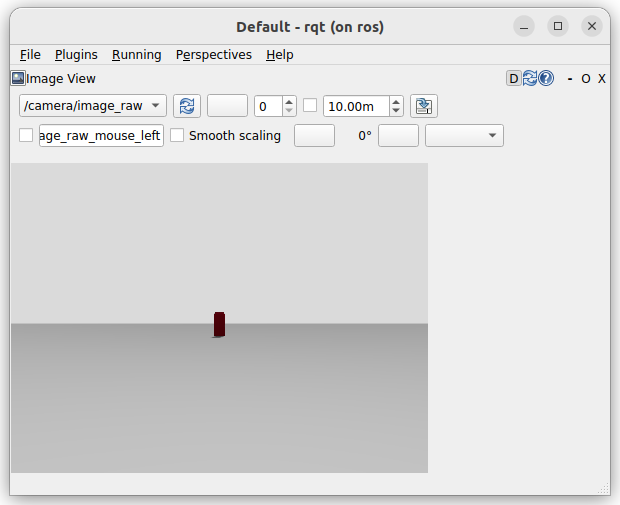

# Camera
Bridge rgb camera between gazebo to ros

!!! Tip
    [Check resource for detail gazebo ros bridge](https://github.com/gazebosim/ros_gz/blob/ros2/ros_gz_bridge/README.md)


<div class="grid-container">
     <div class="grid-item">
            <a href="#bridge">
            <p>bridge</p></a>
        </div>
    <div class="grid-item">
       <a href="#image-transport">
            <p>image transport</p></a>
    </div>
    <div class="grid-item">
        <a href="project_template">
            <p>coordinate system</p></a>
    </div>
   
   </div>

## Gazebo
[sdf specification](https://sdformat.org/spec/1.9/sensor#sensor_camera)

!!! tip "Add sensor plugin to world"
    ```xml title="add sensor plugin to world"
    <plugin
      filename="gz-sim-sensors-system"
      name="gz::sim::systems::Sensors">
      <render_engine>ogre2</render_engine>
    </plugin>
    ```
     

```xml title="RGB Camera"
  <gazebo reference="camera_link">
    <sensor name="camera" type="camera">
      <camera>
        <horizontal_fov>1.3962634</horizontal_fov>
        <image>
          <width>640</width>
          <height>480</height>
          <format>R8G8B8</format>
        </image>
        <clip>
          <near>0.1</near>
          <far>15</far>
        </clip>
        <noise>
          <type>gaussian</type>
          <!-- Noise is sampled independently per pixel on each frame.
               That pixel's noise value is added to each of its color
               channels, which at that point lie in the range [0,1]. -->
          <mean>0.0</mean>
          <stddev>0.007</stddev>
        </noise>
        <optical_frame_id>camera_link_optical</optical_frame_id>
        <camera_info_topic>camera/camera_info</camera_info_topic>
      </camera>
      <always_on>1</always_on>
      <update_rate>20</update_rate>
      <visualize>true</visualize>
      <topic>camera/image</topic>
    </sensor>
  </gazebo>
```

---

## ROS2
[check ros gz sim demo](https://github.com/gazebosim/ros_gz/tree/jazzy/ros_gz_sim_demos#camera)

### Bridge

- image_raw
- image_info

```yaml title="gz_bridge.yaml"
- ros_topic_name: "/camera/image_raw"
  gz_topic_name: "/camera/image_raw"
  ros_type_name: "sensor_msgs/msg/Image"
  gz_type_name: "gz.msgs.Image"
  direction: GZ_TO_ROS
# camera info
- ros_topic_name: "/camera/image_info"
  gz_topic_name: "/camera/image_info"
  ros_type_name: "sensor_msgs/msg/CameraInfo"
  gz_type_name: "gz.msgs.CameraInfo"
  direction: GZ_TO_ROS
 

```

## Image Transport
automatically compress the video stream in the background

```yaml title=launch
launch:
  - arg:
      name: use_sim_time
      default: "true"
      description: Use simulation (Gazebo) clock if true
  - node:
      pkg: "ros_gz_image"
      exec: "image_bridge"
      output: screen
      args:
          "/camera/image"
      param:
          - name: use_sim_time
            value : true
          - name: camera.image.compressed.jpeg_quality          
            value: 75
  # using topic_tools relay to republish camera_info topic
  - node:
      pkg: "topic_tools"
      exec: "relay"
      output: screen
      args:
          "'camera/camera_info' 'camera/image/camera_info'"
      param:
          - name: use_sim_time
            value : $(var use_sim_time)
      
```

TODO: configure and more


---

## Coordinate system

- camera link
- camera optical link
- 
```xml
  <joint type="fixed" name="camera_joint">
    <origin xyz="0.225 0 0.075" rpy="0 0 0"/>
    <child link="camera_link"/>
    <parent link="base_link"/>
    <axis xyz="0 1 0" />
  </joint>

  <link name='camera_link'>
    <pose>0 0 0 0 0 0</pose>
    <inertial>
      <mass value="0.1"/>
      <origin xyz="0 0 0" rpy="0 0 0"/>
      <inertia
          ixx="1e-6" ixy="0" ixz="0"
          iyy="1e-6" iyz="0"
          izz="1e-6"
      />
    </inertial>

    <collision name='collision'>
      <origin xyz="0 0 0" rpy="0 0 0"/> 
      <geometry>
        <box size=".03 .03 .03"/>
      </geometry>
    </collision>

    <visual name='camera_link_visual'>
      <origin xyz="0 0 0" rpy="0 0 0"/>
      <geometry>
        <box size=".03 .03 .03"/>
      </geometry>
    </visual>

  </link>

  <gazebo reference="camera_link">
    <material>Gazebo/Red</material>
  </gazebo>

  <joint type="fixed" name="camera_optical_joint">
    <origin xyz="0 0 0" rpy="-1.5707 0 -1.5707"/>
    <child link="camera_link_optical"/>
    <parent link="camera_link"/>
  </joint>

  <link name="camera_link_optical">
  </link>
```
---
## ros_gz_image

use [image_transport](http://wiki.ros.org/image_transport)

```bash title="image transport bridge "
sudo apt install ros-jazzy-ros-gz-image
```

```bash title=""
ros2 run ros_gz_image image_bridge /camera/image_raw
```

---

### rqt

```bash
ros2 run rqt_image_view rqt_image_view /camera/image_raw
```


