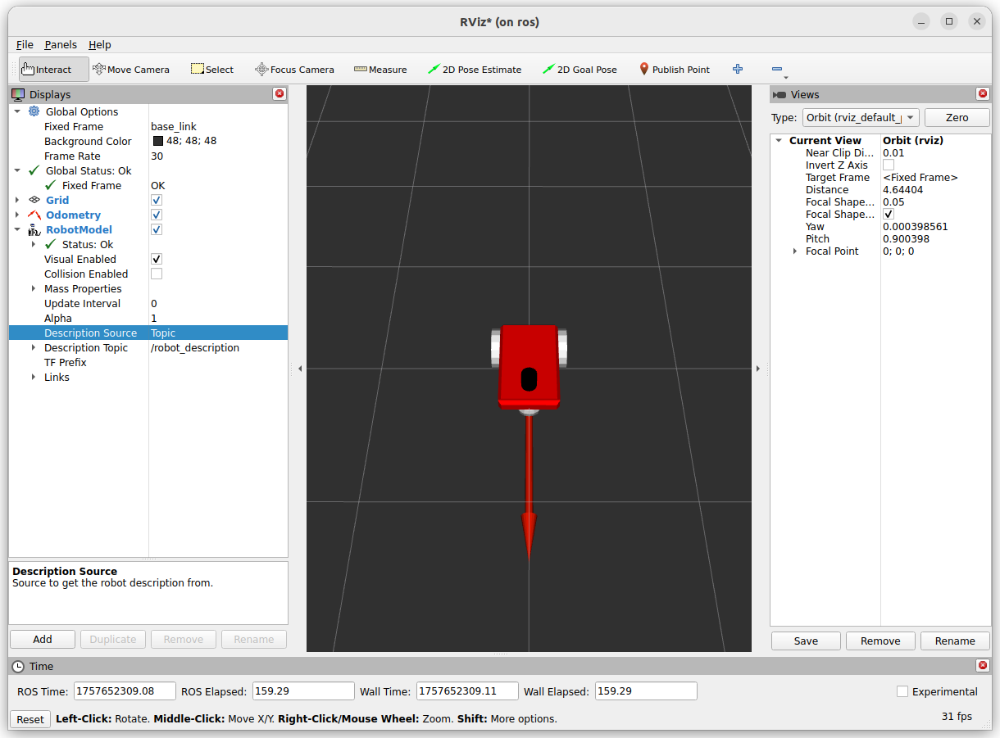
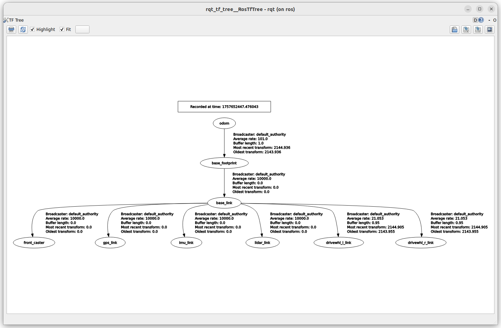
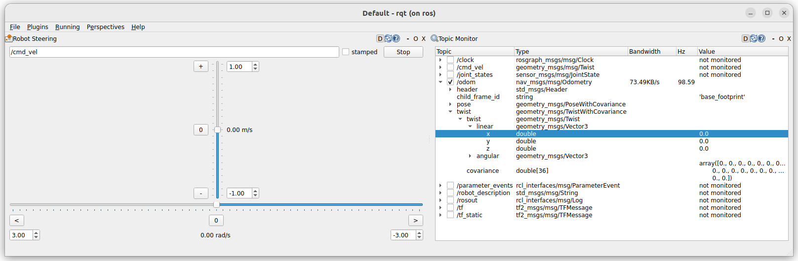

---
tags:
    - ros
    - gazebo
    - bridge
    - jazzy
    - harmonic
    - diff drive
---

# DiffDrive
Differential drive controller which can be attached to a model with any number of left and right wheels. [more](https://gazebosim.org/api/sim/8/classgz_1_1sim_1_1systems_1_1DiffDrive.html#details)

## Gazebo

```xml title="gazebo diff drive plugin"
<plugin
    filename="gz-sim-diff-drive-system"
    name="gz::sim::systems::DiffDrive">
    <left_joint>left_wheel_joint</left_joint>
    <right_joint>right_wheel_joint</right_joint>
    <wheel_separation>1.2</wheel_separation>
    <wheel_radius>0.4</wheel_radius>
    <odom_publish_frequency>1</odom_publish_frequency>
    <topic>cmd_vel</topic>
    <odom_topic>odom</odom_topic>
    <frame_id>odom</frame_id>
    <child_frame_id>base_footprint</child_frame_id>
</plugin>
```

- **tf_topic**: Custom topic on which this system will publish the transform from frame_id to child_frame_id. This element is optional, and the **default value is /model/{name_of_model}/tf**.
- **frame_id**: Custom frame_id field that this system will use as the origin of the odometry transform in both the <tf_topic> gz.msgs.Pose_V message and the <odom_topic> gz.msgs.Odometry message. This element if optional, and the **default value is {name_of_model}/odom**.
**child_frame_id**: Custom child_frame_id that this system will use as the target of the odometry trasnform in both the <tf_topic> gz.msgs.Pose_V message and the <odom_topic> gz.msgs.Odometry message. This element if optional, and the **default value is {name_of_model}/{name_of_link}**.


!!! warning "child_frame_id"
    According to REP-105 (coordinate frames for mobile platforms):

    - **header.frame_id** = "odom" (or "map" if you have localization).
    - **child_frame_id** = "base_link" (or base_footprint depending on your URDF).


    **Rule of Thumb**
    - header.frame_id = where the robot is **located** (world reference).
    - child_frame_id = what part of the robot is **moving** (usually base_link).
### Twist from gazebo cli

```bash
gz topic -t "/cmd_vel" -m gz.msgs.Twist -p "linear: {x: 0.5}, angular: {z: 0.05}"
```

---

## ROS

### bridge file

!!! tip "diff-drive tf topic name"
    the default tf topic name is : /model/{name_of_model}/tf
    we control the tf name using `tf_topic` tag
    **check the bride yaml tf part for correct mapping**
     

```yaml title="bridge.yaml"
#sync sim and ros
- ros_topic_name: "/clock"
  gz_topic_name: "/clock"
  ros_type_name: "rosgraph_msgs/msg/Clock"
  gz_type_name: "gz.msgs.Clock"
  direction: GZ_TO_ROS

# gz topic published by DiffDrive plugin
- ros_topic_name: "odom"
  gz_topic_name: "odom"
  ros_type_name: "nav_msgs/msg/Odometry"
  gz_type_name: "gz.msgs.Odometry"
  direction: GZ_TO_ROS

# gz topic published by DiffDrive plugin
- ros_topic_name: "tf"
  gz_topic_name: "tf"
  ros_type_name: "tf2_msgs/msg/TFMessage"
  gz_type_name: "gz.msgs.Pose_V"
  direction: GZ_TO_ROS

# gz topic subscribed to by DiffDrive plugin
- ros_topic_name: "cmd_vel"
  gz_topic_name: "cmd_vel"
  ros_type_name: "geometry_msgs/msg/Twist"
  gz_type_name: "gz.msgs.Twist"
  direction: ROS_TO_GZ
```

### Twist From ROS

```bash
ros2 topic pub /cmd_vel geometry_msgs/msg/Twist \
"{linear: {x: 2.0, y: 0.0, z: 0.0}, angular: {x: 0.0, y: 0.0, z: 0.0}}"
```

### Rviz



- The base of the red arrow mark the robot position
- The arrow direction display the robot heading

### TF tree
The tf tree include tf from `joint_states`

```yaml title="bridge mapping"
#joint state
- ros_topic_name: "joint_states"
  gz_topic_name: "joint_states"
  ros_type_name: "sensor_msgs/msg/JointState"
  gz_type_name: "gz.msgs.Model"
  direction: GZ_TO_ROS
```



---

### Usgae
Rqt has nice plugin `robot steering` to send Twist message

```bash
sudo apt install ros-jazzy-rqt-robot-steering
```




The **nav_msgs/Odometry** message contains two main fields:

- **pose**: robot position + orientation in some reference frame (usually odom)
- **twist**: robot linear & angular velocities in body reference frame

The important detail is that the twist is expressed in the robot’s local frame (the FRD/FLU convention,

!!! tip "Twist"
    The twist message expressed in the robot's local frame (FRD/FLU)
    REP-103 defines the reference frame for **mobile base** (differential drive) as FLU (Forward, Left, Up): 

    - x-axis: point forward
    - y-axis: point left
    - z-axis: point up
     