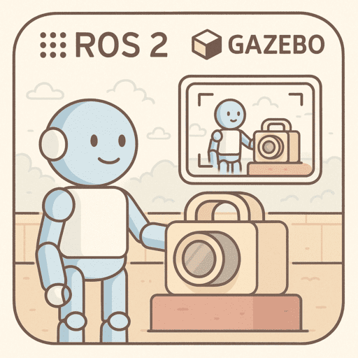
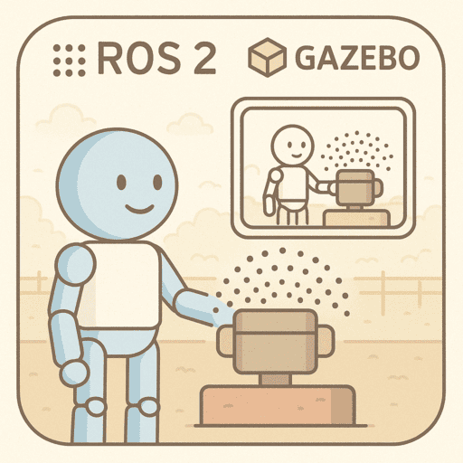

# Gazebo bridge

<div class="grid-container">
    <div class="grid-item">
        <a href="camera">
            
            <p>Camera</p>
        </a>
    </div>
    <div class="grid-item">
        <a href="clock">
            
            <p>clock</p>
        </a>
    </div>
    <div class="grid-item">
    <a href="imu">
        
            <p>imu</p>
            </a>
    </div>

</div>

<details>
    <summary>more</summary>

<div class="grid-container">
    <div class="grid-item">
        <a href="lidar">
            
            <p>lidar</p>
        </a>
    </div>
    <div class="grid-item">
        <a href="diff-drive">
            <p>Diff drive</p>
        </a>
    </div>
    <div class="grid-item">
        <a href="joint_state">
            <p>joint state</p>
        </a>
    </div>
    <div class="grid-item">
        <a href="odometry">
            <p>Odometry</p>
        </a>
    </div>

</div>
</details>


The bridge allows you to connect ROS 2 topics with Gazebo Harmonic topics so you can:

- Control simulation objects from ROS 2 (e.g., publish velocity commands).
- Get data from simulation (e.g., sensor readings, /clock).
- Sync **time** between ROS 2 and Gazebo.

!!! tip parameter_bridge
    ```
    parameter_bridge <topic@ROS2_type@gz_type>
    ```

!!! tip sign between ros2 type to gz type
    - **@** : a bidirectional bridge, 
    - **[** : a bridge from Gazebo to ROS,
    - **]** : a bridge from ROS to Gazebo.


### bridge yaml config
[github config yaml and message type mapping table](https://github.com/gazebosim/ros_gz/tree/jazzy/ros_gz_bridge#example-5-configuring-the-bridge-via-yaml){:target="_blank"}


```bash
ros2 run ros_gz_bridge parameter_bridge --ros-args -p config_file:=$WORKSPACE/test/config/full.yaml
```

## Clock

- Gazebo publishes a simulation clock internally.
- To share it with ROS, you need a bridge between Gazebo’s `gz.msgs.Clock` and ROS 2’s `rosgraph_msgs/msg/Clock`.
  

```yaml
- ros_topic_name: "/clock"
  gz_topic_name: "/clock"
  ros_type_name: "rosgraph_msgs/msg/Clock"
  gz_type_name: "gz.msgs.Clock"
  direction: GZ_TO_ROS
```


---

## Demo
Simulate using bridge, send message from side to side
(no need to run gz sim for this check)

send string message from gz to ros and from ros to gz using cli

- Run bridge
- Pub from GZ echo in ROS
- Pub from ROS echo in GZ


```bash title="Terminal1: bridge"
ros2 run ros_gz_bridge parameter_bridge /chatter@std_msgs/msg/String@gz.msgs.StringMsg
#
[INFO] [1734974012.615668960] [ros_gz_bridge]: Creating GZ->ROS Bridge: [/chatter (gz.msgs.StringMsg) -> /chatter (std_msgs/msg/String)] (Lazy 0)
[INFO] [1734974012.616345817] [ros_gz_bridge]: Creating ROS->GZ Bridge: [/chatter (std_msgs/msg/String) -> /chatter (gz.msgs.StringMsg)] (Lazy 0)
```

#### pub data from gz to ros
```bash title="Terminal2: ros subscribe"
ros2 topic echo /chatter
```

```bash title="Terminal3: gz pub"
gz topic -t /chatter -m gz.msgs.StringMsg -p 'data:"Hello"'
```

#### pub data from ros to gz

```bash title="Terminal2: ros pub"
ros2 topic pub /chatter std_msgs/msg/String "data: 'Hi'"
```

```bash title="Terminal3: gz sub"
gz topic -e -t /chatter
```

---

### Resources
- [ROS gazebo message type mapping](https://github.com/gazebosim/ros_gz/tree/ros2/ros_gz_bridge)
- [ROS + Gazebo Sim demos](https://github.com/gazebosim/ros_gz/tree/jazzy/ros_gz_sim_demos)
