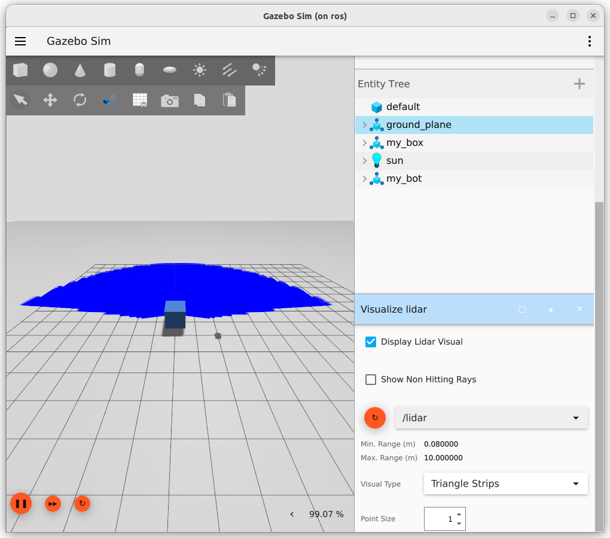

{{ page_folder_links() }}

Bridge lidar system between gazebo to ros
lidar sensor send two topics

- /lidar (sensor_msgs/msg/LaserScan) use for 2D lidar
- /lidar/points (sensor_msgs/msg/PointCloud2) use for 3D lidar

## Gazebo

!!! tip "Add sensor plugin to world"
    ```xml title="add sensor plugin to world"
    <plugin
      filename="gz-sim-sensors-system"
      name="gz::sim::systems::Sensors">
      <render_engine>ogre2</render_engine>
    </plugin>
    ```


```xml title="sensor"
<sensor name='gpu_lidar' type='gpu_lidar'>
    <topic>lidar</topic>
    <update_rate>10</update_rate>
    <lidar>
    <scan>
        <horizontal>
        <samples>640</samples>
        <resolution>1</resolution>
        <min_angle>-1.396263</min_angle>
        <max_angle>1.396263</max_angle>
        </horizontal>
        <vertical>
        <samples>16</samples>
        <resolution>1</resolution>
        <min_angle>-0.261799</min_angle>
        <max_angle>0.261799</max_angle>
        </vertical>
    </scan>
    <range>
        <min>0.08</min>
        <max>10.0</max>
        <resolution>0.01</resolution>
    </range>
    </lidar>
    <alwaysOn>1</alwaysOn>
    <visualize>true</visualize>
</sensor>
```

```bash title="gz"
gz topic --echo -t /lidar
```



---

## ROS

### cli

```bash
ros2 run ros_gz_bridge parameter_bridge /lidar@sensor_msgs/msg/LaserScan[gz.msgs.LaserScan
#

```

### bridge file

```yaml
- ros_topic_name: "/lidar"
  gz_topic_name: "/lidar"
  ros_type_name: "sensor_msgs/msg/LaserScan"
  gz_type_name: "gz.msgs.LaserScan"
  direction: GZ_TO_ROS
```

### launch

```python title="imu_bridge.launch.py"
--8<-- "docs/ROS/ros_eco/urdf_xacro_gz_plugin/gazebo_harmonic/jazzy_bridge/imu/code/imu_bridge.launch.py"
```