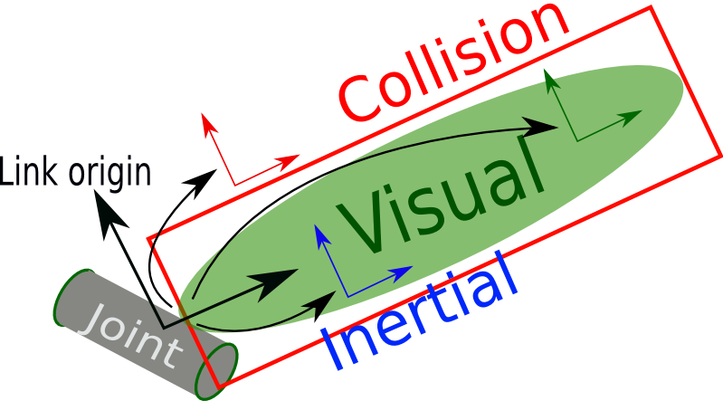

---
tags:
    - urdf
    - ros
---

# URDF

URDF is an xml file that describe the geometry of a robot. URDF is a tree structure with one root link. The measuring units are **meters** and **radians**.

```xml title="robot"
<robot name="robot_name">
  <link>  </link>
  <link>  </link>

  <joint>  </joint>
</robot>
```

## Link
The link element describes a rigid body with an **inertia**, **visual** features, and **collision** properties.



!!! tip
    The reference frame of the link is its joint
     

```xml title="link"
<link name="link_name">

  <visual>
      <origin xyz="0 0 0" rpy="0 0 0" />
      <geometry>
        <cylinder length="0.6" radius="0.2"/>
      </geometry>
  </visual>

  <collision>
      <origin xyz="0 0 0" rpy="0 0 0" />
      <geometry>
          <cylinder length="0.6" radius="0.2"/>
      </geometry>
  </collision>

  <inertial>
      <origin xyz="0 0 0" rpy="0 0 0"/>
      <mass value="1"/>
      <inertia
          ixx="1.0" ixy="0.0" ixz="0.0"
          iyy="1.0" iyz="0.0"
          izz="1.0"/>
  </inertial>
</link>
```

