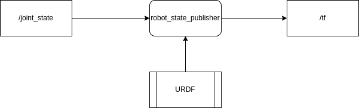

The robot_state_publisher node takes a robot’s URDF model and joint positions and computes the full set of TF transforms between all robot links.





## Install
```bash
sudo apt install ros-${ROS_DISTRO}-robot-state-publisher
# joint state gui
sudo apt install ros-${ROS_DISTRO}-joint-state-publisher-gui
# parse xacro files and convert to urdf
sudo apt install ros-${ROS_DISTRO}-xacro

```


## usage

launch robot-state-publisher, joint_state_publisher_gui and rviz

```yaml
launch:
  - arg:
      name: "rviz_config_file"
      default: "$(find-pkg-share bumperbot_bringup)/config/rviz.rviz"
  - arg:
      name: "robot_description_file"
      default: "$(find-pkg-share bumperbot_description)/urdf/bumperbot.urdf.xacro"
  - node:
      pkg: rviz2
      exec: rviz2
      name: rviz2
      output: screen
      args:
          "-d $(var rviz_config_file)"
  - node:
      pkg: "robot_state_publisher"
      exec: "robot_state_publisher"
      name: "robot_state_publisher"
      param:
        - name: "robot_description"
          value : "$(command '$(find-exec xacro) $(var robot_description_file)')"
  - node:
      pkg: "joint_state_publisher_gui"
      exec: "joint_state_publisher_gui"
      name: "joint_state_publisher_gui"
      output: screen
```