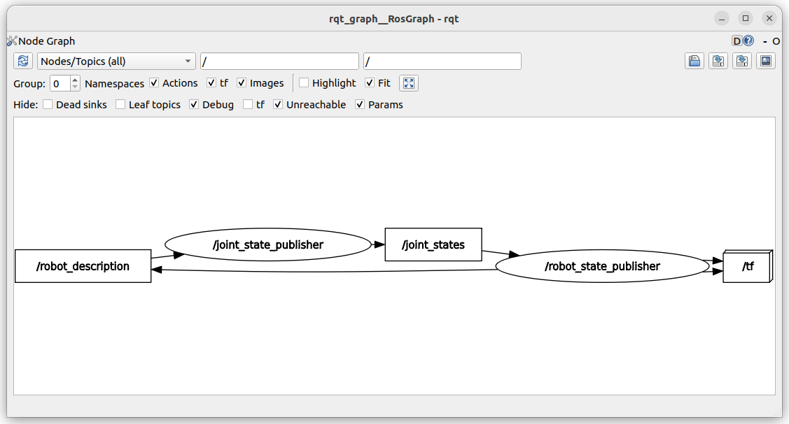

---
tags:
    - urdf
    - ros
    - robot_state_publisher
---

# robot state publisher


```
sudo apt install ros-${ROS_DISTRO}-xacro
sudo apt install ros-${ROS_DISTRO}-joint-state-publisher-gui

```


```bash title="terminal1"
# don't forget to the quat when set the robot_description parameter
ros2 run robot_state_publisher robot_state_publisher --ros-args -p robot_description:="$(xacro urdf/my_robot.urdf)"
```

```bash title="terminal2"
ros2 run joint_state_publisher_gui joint_state_publisher_gui 

```

```bash title="terminal3"
rqt_graph
```




```
install(
    DIRECTORY urdf
    DESTINATION share/${PROJECT_NAME}/
)
```

## Collision

!!! tip ""
    Check collision with RVIZ
     

---

## Gazebo fortress
[Migrating ROS 2 packages that use Gazebo Classic](https://gazebosim.org/docs/fortress/migrating_gazebo_classic_ros2_packages/)

```bash
sudo apt install ros-humble-ros-gz-sim
```

### Launch gazebo

```bash title="launch gazebo"
ros2 launch ros_gz_sim gz_sim.launch.py
```

### Spawn robot from file
```bash
# convert xacro file to urdf
xacro my_robot.urdf.xacro > my_robot.urdf
#
ros2 run ros_gz_sim create -name xxx -file src/gz_tutorial_description/urdf/my_robot2.urdf

```