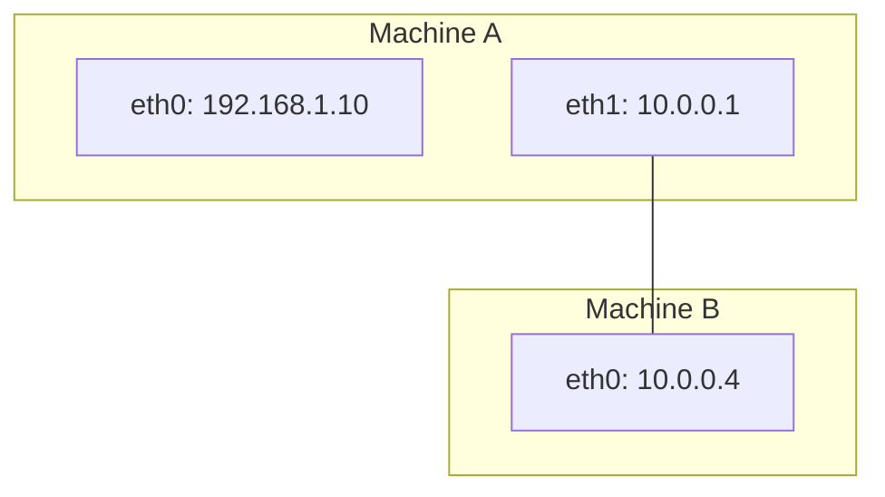

---
tags:
    - dds
    - cyclonedds
    - ros
    - unicast
---

# CycloneDDS unicast between machine
Disable multicast discovery and allow unicast traffic between two machines


## Demo




<details>
    <summary>Sender</summary>

```xml title="cyclondedds.xml"
<?xml version="1.0" encoding="UTF-8"?><CycloneDDS xmlns="https://cdds.io/config" xmlns:xsi="http://www.w3.org/2001/XMLSchema-instance" 
xsi:schemaLocation="https://cdds.io/config https://raw.githubusercontent.com/eclipse-cyclonedds/cyclonedds/master/etc/cyclonedds.xsd">

  <Domain Id="any">
    <General>
      <AllowMulticast>false</AllowMulticast>
        
    </General>
    <Discovery>
      <ParticipantIndex>auto</ParticipantIndex>
      <Peers>
        <Peer Address="10.0.0.4" />
        <Peer Address="127.0.0.1" />
      </Peers>
    </Discovery>
  </Domain>
</CycloneDDS>
```
</details>


<details>
    <summary>Receiver</summary>

```xml title="cyclondedds.xml"
<?xml version="1.0" encoding="UTF-8"?><CycloneDDS xmlns="https://cdds.io/config" xmlns:xsi="http://www.w3.org/2001/XMLSchema-instance" 
xsi:schemaLocation="https://cdds.io/config https://raw.githubusercontent.com/eclipse-cyclonedds/cyclonedds/master/etc/cyclonedds.xsd">

  <Domain Id="any">
    <General>
        <AllowMulticast>false</AllowMulticast>
    </General>
    <Discovery>
    <ParticipantIndex>auto</ParticipantIndex>
      <Peers>
        <Peer Address="10.0.0.1" />
        <Peer Address="127.0.0.1" />
      </Peers>
    </Discovery>
  </Domain>
</CycloneDDS>
```
</details>

!!! tip "peer localhost"
    `<Peer Address="127.0.0.1" />`
    
    This is essential because Cyclone DDS does not automatically assume loopback (127.0.0.1) unless you’re using multicast or explicitly list it.

     

```bash title="env.sh"
export CYCLONEDDS_URI=file://$PWD/cyclonedds.xml
source /opt/ros/humble/setup.bash
export RMW_IMPLEMENTATION=rmw_cyclonedds_cpp
```

### usage
We can run the pub/sub on both side

```bash title="pub"
source env.sh
ros2 topic pub xxx std_msgs/String "data: hello world" -r 1

```

```bash title="echo"
source env.sh
ros2 topic echo /xxx
```


!!! tip "ros2 daemon"
    The ROS2 daemon is a background process that:

    - Caches discovered ROS nodes and topics
    - Improves discovery performance
    - Manages node name resolution
  
    Some time we need to restart for refresh discovery when using ROS commands

    ```
    ros2 daemon stop && ros2 daemon start

    ```

     
