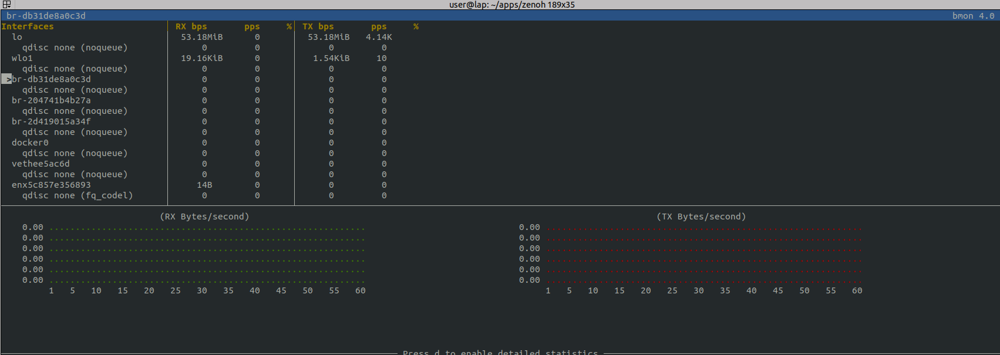
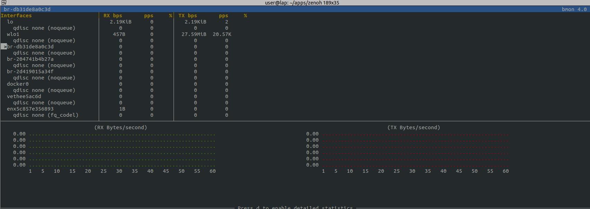

---
tags:
  - dds
  - cyclonedds
  - multicast
  - xml
---

# CycloneDDS XML configuration
- [CycloneDDS config](https://cyclonedds.io/docs/cyclonedds/0.9.1/config.html)
- [xml reference](https://cyclonedds.io/docs/cyclonedds/latest/config/config_file_reference.html)

Default Multicast Behavior in CycloneDDS (ROS 2 Humble)

| Settings                                     | Default Value     |
| -------------------------------------------- | ----------------- |
| Discovery (SPDP)                             | Multicast Enabled |
| User Data (Topic Data)                       | Unicast Only      |
| Meta Traffic (SEDP, other discovery traffic) | Unicast Only      |

## Demo

Send image data using gscam package and subscribe using rqt_image_viewer and ros2 topic echo
measure/monitor the data using bmon tool

```bash title="installation"
sudo apt install bmon
sudo apt install ros-humble-gscam
```

```bash title="bmon"
bmon
```

```bash title="terminal1"
export GSCAM_CONFIG="videotestsrc pattern=snow ! video/x-raw,width=640,height=480,framerate=30/1 ! videoconvert"
ros2 run gscam gscam_node
```

```bash
ros2 run rqt_image_view rqt_image_view
```


```
ros2 topic echo /camera/image_raw
```



---

### Multicast
For easy of use , using tmuxp yaml file to run all the test together
```xml title="temp.xml"
<?xml version="1.0" encoding="UTF-8"?>
<CycloneDDS xmlns="https://cdds.io/config" xmlns:xsi="http://www.w3.org/2001/XMLSchema-instance"
  xsi:schemaLocation="https://cdds.io/config https://raw.githubusercontent.com/eclipse-cyclonedds/cyclonedds/master/etc/cyclonedds.xsd">
  <Domain Id="any">
    <General>
      <AllowMulticast>true</AllowMulticast>
    </General>
  </Domain>
</CycloneDDS>
```


#### tmuxp script

```yaml title="tmuxp_demo_multicast.yaml"
session_name: dds
windows:
  - window_name: cyclone
    layout: tiled
    suppress_history: false
    shell_command_before:
      - source /opt/ros/humble/setup.bash
    panes:
      - shell_command: #
          - export GSCAM_CONFIG="videotestsrc pattern=snow ! video/x-raw,width=640,height=480,framerate=30/1 ! videoconvert"
          - export CYCLONEDDS_URI=file://$PWD/temp.xml
          - ros2 run gscam gscam_node
      - shell_command: #
          - export CYCLONEDDS_URI=file://$PWD/temp.xml
          - ros2 run rqt_image_view rqt_image_view

      - shell_command:
          - export CYCLONEDDS_URI=file://$PWD/temp.xml
          -  # ros2 topic echo /camera/image_raw
```

```bash
tmuxp load tmuxp_demo_multicast.yaml

```

#### multicast with one subscriber
!!! note "lo"
    The communication use lo interface  
    by default lo not support multicast
     


#### multicast with two or more subscriber
!!! note "wlo1"
    The communication use the physical adapter (wlo1)  
    support multicast



---

## Reference
- [Download tmuxp file](tmuxp_demo_multicast.yaml)