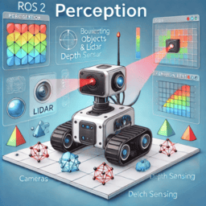
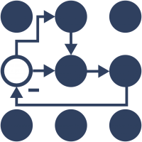

# ROS World

    

            <a href="navigation_and_localization">
                
                
Navigation and Localization

            </a>
        

        

             <a href="perception">
                
                
Perception

            </a>
        

    

          <a href="dds">
                
                
DDS

            </a>
    

    

          <a href="ros_control">
                
                
ROS Control

            </a>
    

     

          <a href="ros_tf">
                
                
TF

            </a>
    

    

            <a href="zenoh">
            
            
Zenoh

            </a>
        

## Posts

- [ROS2 Parameters](parameters)
