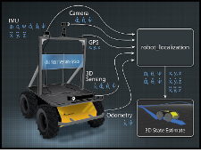

    

            <a href="robot_localization">
                
                
Robot Localization

            </a>
        

        

             <a href="nav2">
                
                
NAV2

            </a>
        

    

          <a href="dds">
                
                
tbd

            </a>
    

    

