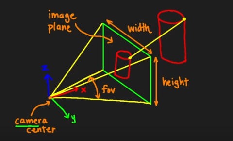
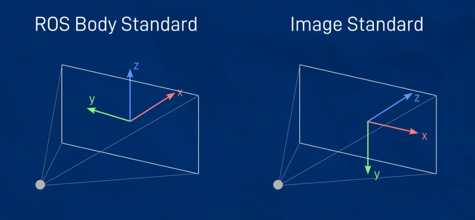
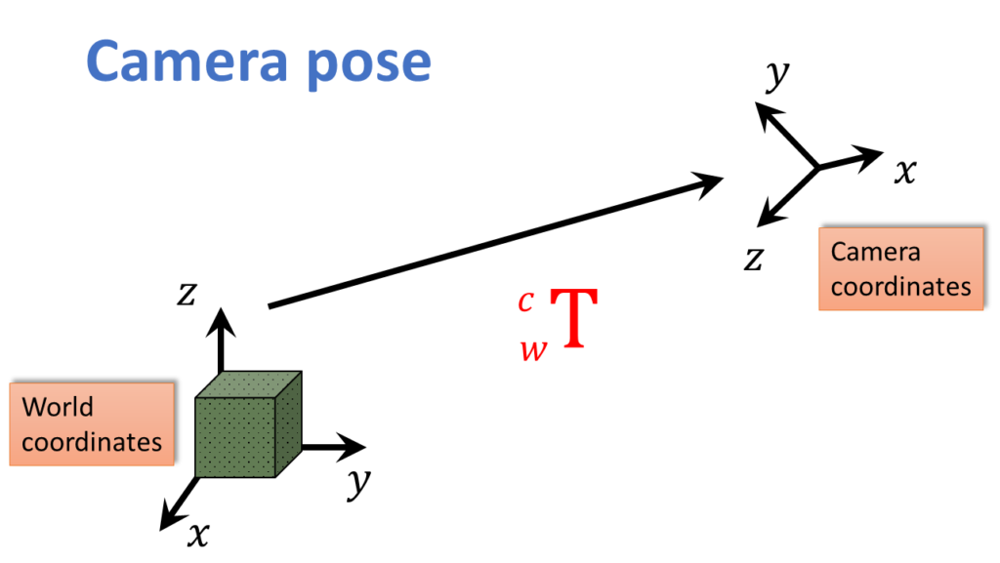

---
tags:
    - ros
    - cvbridge
    - cv-bridge
---

# Perception


<div class="grid-container">
    <div class="grid-item">
            <a href="cv_bridge">
                
                <p>CV-Bridge</p>
            </a>
        </div>
        <div class="grid-item">
             <a href="">
                <!--  -->
                <p>TBD</p>
            </a>
        </div>
    <div class="grid-item">
          <a href="">
                <!--  -->
                <p>TBD</p>
            </a>
    </div>
</div>






\( R_{\mathbf{C}\leftarrow\mathbf{G}} =
\begin{bmatrix}
0 & -1 & 0\\
0 & 0 & -1\\
1 & 0 & 0
\end{bmatrix} \)


## intrinsic matrix

The intrinsic matrix **K** converts normalized camera coordinates (xn,yn) (where xn=X/Z,  yn=Y/Zxn​=X/Z,yn​=Y/Z) into pixel coordinates (u,v):


---

**World frame**: a global fixed reference (e.g., origin at some arbitrary place in the scene).
**Camera frame**: origin is at the camera center, axes aligned with the camera’s orientation.



```
Pcamera​=Rcw​⋅Pworld​+tcw
```

### Camera Pose in world Coordinate
Suppose we know the camera pose in the world frame as:

Rwc: rotation from camera to world (3*3 rotation matrix)
twc: translation camera origin position in world coordinates (3*1 translation vector)

### Invert the Pose

We want world → camera, so we take the inverse of the camera pose:

$
R_{cw} = R_{wc}^T
$

because rotation matrices are orthogonal: $R^{-1}=R^{T}$

### Apply the Transformation

Given a point in world coordinate $\mathbf{P}_w = \begin{bmatrix} X_w \\ Y_w \\ Z_w \end{bmatrix}
$


**Translate**: subtract the camera’s world position

!!! translate word to camera
    negative camera to world $- t_{wc}$

$
P_{\text{shifted}} = P_{w} - t_{wc}
$

**Rotate**: apply the inverse rotation to align axes with camera frame

The point in camera frame

$
P_c = R_{wc}^T \cdot P_{\text{shifted}}
$