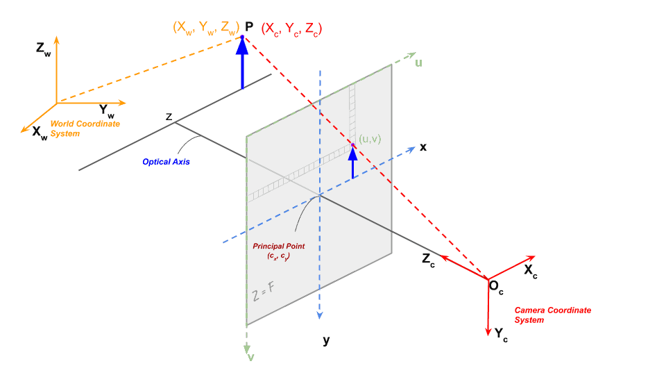
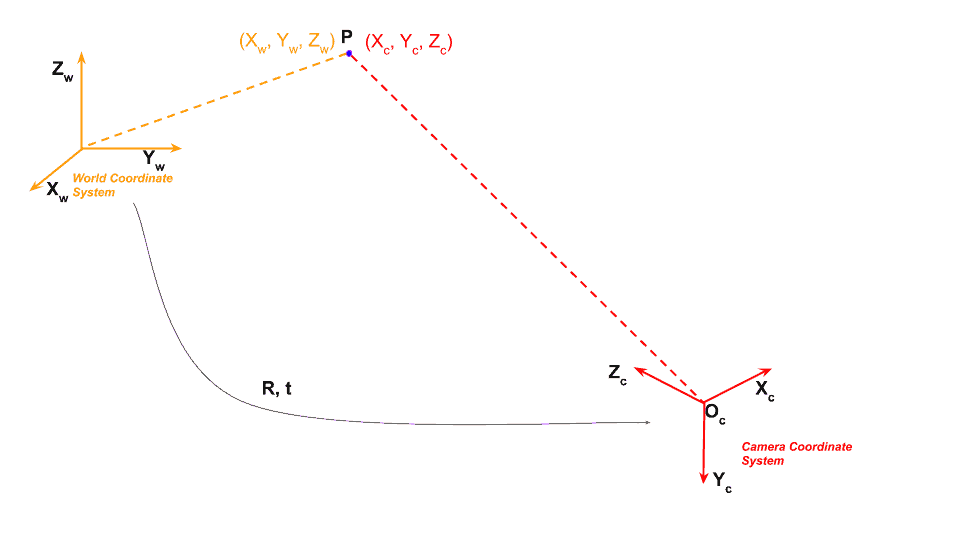

Perception is the process that turns raw sensor data into useful understanding of the environment

Perception takes raw data like:

- image pixels
- depth values
- point cloud

And extracts:

- Objects
- Position
- Shapes 
- Lines


<div class="grid-container">
    <div class="grid-item">
            <a href="cv_bridge">
                
                <p>CV-Bridge</p>
            </a>
        </div>
        <div class="grid-item">
             <a href="">
                <!--  -->
                <p>TBD</p>
            </a>
        </div>
    <div class="grid-item">
          <a href="">
                <!--  -->
                <p>TBD</p>
            </a>
    </div>
</div>

---

[must read before : Image Geometry](https://learnopencv.com/geometry-of-image-formation/)


## Project 3D point to image plane




## Convert World point in camera coordinate system ($X_c, Y_c, Z_c$) to (u,v) image plane using intrinsic matrix K

$$
K =
\begin{bmatrix}
f_x & 0 & c_x \\
0 & f_y & c_y \\
0 & 0 & 1
\end{bmatrix}
$$

3D point in camera frame

$$
\mathbf{P} =
\begin{bmatrix}
X \\
Y \\
Z
\end{bmatrix}
$$


#### Matrix multiplication

$$
K \mathbf{P} =
\begin{bmatrix}
f_x & 0 & c_x \\
0 & f_y & c_y \\
0 & 0 & 1
\end{bmatrix}
\begin{bmatrix}
X \\
Y \\
Z
\end{bmatrix}
=\begin{bmatrix}
f_x X + c_x Z \\
f_y Y + c_y Z \\
Z
\end{bmatrix}
$$

Homogeneous image coordinate

$$
\begin{bmatrix}
\tilde{u} \\
\tilde{v} \\
\tilde{w}
\end{bmatrix}
=\begin{bmatrix}
f_x X + c_x Z \\
f_y Y + c_y Z \\
Z
\end{bmatrix}
$$

#### Convert homogeneous coordinate to pixel coordinate

The matrix multiplication gives a scaled form of the pixel location, and the scale is removed by dividing by the third component.

$$
u = \frac{\tilde{u}}{\tilde{w}}, \qquad v = \frac{\tilde{v}}{\tilde{w}}
$$

since $\tilde{w} = Z$

$$
u = \frac{f_x X + c_x Z}{Z} = \frac{f_x X}{Z} + c_x
$$

$$
v = \frac{f_y Y + c_y Z}{Z} = \frac{f_y Y}{Z} + c_y
$$


---

### Homogeneous image coordinate

Instead of representing a pixel as **(u,v)**
We represent it as a **3D vector**

$$
\begin{bmatrix}
u \\
v \\
1
\end{bmatrix}
$$


---

### Demo: Python code to calc u,v

```python
import numpy as np

K = np.array([
    [600.0,   0.0, 320.0],
    [  0.0, 600.0, 240.0],
    [  0.0,   0.0,   1.0]
])

P = np.array([0.2, 0.1, 2.0])  # X, Y, Z in camera frame

p_h = K @ P   # homogeneous image coordinates

u = p_h[0] / p_h[2]
v = p_h[1] / p_h[2]

print("homogeneous:", p_h)
print("pixel:", (u, v))
```


---


---

## Demo: from pixel -> camera -> world

```
(u, v) + depth Z
        ↓
camera intrinsics (K⁻¹)
        ↓
3D point in camera frame
        ↓
extrinsic (R, t)
        ↓
3D point in world frame
```

### Pixel -> Camera coordinate

pixel (u,v) as homogeneous

$$
\mathbf{p} =
\begin{bmatrix}
u \\
v \\
1
\end{bmatrix}
$$

#### Then

$$
\mathbf{P}_{cam} = Z \cdot K^{-1} \mathbf{p}
$$

#### inverse K matrix 
$$
K^{-1} =
\begin{bmatrix}
1/f_x & 0 & -c_x/f_x \\
0 & 1/f_y & -c_y/f_y \\
0 & 0 & 1
\end{bmatrix}$$

#### Multiple inverse with homogeneous P vector

$$
K^{-1} p =
\begin{bmatrix}
(u-c_x)/f_x \\
(v-c_y)/f_y \\
1
\end{bmatrix}
$$

#### Point in camera coordinate system

$$
P_{cam} = Z K^{-1} p
$$

$$
P_{cam} = 
\begin{bmatrix}
X_c \\
Y_c \\
Z_c
\end{bmatrix} =
\begin{bmatrix}
(u-c_x)Z/f_x \\
(v-c_y)Z/f_y \\
Z
\end{bmatrix}
$$

#### Camera to World coordinate system



$$
T =
\begin{bmatrix}
R & t \\
0 & 1
\end{bmatrix}
$$

##### then

$$
\mathbf{P}_{world} = R \cdot \mathbf{P}_{cam} + t
$$

---

## Demo: Using ROS

To get a world 3D point from image pixel, you need:

- u, v
- camera intrinsics: fx, fy, cx, cy
- depth Z
- TF from camera_optical_frame to world

```bash title="tf tree"
world
 └── base_link
      └── camera_link
           └── camera_optical_frame
```


<details>
<summary>ROS Node using camera_info and TF </summary>
```python
#!/usr/bin/env python3

import rclpy
from rclpy.node import Node

from sensor_msgs.msg import CameraInfo
from geometry_msgs.msg import PointStamped

from tf2_ros import Buffer, TransformListener
from tf2_geometry_msgs.tf2_geometry_msgs import do_transform_point


class PixelToWorldFixedDepth(Node):
    def __init__(self):
        super().__init__("pixel_to_world_fixed_depth")

        # Parameters
        self.declare_parameter("u", 320)
        self.declare_parameter("v", 240)
        self.declare_parameter("fixed_depth_m", 2.0)
        self.declare_parameter("camera_frame", "camera_optical_frame")
        self.declare_parameter("world_frame", "world")

        self.u = int(self.get_parameter("u").value)
        self.v = int(self.get_parameter("v").value)
        self.fixed_depth_m = float(self.get_parameter("fixed_depth_m").value)
        self.camera_frame = str(self.get_parameter("camera_frame").value)
        self.world_frame = str(self.get_parameter("world_frame").value)

        # Camera intrinsics
        self.fx = None
        self.fy = None
        self.cx = None
        self.cy = None

        # TF
        self.tf_buffer = Buffer()
        self.tf_listener = TransformListener(self.tf_buffer, self)

        self.create_subscription(
            CameraInfo,
            "/camera/camera_info",
            self.camera_info_callback,
            10,
        )

        self.timer = self.create_timer(1.0, self.process_pixel)

    def camera_info_callback(self, msg: CameraInfo):
        # msg.k =
        # [fx, 0,  cx,
        #  0,  fy, cy,
        #  0,  0,  1]
        self.fx = msg.k[0]
        self.fy = msg.k[4]
        self.cx = msg.k[2]
        self.cy = msg.k[5]

    def process_pixel(self):
        if self.fx is None:
            self.get_logger().info("Waiting for /camera/camera_info ...")
            return

        z = self.fixed_depth_m

        # Back-project pixel -> 3D point in camera_optical_frame
        x = (self.u - self.cx) * z / self.fx
        y = (self.v - self.cy) * z / self.fy

        p_cam = PointStamped()
        p_cam.header.stamp = self.get_clock().now().to_msg()
        p_cam.header.frame_id = self.camera_frame
        p_cam.point.x = float(x)
        p_cam.point.y = float(y)
        p_cam.point.z = float(z)

        self.get_logger().info(
            f"pixel=({self.u}, {self.v}) "
            f"-> camera [{self.camera_frame}] "
            f"x={p_cam.point.x:.3f}, y={p_cam.point.y:.3f}, z={p_cam.point.z:.3f}"
        )

        try:
            transform = self.tf_buffer.lookup_transform(
                self.world_frame,
                self.camera_frame,
                rclpy.time.Time()
            )

            p_world = do_transform_point(p_cam, transform)

            self.get_logger().info(
                f"world [{self.world_frame}] "
                f"x={p_world.point.x:.3f}, y={p_world.point.y:.3f}, z={p_world.point.z:.3f}"
            )

        except Exception as e:
            self.get_logger().warn(f"TF lookup failed: {e}")


def main():
    rclpy.init()
    node = PixelToWorldFixedDepth()
    rclpy.spin(node)
    node.destroy_node()
    rclpy.shutdown()


if __name__ == "__main__":
    main()
```
</details>