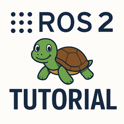
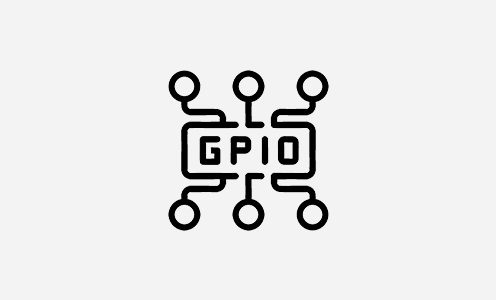
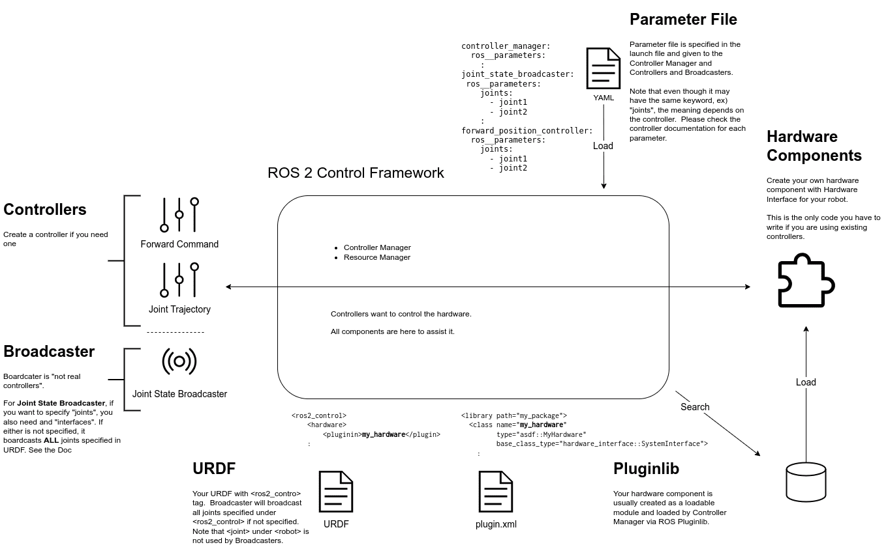
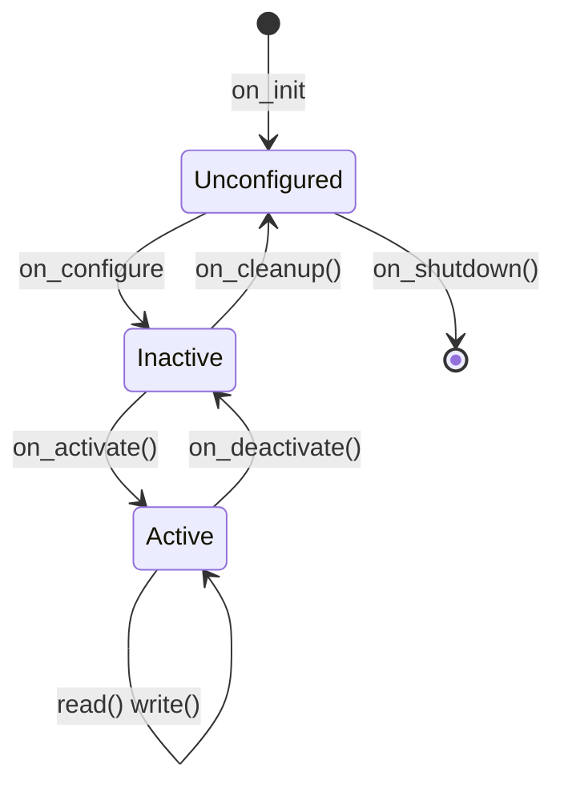

---
tags:
    - ros
    - control
    - ros2_control
---

# ROS2_Control
ros2_control is a framework for robot hardware abstraction and controller management 

Hardware interface Abstracts real or simulated robot hardware and expose hardware functionality in a standard way:

- state interface (read-only) feedback from hardware
- command interface (Read/Write) : command to the hardware


<div class="grid-container">
    <div class="grid-item">
            <a href="tutorials">
                
                <p>ros2 control tutorials</p>
            </a>
        </div>
        <div class="grid-item">
             <a href="perception">
                <p>TBD</p>
            </a>
        </div>
    <div class="grid-item">
          <a href="gpio">
                
                <p>GPIO</p>
            </a>
    </div>
</div>

## Install

```bash
sudo apt install ros-humble-ros2-control
sudo apt install ros-humble-ros2-controllers
sudo apt install ros-humble-control-msgs
# gazebo classic 
sudo apt install ros-humble-gazebo-ros2-control
```

ROS2_control abstract controller from hardware interfaces
Hardware interface expose hardware functionality in a standard way:
- state interface (read-only) feedback from hardware
- command interface (Read/Write) : command to the hardware



## Controller Manager

## Resource Manager

## Hardware interface


### Lifecycle State



**on_init**: read parameters
**on_configure**: establish comms
**on_activate**: engage actuators
**on_deactivate**: disengage actuators
**on_cleanup**: disconnect comms
**on_shutdown**: graceful shutdown

---

## To Read and Watch
- [must watch](https://youtu.be/J02jEKawE5U)
- [The construct - ROS2 Control Framework ](https://app.theconstruct.ai/Course/102)
- [You can use ANY hardware with ros2_control ](https://youtu.be/J02jEKawE5U)
- [ros2_control Concepts & Simulation](https://articulatedrobotics.xyz/tutorials/mobile-robot/applications/ros2_control-concepts/)
- [ros2_control_custom_hardware_interface](https://github.com/masum919/ros2_control_custom_hardware_interface/tree/main)
- [Using I2C to control PWM | ROS Control with the JetBot Part 1 ](https://youtu.be/MdHeETllDN8)
    - [ROS2 Control with the JetBot Part 1: Using I2C to control PWM](https://mikelikesrobots.github.io/blog/jetbot-motors-pt1)