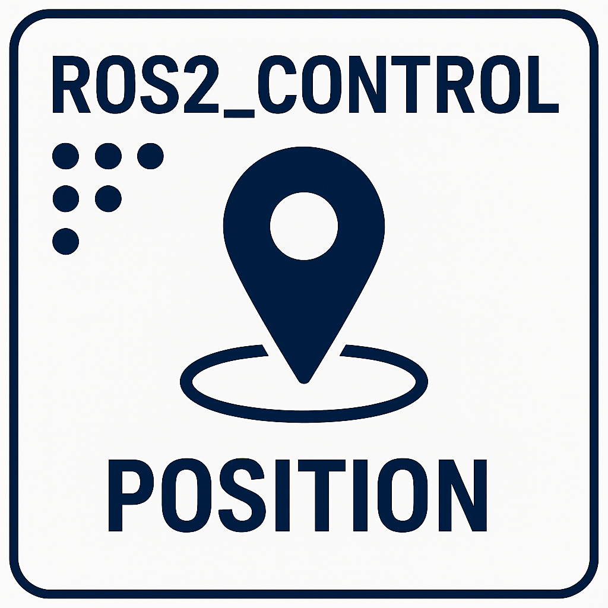
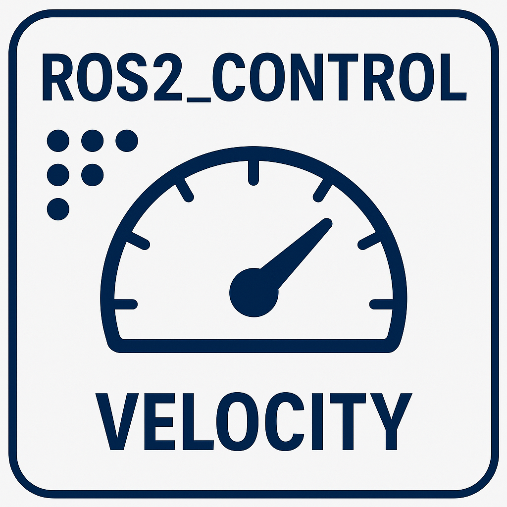
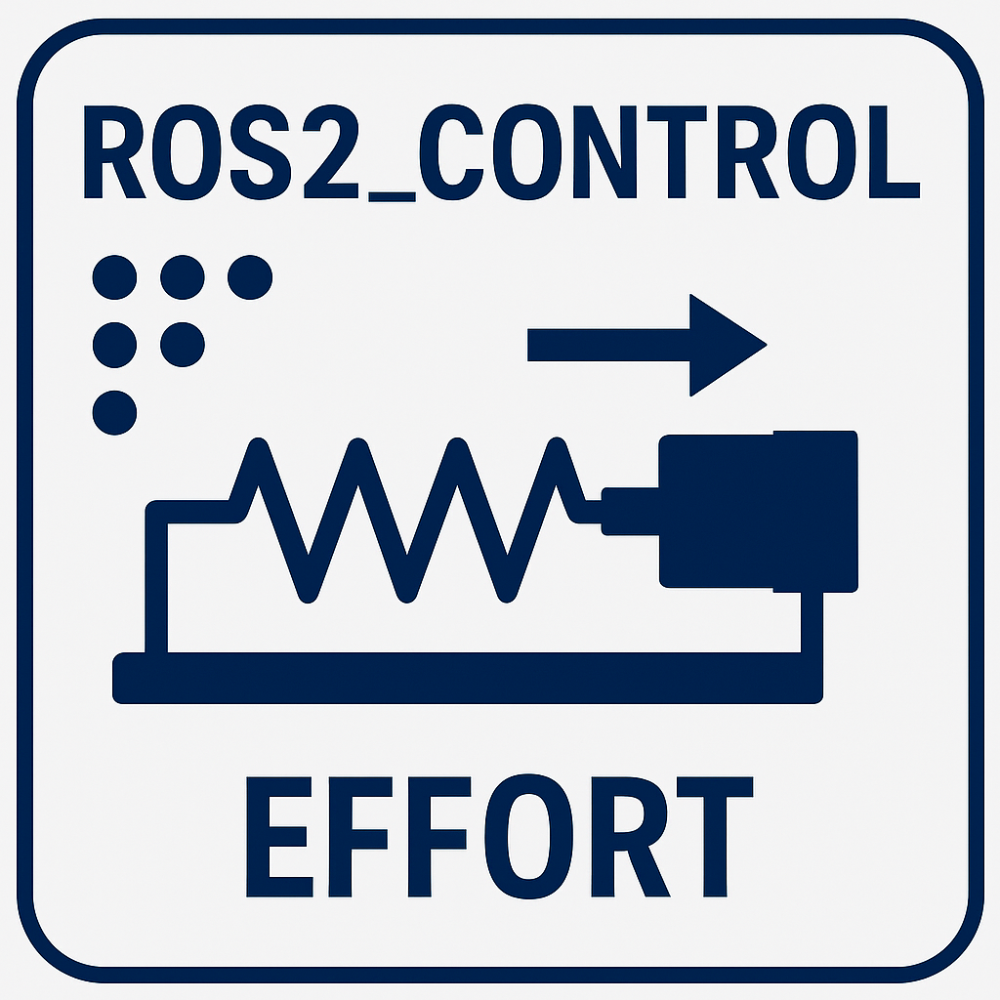

---
tags:
    - ros
    - ros2_control
    - tutorial
---

# ros2 control tutorials

Using Gazebo to simulate type of control on one joint simple robot.  
Show **yaml** control configuration and **ros2_control** tag for each type.

The ros2_control declare what the robot can do, and expose it as command and state  
The Controller YAML declare which controller to load and use by the **controller_manager**
The controller expose ROS messages to command and get states

    

            <a href="position_control">
                
                
position controller

            </a>
        

        

             <a href="velocity_control">
             
                
velocity controller

            </a>
        

    

          <a href="effort_control">
                
                
Effort Control

            </a>
    

    

          <a href="imu_broadcaster">
                
                
imu broadcaster

            </a>
    

- [ros2_control guide](https://control.ros.org/jazzy/doc/getting_started/getting_started.html)
- [ROS2 Jazzy Tutorial: ros2_control in Gazebo - Control Simulation from Scratch in Gazebo!](https://www.youtube.com/watch?v=_F8wVuiEmww)

