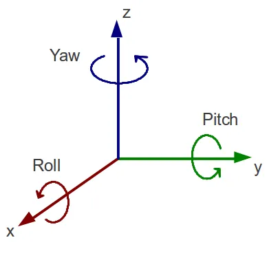
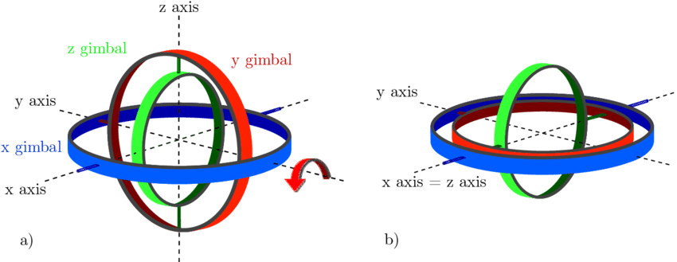

---
tags:
    - euler
    - RPY
---

# Euler

## Gimbal lock

Gimbal lock is a loss of one degree of freedom (DOF) in a 3D rotation system due to the alignment of two rotational axes.  
For example when `PITCH` is &#177;90&#176; the `YAW` and `ROLL` axes rotate around the `YAW` and we loss on degree of freedom

[Euler Angles Gimbal Visualization](https://compsci290-s2016.github.io/CoursePage/Materials/EulerAnglesViz/)

!!! note "colors"
    roll (x) - blue
    pitch (y) - green
    yaw (z) - green

    rotate pitch 90 degree make roll and yaw rotation to the same direction

## Rotation Order

### Euler (XYZ) 
RPY

     