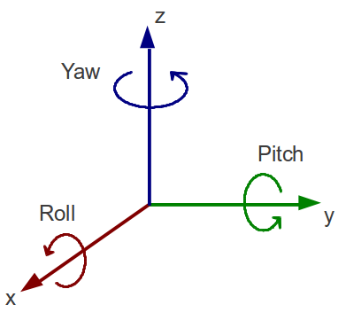
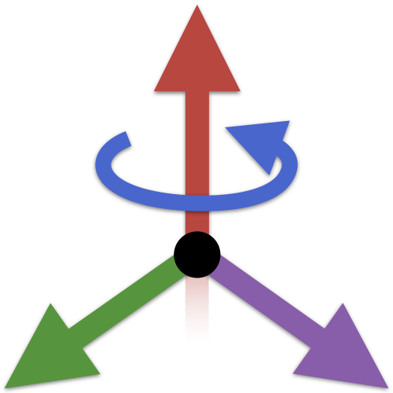
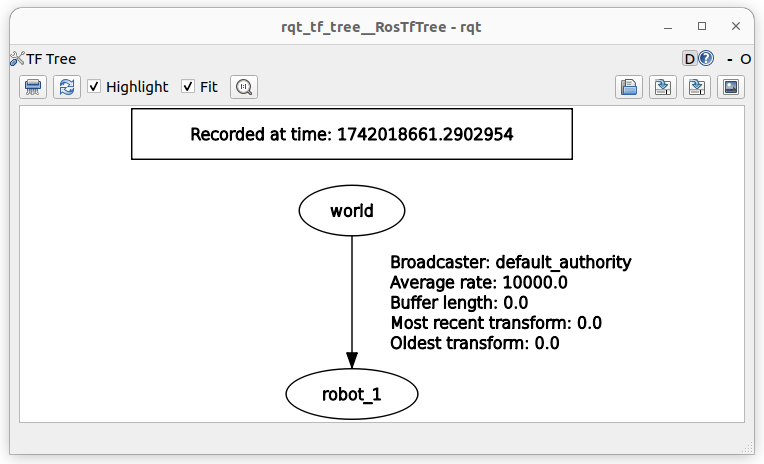
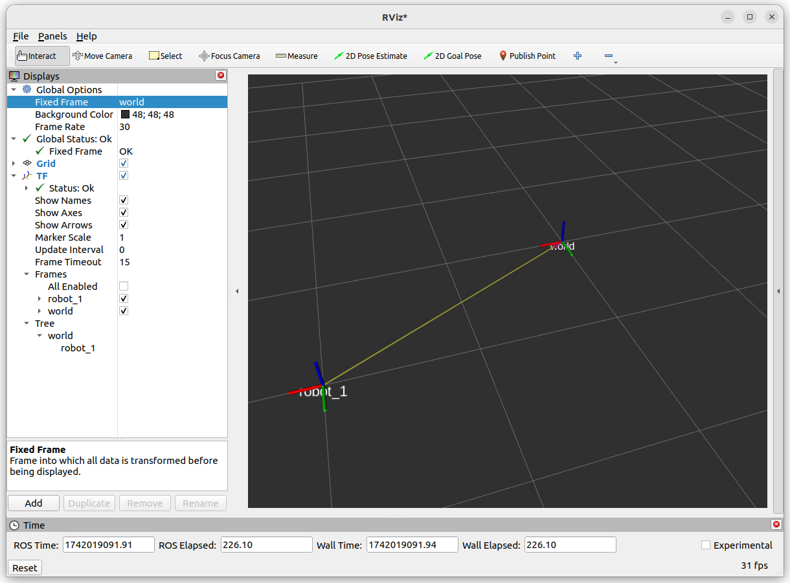
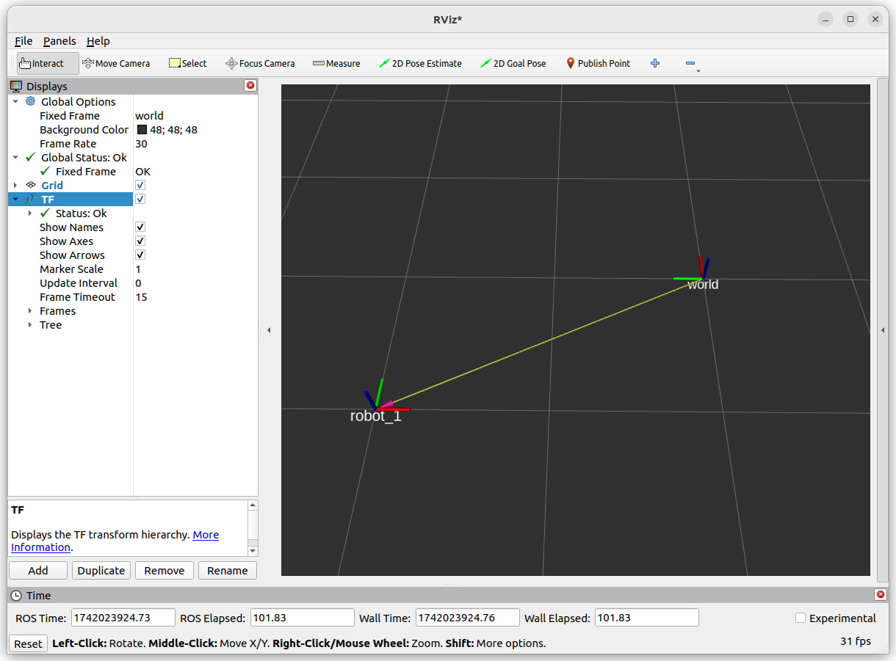
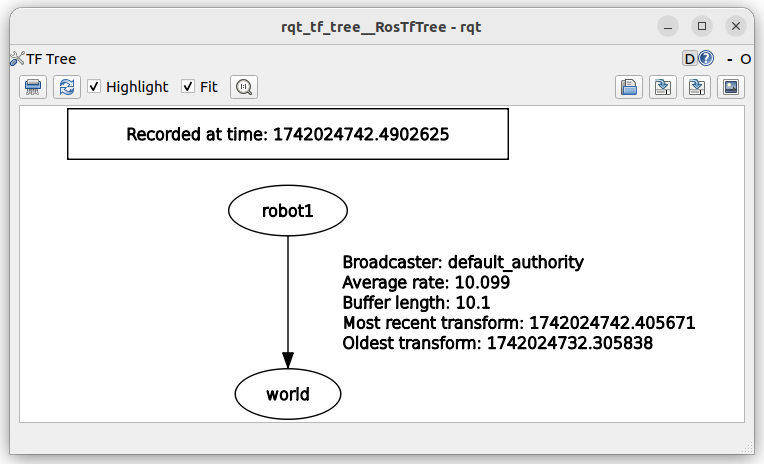

---
tags:
    - ros
    - tf
    - quaternion
    - tf2
---

# TF2

tf2  provides a coordinate transformation framework, allowing nodes to track and transform data between different coordinate frames over time

<div class="grid-container">
    <div class="grid-item">
            <a href="euler">
                
                <p>Euler RPY</p>
            </a>
        </div>
        <div class="grid-item">
             <a href="quaternion">
                
                <p>Quaternion</p>
            </a>
        </div>
    <div class="grid-item">
          <a href="liner_algebra">
                
                <p>Linear algebra</p>
            </a>
    </div>

</div>

## Rotation and Translation Matrix

- **Translation**: Shifts a point in space (represented as a vector [x, y, z]).
- **Rotation**: Rotates a point around an axis (using quaternions or rotation matrices).

A transformation matrix combines rotation and translation

$$
T=\begin{bmatrix}
R & t \\
0 & 1
\end{bmatrix}
$$

$$
T = \begin{bmatrix}
r_{11} & r_{12} & r_{13} & x \\
r_{21} & r_{22} & r_{23} & y \\
r_{31} & r_{32} & r_{33} & z \\
0 & 0 & 0 & 1
\end{bmatrix}
$$

---

## Install ROS tf support packages
```bash title="install"
sudo apt-get install \
ros-humble-tf2-tools \
ros-humble-tf-transformations \
ros-humble-rqt-tf-tree
```

## Static and Dynamic TF

### Static TF
Use to publish fix coordinate relation (coordinate that not change in time) it publish to `tf_static` topic 

#### Demo
Publish the relation between world to robot_1

```bash title="publish static tf"
# new style quaternion
ros2 run tf2_ros static_transform_publisher --x 2 --y 1 --z 0 --qx 0 --qy 0 --qz 0 --qw 1 --frame-id world --child-frame-id robot_1

# new style euler
ros2 run tf2_ros static_transform_publisher --x 2 --y 1 --z 0 --roll 0 --pitch 0 --yaw 0 --frame-id world --child-frame-id robot_1

#
translation: ('2.000000', '1.000000', '0.000000')
rotation: ('0.000000', '0.000000', '0.000000', '1.000000')
from 'world' to 'robot_1'
```

```bash title="echo topic"
ros2 topic echo /tf_static
transforms:
- header:
    stamp:
      sec: 1742018434
      nanosec: 760327680
    frame_id: world
  child_frame_id: robot_1
  transform:
    translation:
      x: 2.0
      y: 1.0
      z: 0.0
    rotation:
      x: 0.0
      y: 0.0
      z: 0.0
      w: 1.0
---

```






!!! tip "coordinate"
    - X: red
    - Y: green
    - Z: blue
     

##### Resolve code

ROS node that resolve the translation and Rotation between two coordinate, in the example is to resolve between robot_1 to world, 

<details>
    <summary>tf resolve code</summary>

```python
--8<-- "docs/ROS/ros_world/ros_tf/code/demo1_reslove.py"
```
</details>


```
python /home/user/projects/blog/docs/ROS/ros_world/ros_tf/code/demo1_reslove.py
[INFO] [1742019661.607132099] [tf_resolver]: Translation: x=-2.0, y=-1.0, z=0.0
[INFO] [1742019661.607396088] [tf_resolver]: Rotation (quaternion): x=0.0, y=0.0, z=0.0, w=1.0

```

The `robot_1` need to move back 2m in **X** and 1m back in **Y** to return to the word coordinate frame

---

#### Demo2: Send static transformation from code

Send `static tf` from code

<details>
    <summary>static tf</summary>

```python title="StaticTransformBroadcaster" linenums="1" hl_lines="1"
--8<-- "docs/ROS/ros_world/ros_tf/code/demo2_static_broadcast.py"
```
</details>




---

### Dynamic TF

#### Demo: Dynamic TF
Publish `tf` in 10 HZ, (change robot orientation)

<details>
    <summary>dynamic tf broadcaster</summary>

```python
--8<-- "docs/ROS/ros_world/ros_tf/code/demo3_dynamic_tf_broadcaster.py"
```
</details>





<details>
    <summary>tf resolver</summary>

```python
--8<-- "docs/ROS/ros_world/ros_tf/code/demo3_dynamic_tf_broadcaster.py"
```
</details>


---

## TF Performance
- Qos
- Buffer duration (size)

### QOS
Change listener QOS

### Listener QoS
```bash title="default tf QOS"
ros2 topic info --verbose /tf
Type: tf2_msgs/msg/TFMessage

Publisher count: 1

Node name: moving_tf_publisher
Node namespace: /
Topic type: tf2_msgs/msg/TFMessage
Endpoint type: PUBLISHER
GID: 01.10.75.c8.eb.03.e1.a2.15.e9.45.5c.00.00.14.03.00.00.00.00.00.00.00.00
QoS profile:
  Reliability: RELIABLE
  History (Depth): KEEP_LAST (100)
  Durability: VOLATILE
  Lifespan: Infinite
  Deadline: Infinite
  Liveliness: AUTOMATIC
  Liveliness lease duration: Infinite

Subscription count: 1

Node name: tf_resolver
Node namespace: /
Topic type: tf2_msgs/msg/TFMessage
Endpoint type: SUBSCRIPTION
GID: 01.10.e4.9b.73.91.d0.2b.17.52.17.b6.00.00.14.04.00.00.00.00.00.00.00.00
QoS profile:
  Reliability: RELIABLE
  History (Depth): KEEP_LAST (100)
  Durability: VOLATILE
  Lifespan: Infinite
  Deadline: Infinite
  Liveliness: AUTOMATIC
  Liveliness lease duration: Infinite

```

<details>
    <summary>tf listener with best effort qos</summary>

```python
--8<-- "docs/ROS/ros_world/ros_tf/code/demo3_dynamic_reolver_qos.py"
```
</details>


---
## Reference
- [Articulated Robotics - The Transform System (tf2)](https://articulatedrobotics.xyz/tutorials/ready-for-ros/tf/)
- [Coordinate Transforms For Robotics](https://articulatedrobotics.xyz/category/coordinate-transforms-for-robotics)