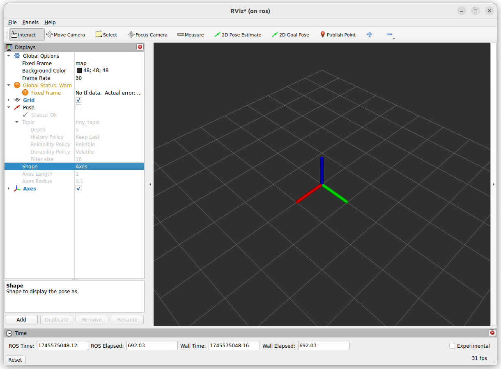
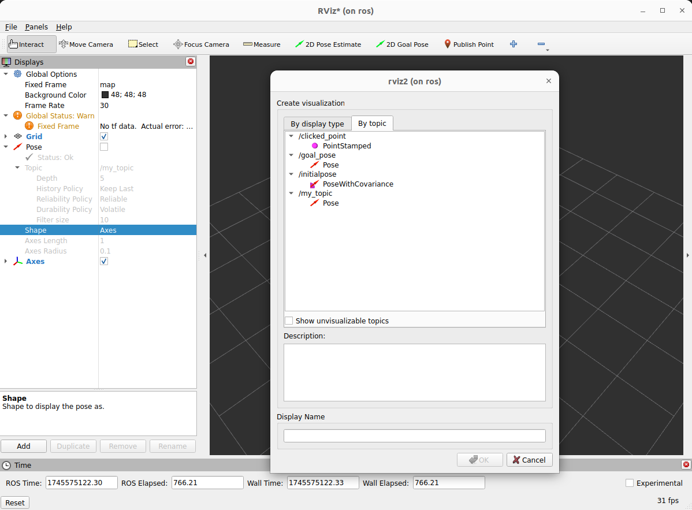
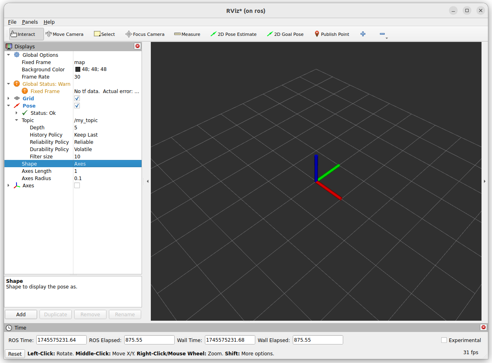
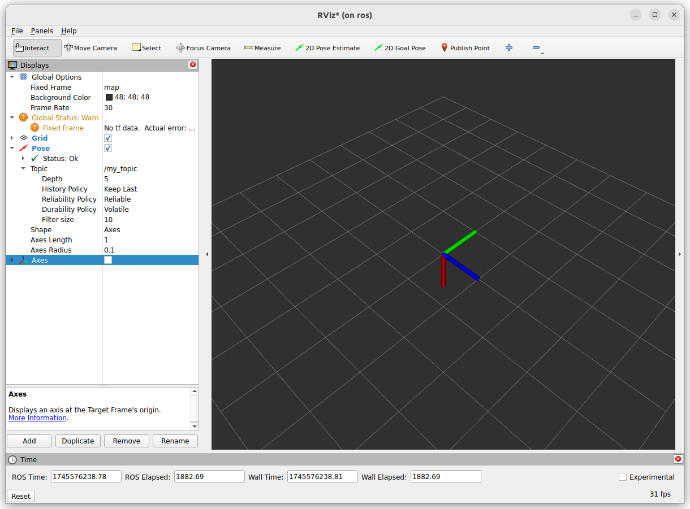

{{ page_folder_links() }}

A quaternion is a way to represent rotation in 3D


## Demo

Using Pose (PoseStamped) message and rviz to show coordinate rotation.
using `quaternion_from_euler` to convert euler angle to quaternion


<figure>
  
  <figcaption style="text-align: center; font-weight: bold;">Figure 1: Show axis.</figcaption>
</figure>

<details>
    <summary>code: Publish pose message node</summary>

```python
--8<-- "docs/ROS/ros_world/ros_tf/quaternion/code/pub_pose_with_quaternion.py"
```
</details>


!!! tip "PoseStamped"
    For rviz to shown the pose topic it need to be publish as `PoseStamped` for the frame_id field

<figure>
  
  <figcaption style="text-align: center; font-weight: bold;">Figure 2: Add Pose message</figcaption>
</figure>

<figure>
  
  <figcaption style="text-align: center; font-weight: bold;">Figure 3: Show Pose message (my_topic) (r=0,p=0,y=90)</figcaption>
</figure>

The Axis is rotate 90 degree CCW (right hand rule)


<figure>
  
  <figcaption style="text-align: center; font-weight: bold;">Figure 4: Show Pose message rotate (r=0,p=90,y=90)</figcaption>
</figure>