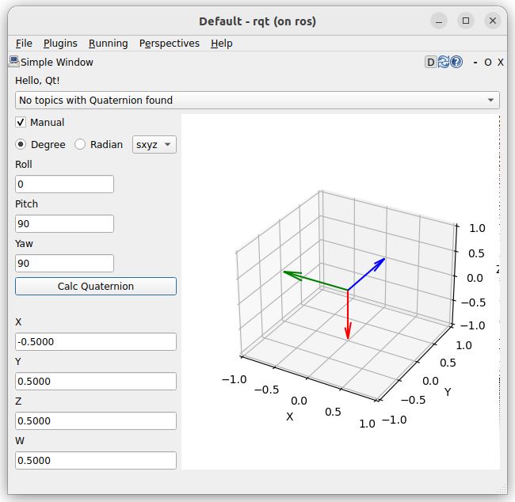
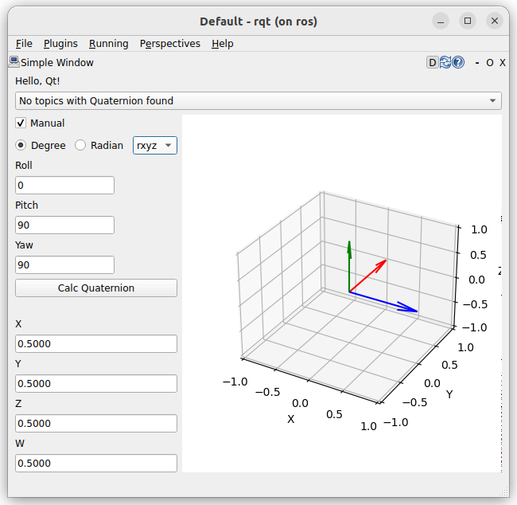

{{ page_folder_links() }}

tf_transformations is a Python utility library in ROS that provides functions for working with 3D rotations and transformations.
converting between different orientation formats like **Euler angles**, **quaternions**, and **transformation matrices**.

```bash title="install"
sudo apt install ros-$ROS_DISTRO-tf-transformations
```


### Quaternion <-> Euler
- quaternion_from_euler
- euler_from_quaternion

```python
from tf_transformations import quaternion_from_euler, euler_from_quaternion
import math

# euler default axis rpy ("sxyz")
# quaternion [x, y, z, w]
q = quaternion_from_euler(0, 0, math.pi/2)
roll, pitch, yaw = euler_from_quaternion([x, y, z, w])
```

#### Rotation Axes
Euler angles describe a 3D rotation as a sequence of three rotations around three orthogonal axes. 
the axes parameter is 4 character string, defines the specific convention of Euler angles you are using.

##### Static (Extrinsic) Rotations
- **Character**: The axes string starts with **'s'**.
- **Description**: Each rotation is performed about a **fixed**, global coordinate system's axes. The axes **do not move** with the object.

##### Rotating (Intrinsic) Rotations
- **Character**: The axes string starts with **'r'**.
- **Description**: Each rotation is performed about the object's own moving coordinate system's axes. The axes change their orientation after each preceding rotation.

##### Common Conventions

Roll-Pith-Yaw (RPY)

- Roll: Rotation around the X-axis
- Pitch: Rotation around the Y-axis
- Yaw: Rotation around the Z-axis

| Extrinsic  | Rotating  |
|:---:|:---:|
|   |   |
| sxyz  | rxyz  |
| quaternion = quaternion_from_euler(yaw_rad, pitch_rad, roll_rad, axes='sxyz') | quaternion = quaternion_from_euler(yaw_rad, pitch_rad, roll_rad, axes='rxyz')


#### quaternion_about_axis
This function creates a quaternion that represents a rotation around a single axis by a given angle.

```python
import tf_transformations
import numpy as np

angle = np.radians(90)
axis = [1, 0, 0]  # X axis

q = tf_transformations.quaternion_about_axis(angle, axis)
print("Quaternion:", q)
```
---

###