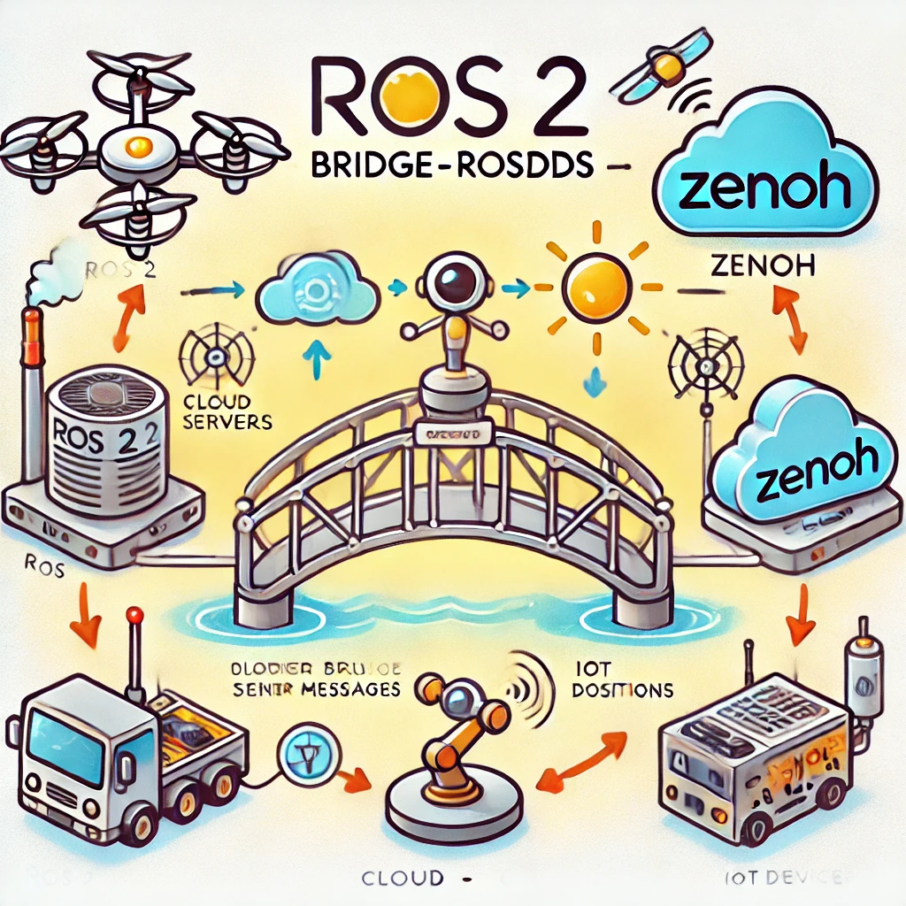
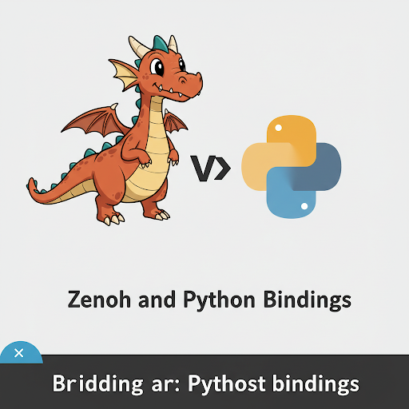
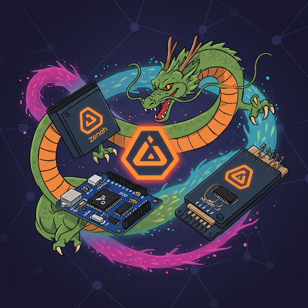

Zenoh networking is a unified data-centric communication protocol
A unified data-centric communication protocol is a networking model where:

Applications communicate by sharing data, not by talking to specific endpoints — and the same protocol supports multiple communication patterns.

### Unified
A single protocol supports:

- **Publish / Subscribe** → streaming data
- **Request / Reply (Query)** → asking for data or computation
- **Storage / Replay** → retrieving past data

[TO READ](https://medium.com/@kelj/zenoh-a-protocol-that-should-be-on-your-radar-72befa697411)

    

        <a href="ros_bridge">
        
        
ROS Bridge

        </a>
    

    

    <a href="python_bindings">
        
        
Python bindings

        </a>
    

    

        <a href="remote_ssh">
        
        
Zenoh pico

        </a>
    

     

        <a href="rmw">
        
        
ROS RMW

        </a>
    

    

        <a href="cpp_bindings">
        
        
CPP bindings

        </a>
    

---

## Resource
- [Zenoh Tutorial – Part I](https://youtu.be/xNJlDIkV2uo?list=PLZDEtJusUvAa91YlGT4ugsR3_heTa1RqS)
  
---

- [zenoh json5 configuration schema](https://github.com/eclipse-zenoh/zenoh/blob/main/DEFAULT_CONFIG.json5)
- [build zenoh bridge with shm support ](ros_bridge/zenoh_bridge_build_with_shm.md)

---

## To Read
- [Zenoh](https://conferences2.sigcomm.org/acm-icn/2022/assets/zenoh-4-Zenoh-and-Zenoh-Flow-Hands-on-e8cbd760e0b88b74417fb1c14d1d373b5ce2a094bc29b5f1a0bfd8e52030c151.pdf)
- [Zenoh ROSCon 2024 Workshop](https://github.com/ZettaScaleLabs/roscon2024_workshop/tree/main)
  