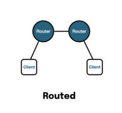
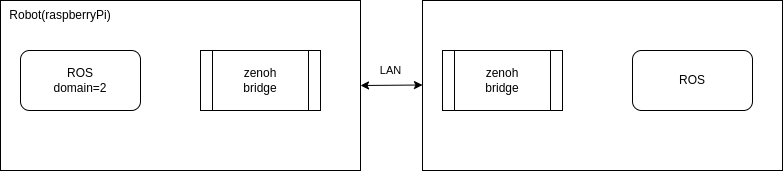

---
tags:
    - zenoh
    - ros
    - bridge
    - router
---

# ROS Zenoh Bridge
Connect two ROS machine via zenoh bridge  
[just read the readme](https://github.com/eclipse-zenoh/zenoh-plugin-ros2dds)

!!! info "versions"
    - ubuntu 22.04
    - ROS humble
    - cycloneDDS
    - zenoh 1.2.0
    - zenoh-plugin-ros2dds 1.2.0

## ROS test
Run pub/sub without any restriction between the machine
### Remote machine
```
RMW_IMPLEMENTATION=rmw_cyclonedds_cpp ros2 topic pub /my_int32_topic std_msgs/msg/Int32 "{ data: 10 }
```

### Local machine
```
ros2 topic echo /my_int32_topic
```

---

## Using Zenoh
Close/ restrict the DDS traffic between machine
Config remote machine as another domain `ROS_DOMAIN_ID=2` or set it `ROS_LOCALHOST_ONLY=1`

Run zenoh bridge in `router` mode (default)





### Remote machine

```bash title="publisher"
ROS_DOMAIN_ID=2 RMW_IMPLEMENTATION=rmw_cyclonedds_cpp ros2 topic pub /my_int32_topic std_msgs/msg/Int32 "{ data: 10 }"
# OR
ROS_LOCALHOST_ONLY=1 RMW_IMPLEMENTATION=rmw_cyclonedds_cpp ros2 topic pub /my_int32_topic std_msgs/msg/Int32 "{ data: 10 }"
```

```bash title="zenoh bridge"
ROS_DOMAIN_ID=2 ROS_DISTRO=humble ./zenoh-bridge-ros2dds
# OR
ROS_LOCALHOST_ONLY=1  ROS_DISTRO=humble ./zenoh-bridge-ros2dds
```


### Local machine

```bash title="zenoh bridge"
ROS_DISTRO=humble ./zenoh-bridge-ros2dds -e tcp/10.0.0.10:7447
```

```bash title="subscriber"
ros2 topic echo /my_int32_topic
```

!!! note "client bridge connect to remote bridge"
    The zenoh-bridge-ros2dds is by default started in **router** mode  
    This means it's listening for incoming TCP connections by remote bridges or any Zenoh application on port 7447 via any network interface. 
    It does perform discovery via scouting over UDP multicast or gossip protocol, but doesn't auto-connect to anything.
     

### autoconnect

```json5 title="autoconnect.json5"
--8<-- "docs/ROS/zenoh/ros_bridge/autoconnect.json5"
```

!!! warning multicast
    l.o multicast disabled by default  
    don't work with environment variable `ROS_LOCALHOST_ONLY=1`
     
#### Remote machine

```bash title="publisher"
ROS_DOMAIN_ID=2 RMW_IMPLEMENTATION=rmw_cyclonedds_cpp ros2 topic pub /my_int32_topic std_msgs/msg/Int32 "{ data: 10 }"
```

```bash title="zenoh bridge"
ROS_DOMAIN_ID=2 ROS_DISTRO=humble ./zenoh-bridge-ros2dds --config autoconnect.json5
```


#### Local machine

```bash title="zenoh bridge"
ROS_DISTRO=humble ./zenoh-bridge-ros2dds --config autoconnect.json5
```

```bash title="subscriber"
ros2 topic echo /my_int32_topic
```

---

### Bridge Admin

Running Bridge with `--rest-http-port 8000` expose web interface to query bridge state

|   | Description  |
|---|---|
| http://\<bridge-IP\>:8000/@/local/ros2/node/**  | ROS nodes with their interfaces discovered by the bridge  |
| http://\<bridge-IP\>:8000/@/*/ros2/node/**  | ROS nodes discovered by all bridges  |
| http://\<bridge-IP\>:8000/@/local/ros2/route/**  | All routes between ROS interfaces and Zenoh established by the bridge  |
|   | [more](https://github.com/eclipse-zenoh/zenoh-plugin-ros2dds#admin-space)  |


```txt title="http://localhost:8001/@/*/ros2/node/**" linenums="1" hl_lines="5 8"

@/e25ed72d391828f7b6fbf87c5ea6e947/ros2/node/01102f4fbeea030c1eaab469000001c1/_ros2cli_daemon_0_ee39487b11b244b5b78a51b784d6e0ea
    {"action_clients":[],"action_servers":[],"publishers":[{"name":"/parameter_events","type":"rcl_interfaces/msg/ParameterEvent"},{"name":"/rosout","type":"rcl_interfaces/msg/Log"}],"service_clients":[],"service_servers":[],"subscribers":[]}
@/e25ed72d391828f7b6fbf87c5ea6e947/ros2/node/01100c7dd6bcb38d4918646d000001c1/_ros2cli_1340499
    {"action_clients":[],"action_servers":[],"publishers":[{"name":"/rosout","type":"rcl_interfaces/msg/Log"},{"name":"/parameter_events","type":"rcl_interfaces/msg/ParameterEvent"}],"service_clients":[],"service_servers":[],
    "subscribers":[{"name":"/my_int32_topic","type":"std_msgs/msg/Int32"}]}
@/5d61a72ea243edb2653eecef8632fee8/ros2/node/01100e33ce14108eacd1a16c000001c1/_ros2cli_4554
    {"action_clients":[],"action_servers":[],
    "publishers":[{"name":"/my_int32_topic","type":"std_msgs/msg/Int32"},
        {"name":"/rosout","type":"rcl_interfaces/msg/Log"},
        {"name":"/parameter_events","type":"rcl_interfaces/msg/ParameterEvent"}],
    "service_clients":[],"service_servers":[],"subscribers":[]} 
```

---

## Config
[zenoh config from github](https://github.com/eclipse-zenoh/zenoh-plugin-ros2dds/blob/main/DEFAULT_CONFIG.json5)

