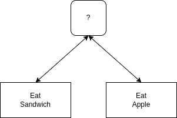

Behavior Trees (BTs) are a way to model decision-making logic,

key problem solved by behavior: **What to do next ?**

Each action needs to know
"Did I **Succeed** or **Fail**?"

The ancestors decide "What to do next?"

### Composition Of Actions
- Fallback / ? / or
- Sequence / -> / and

#### Fallback
- Eat Sandwich **or** Eat apple
- rule: if failure then tick next else return "same as chile"

#### Sequence
- Peel the banana **and** eat the banana
- Rule: If success then tick next else return "same as chile"

# TODO: Explain

## TOdo : code example
---

## Reference
- [Petter Ogren - introduction to behavior Trees](https://www.youtube.com/watch?v=KeShMInMjro&list=PLFQdM4LOGDr_vYJuo8YTRcmv3FrwczdKg)
- [py_trees](https://py-trees.readthedocs.io/en/devel/index.html)