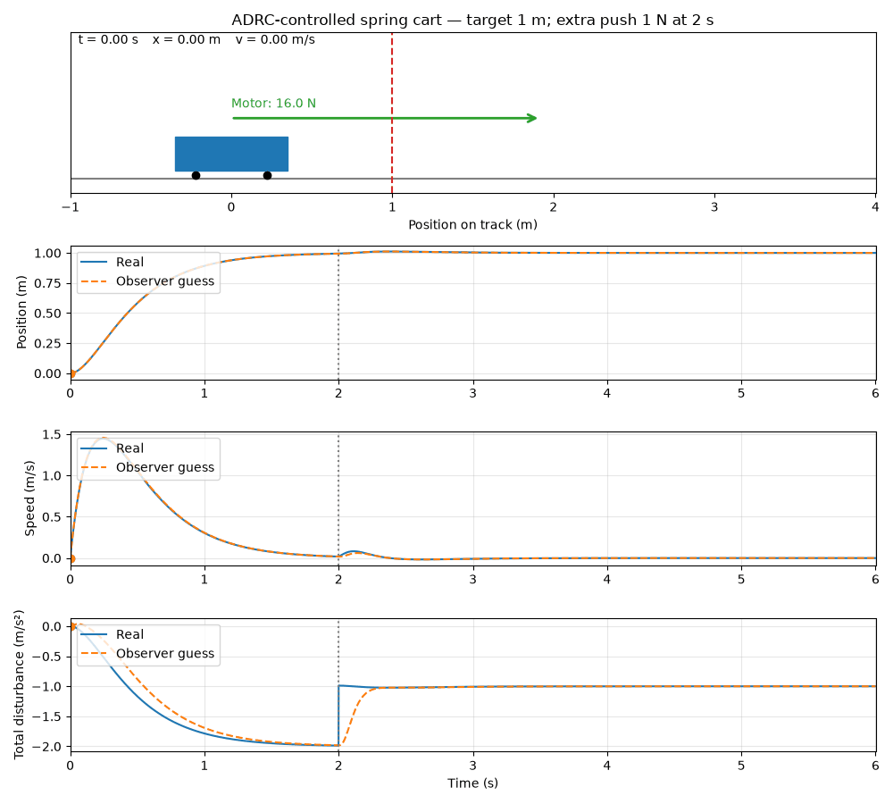

learning Active Disturbance Rejection Control (ADRC) using a simple spring–mass system without a damper.
A motor moves a cart attached to a spring. Our goal is to move the cart to a target position and hold it there, even when the spring pulls it back or an unknown external force pushes it.
We will learn how to:

1. Describe the cart’s motion using Newton’s law.
2. Use an observer to estimate velocity and the combined effect of the spring and unknown forces, using measured position and motor input.
3. Use those estimates to calculate a motor force that reaches the target, reduces bouncing, and counteracts disturbances.


### The physical system

$$
ma = u - kx + d(t)
$$

| Symbol | Meaning |
|---|---|
| \(m\) | Cart mass |
| \(a\) | Acceleration |
| \(u\) | Motor force we choose |
| \(x\) | Position relative to the spring’s resting position |
| \(k\) | Spring stiffness |
| \(d(t)\) | Unknown external force |


### Control

Goal: **Move the cart to target position and stop it there**

There are two different things we need:
- The **physical equation** describes how the cart moves.
- The **control equation** decides what motor force to apply.

#### Physical equation

$$
ma = u - kx + d(t)
$$

##### Step 2
Divide every term by mass
tells us how forces change the cart velocity

$$
a = \frac{1}{m}u - \frac{k}{m}x + \frac{d(t)}{m}
$$

##### Step 3
Group the equation into two parts

$$
b_0 = \frac{1}{m},
\qquad
f = -\frac{k}{m}x + \frac{d(t)}{m}
$$

the equation become

$$
a = b_0u + f
$$

!!! tip Read it

    Actual acceleration = acceleration from the motor + acceleration from the other effects.

The observer will estimate **f**. we do not need to calculate the spring and external push separately.

##### Step 4
Decide what acceleration we want

$$
a_{\text{wanted}} = k_p(r-x)
$$

| Symbol | Meaning |
|---|---|
| r | Constant target position |
| x | current position |
| $k_p$ | some gain |


- Cart below the target → positive acceleration.
- Cart beyond the target → negative acceleration.
- Larger position error → stronger response.

$$
a_{\text{wanted}} = k_p(r-x) - k_dv
$$

The term \(-k_dv\) opposes movement. This is braking produced by the motor, even though there is no physical damper.

##### Step 5
Find the motor force that produce that acceleration

$$
a_{\text{wanted}} = b_0u + f
$$

Subtract $f$ from both side

$$
b_0u = a_{\text{wanted}} - f
$$

Then divide by $b_0$

$$
u = \frac{a_{\text{wanted}} - f}{b_0}
$$

!!! info The subtraction is the disturbance compensation
    If the other effects already add acceleration, reduce the motor contribution. If they oppose us, increase it.


##### Step 6
We do not know the true **velocity** or **disturbance**. Our observer provides:

| Observer output | Estimates |
|---|---|
| \(z_1\) | Position \(x\) |
| \(z_2\) | Velocity \(v\) |
| \(z_3\) | Total disturbance \(f\) |

$$
a_{\text{wanted}} = k_p(r-z_1) - k_dz_2
$$

**Then use $z_3$ in place of $f$**

$$
u = \frac{k_p(r-z_1) - k_dz_2 - z_3}{b_0}
$$

<div style="border: 1px solid gray; padding: 12px;">
<b>That is our Linear ADRC control equation.</b>
</div>

---

#### Demo: use the Linear ADRC control equation

- Mass: \(1\) kg, so \(b_0=1\).
- Target: \(1\) m.
- Estimated position: \(0.5\) m.
- Estimated velocity: \(0\).
- Estimated disturbance: \(-2\ \mathrm{m/s^2}\), because the spring pulls left.
- Position gain: \(k_p=4\).

**Wanted acceleration**

$$
a_{\text{wanted}} = 4(1-0.5) = 2
$$

**The motor force is**

$$
u = \frac{2-(-2)}{1} = 4
$$

The motor contributes \(+4\ \mathrm{m/s^2}\), while the spring contributes \(-2\ \mathrm{m/s^2}\). Together, they produce the wanted \(+2\ \mathrm{m/s^2}\).


<div style="border: 1px solid gray; padding: 12px;">
<b>The controller has three jobs:

- pull toward the target,
- brake the motion.
- compensate for the estimated disturbance.</b>
</div>

---

### Demo



The animation is generated by `code/mass-spring.py`. Its `simulate()` method
steps the physical system forward in time with a 1 ms timestep:

1. It calculates the motor force from the ADRC control equation using the
   target position and the observer estimates $z_1$, $z_2$, and $z_3$.
2. It applies the motor force, the spring force $-kx$, and any external
   force to the cart, then updates its position and velocity.
3. It updates the extended state observer, which estimates position,
   velocity, and the combined disturbance.

At $t=2$ seconds, the simulation adds an unknown $1\,\mathrm{N}$ force:

$$
d(t) =
\begin{cases}
0 & t < 2 \\
1\,\mathrm{N} & t \ge 2
\end{cases}
$$

The controller is not told about this force. It only sees the cart position
and knows the force it commanded. The observer detects the resulting change
and $z_3$ converges to the total disturbance from both the spring and the
extra push. The controller then compensates for that estimate, allowing the
cart to return to the $1\,\mathrm{m}$ target and remain there.

To regenerate the animation files:

```bash
python docs/Robotics/control/adrc/code/mass-spring.py \
    --export \
    --output-dir docs/Robotics/control/adrc/media
```
