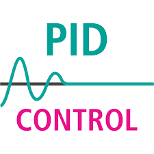
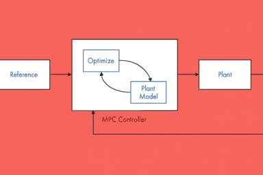

{{ page_folder_links() }}

    

        <a href="pid">
                
                
PID
</a>
    

    

        <a href="mpc">
                
                
MPC

            </a>
    

    

        <a href="geometric_control">
                
                
Geometric control

            </a>
    

---

## Resource
- [MATLAB Tech Talks: Explore the Control Systems Video Series](https://www.mathworks.com/videos/tech-talks/controls.html?s_eid=PSM_15028)
- [System Identification and MPC Design using a Low-Cost Bi-Copter Hardware](https://youtu.be/DvDSkyDHb9o)