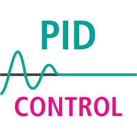
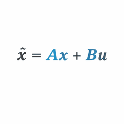

{{ page_folder_links() }}

## Course
- [Brian Douglas](https://engineeringmedia.com/)
- [Course: Introduction to Control (Engineering with Prof. Kim)](https://youtube.com/playlist?list=PLmK1EnKxphikZ4mmCz2NccSnHZb7v1wV-&si=IvlEF6JeK7zvaB7w)

    

        <a href="pid">
                
                
PID
</a>
    

     

        <a href="state_space_model">
                
                
State Space Model

            </a>
    

    

        <a href="lqr">
                
                
LQR

            </a>
    

   

---

## Resource
- [Course: Introduction to Control (Engineering with Prof. Kim)](https://youtube.com/playlist?list=PLmK1EnKxphikZ4mmCz2NccSnHZb7v1wV-&si=IvlEF6JeK7zvaB7w)
- [MATLAB Tech Talks: Explore the Control Systems Video Series](https://www.mathworks.com/videos/tech-talks/controls.html?s_eid=PSM_15028)
- [System Identification and MPC Design using a Low-Cost Bi-Copter Hardware](https://youtu.be/DvDSkyDHb9o)

## Learn
- [Differential Equations and Dynamical Systems](https://youtu.be/9fQkLQZe3u8?list=PLMrJAkhIeNNTYaOnVI3QpH7jgULnAmvPA)
- [Control Bootcamp](https://www.youtube.com/watch?v=Pi7l8mMjYVE&list=PLMrJAkhIeNNR20Mz-VpzgfQs5zrYi085m&pp=iAQB0gcJCZECa94AFGB0)

## TO READ
- [How To Derive the State Space Model for a Mobile Robot](https://automaticaddison.com/how-to-derive-the-state-space-model-for-a-mobile-robot/)