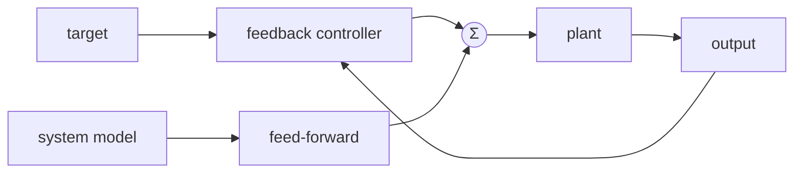
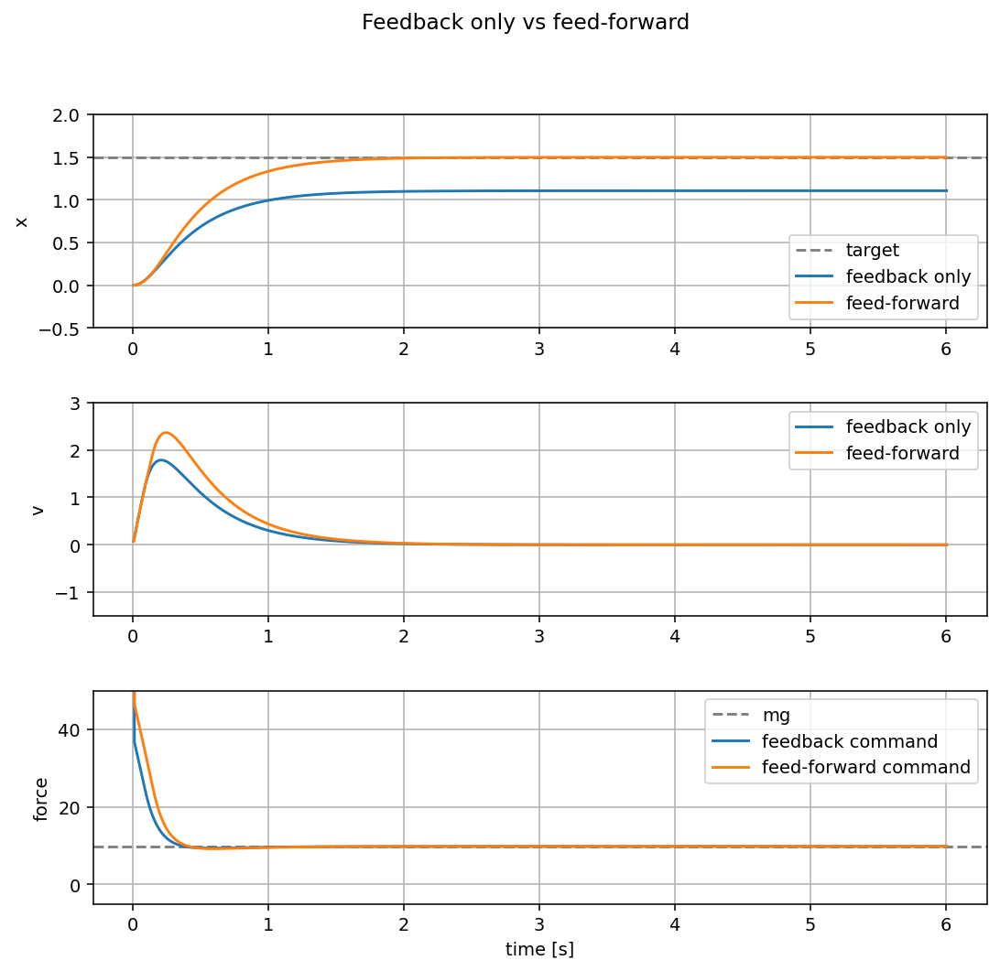

{{ page_folder_links() }}

---


## What is feed-forward control

Feedback control reacts to error after it appears. Feed-forward control adds a
command from a model of the system before waiting for error.

For example, if a robot arm joint must hold a load against gravity, the
controller already knows that some torque is needed just to hold the arm still.
Instead of waiting for the joint to fall and then correcting the error, the
controller can add the gravity compensation directly.

```text
control = feedback + feed_forward
```

Feed-forward does not replace feedback. It helps the controller start closer to
the right command. Feedback still corrects model errors, friction changes,
disturbances, and sensor noise.


---

## Simple idea

In this example the plant is a vertical mass:

```text
mass * acceleration = force - mass * gravity - damping * velocity
```

The feedback-only controller uses position error to create force. That means it
must first see an error before it can push hard enough to fight gravity.

The feed-forward controller adds the known gravity force:

```python
feed_forward = mass * gravity
control = feedback + feed_forward
```

Now the feedback term only has to move the mass and correct small errors. This
usually gives a faster and more stable response.



---

## Demo

Run the interactive demo:

```bash
python3 docs/Robotics/control/feed_forward/code/feed_forward_demo.py
```

Use the `Feedback only` button to run the controller without gravity
compensation. Use the `Feed-forward` button to run the same controller with
`mass * gravity` added to the command. `Reset` clears the graph.

The plot compares:

- `position`: how quickly the mass reaches the target height
- `velocity`: how much motion remains while settling
- `force`: the controller command, with `mg` marked as the force needed to hold
  the mass against gravity



The feed-forward case reaches the target because it starts with the force needed
to cancel gravity. The feedback-only case is slower and has steady-state error
because the controller must create gravity compensation indirectly through
position error.

