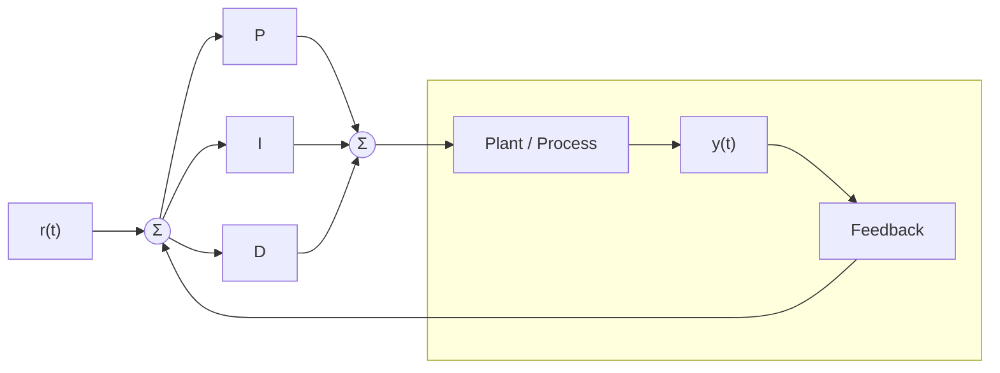
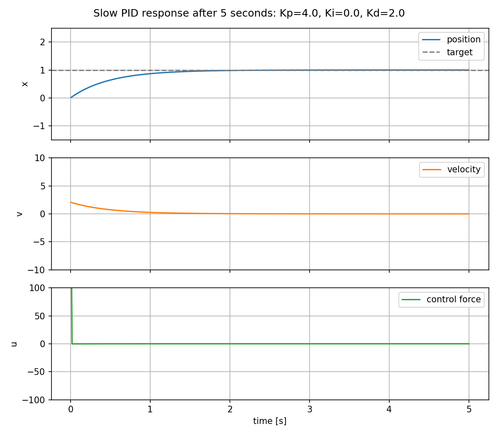
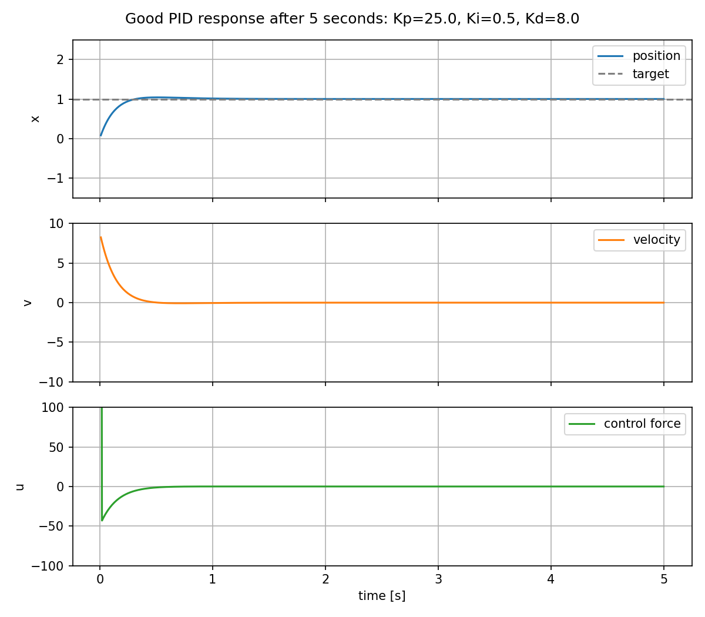
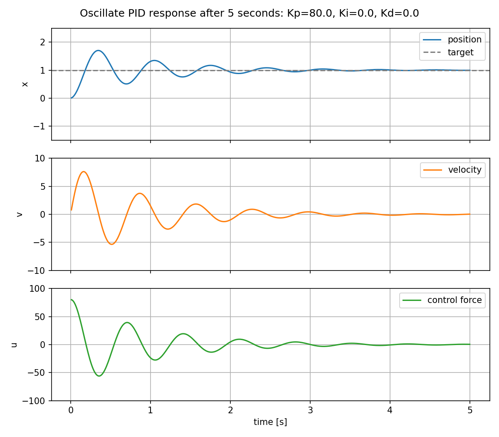

{{ page_folder_links() }}


---

## What is PID control

PID is a feedback controller. It measures the current system output, compares it
to a target, and creates a control command from the error.



## Role of P, I, and D

### P: proportional term

The proportional term reacts to the current error.

```python
self.kp * error
```

If the position is far from the target, the error is large, so the controller
applies a large force. Increasing `Kp` usually makes the system respond faster.
If `Kp` is too high, the mass can overshoot the target and oscillate.

### I: integral term

The integral term reacts to accumulated error over time.

```python
self.integral += error * dt
self.ki * self.integral
```

This helps remove steady-state error. For example, if friction or a constant
disturbance prevents the system from reaching the target exactly, the integral
term slowly grows until the controller applies enough extra force.

Too much `Ki` can make the response overshoot, oscillate, or recover slowly
because the accumulated error keeps pushing even after the system reaches the
target.

### D: derivative term

The derivative term reacts to how quickly the error is changing.

```python
derivative = (error - self.prev_error) / dt
self.kd * derivative
```

This acts like damping. It reduces overshoot by pushing against fast changes in
error. Increasing `Kd` can make the response smoother and more stable.

Too much `Kd` can make the controller sensitive to measurement noise and can
make the control command jumpy.

---

### More on PID Control

<div class="grid-container">
    <div class="grid-item">
        <a href="feed_forward">
            <h2>Feed-forward</h2>
        </a>
    </div>
    <div class="grid-item">
        <a href="windup">
            <h2>Windup</h2>
        </a>
    </div>
    
</div>

---

### Demo
In the demo code, the target is the desired position:

```python
target = 1.0
```

The measured value is the mass position:

```python
x = self.system.state.x
```

The controller computes the force applied to the mass:

```python
control_force = self.controller.compute(
    measurement=x,
    dt=self.dt,
)
```

Inside `PIDController.compute()`, the control law is:

```python
error = self.target - measurement

self.integral += error * dt
derivative = (error - self.prev_error) / dt

output = (
    self.kp * error
    + self.ki * self.integral
    + self.kd * derivative
)
```

That means:

```text
control = Kp * error + Ki * accumulated_error + Kd * error_change_rate
```

The plant in this example is a simple mass with friction:

```python
friction_force = -self.friction * self.state.v
acceleration = (force + friction_force) / self.mass

self.state.v += acceleration * dt
self.state.x += self.state.v * dt
```

So the PID controller is not directly setting the position. It applies a force,
the force changes acceleration, acceleration changes velocity, and velocity
changes position.

---


## Demo presets

Run the interactive demo:

```bash
python3 docs/Robotics/control/pid/code/simple_system.py
```

The demo has sliders for `Kp`, `Ki`, and `Kd`, plus three preset buttons:

| Preset | Gains | Expected response |
| --- | --- | --- |
| `Slow` | `Kp=4.0`, `Ki=0.0`, `Kd=2.0` | The position moves toward the target slowly. It is stable, but takes more time to settle. |
| `Good` | `Kp=25.0`, `Ki=0.5`, `Kd=8.0` | The position reaches the target quickly with limited overshoot. |
| `Oscillate` | `Kp=80.0`, `Ki=0.0`, `Kd=0.0` | The high proportional gain pushes hard with no damping, so the mass overshoots and oscillates. |

### Slow response



### Good response



### Oscillating response



Use `Start` to run the simulation and `Reset` to clear the plot. When you press a
preset button, the sliders are updated and the simulation is reset so the new
response starts from the same initial state.

Look at the three plots:

- `position`: how close the mass is to the target.
- `velocity`: how fast the mass is moving.
- `control force`: how hard the PID controller is pushing.

The goal is not always the fastest response. A useful PID tuning usually balances
rise time, overshoot, settling time, and control effort.

---

## PID terms and tuning tricks to learn

Basic words:

- **Setpoint**: the target value the controller is trying to reach.
- **Process variable**: the measured value from the system, such as position,
  speed, temperature, or pressure.
- **Error**: the difference between the setpoint and the process variable.
- **Rise time**: how long the system takes to move close to the target after a
  change in setpoint.
- **Overshoot**: how far the response goes past the target before coming back.
- **Settling time**: how long the system takes to stay near the target without
  large oscillations.
- **Steady-state error**: the remaining error after the system has mostly
  settled.
- **Control effort**: how much actuator force, torque, voltage, or command the
  controller uses.
- **Saturation**: when the actuator reaches its limit and cannot apply a larger
  command.

Practical PID tricks:

- **Integral windup**: accumulated integral error that keeps pushing the system
  even after the actuator saturates or the target is reached.
- **Anti-windup**: a technique that limits or resets the integral term when it
  would make recovery worse.
- **Integral clamp**: limiting the stored integral value so `Ki` cannot dominate
  the controller after a long error.
- **Conditional integration**: only accumulating the integral term when the
  actuator is not saturated, or when the integral is helping move out of
  saturation.
- **Integral deadband**: stopping or reducing integral accumulation when the
  error is already very small, so the controller does not hunt around the target.
- **Integral reset**: clearing the integral term when the controller mode,
  target, or operating state changes.
- **Integrator preload**: starting the integral term near the command needed for
  a known operating point, instead of always starting from zero.
- **Derivative kick**: a sharp spike in the derivative term caused by a sudden
  setpoint change.
- **Derivative on measurement**: computing `D` from the measured output instead
  of the error, often written as `D = -Kd * dy / dt`, to reduce derivative kick.
- **Derivative on output**: another name for derivative on measurement; it uses
  how fast the plant output is moving instead of how fast the error changes.
- **Derivative filtering**: smoothing the derivative term so measurement noise
  does not create a jumpy control command.
- **Low-pass sensor filtering**: filtering the measured value before the PID
  calculation when the sensor is noisy.
- **Setpoint weighting**: letting the proportional and derivative terms react
  less aggressively to setpoint changes while still correcting disturbances.
- **Feed-forward**: adding a predicted control command before feedback correction,
  such as the force needed to hold a known load.
- **Gravity compensation**: a common robotics feed-forward term that adds the
  torque or force needed to hold a link, elevator, or vertical axis.
- **Velocity feed-forward**: adding a command proportional to desired speed so
  the feedback loop does not need to create all motion from error.
- **Acceleration feed-forward**: adding a command proportional to desired
  acceleration, useful when the required force or torque is predictable.
- **Gain scheduling**: using different PID gains in different operating ranges,
  such as low speed and high speed.
- **Deadband**: ignoring very small errors when tiny corrections would cause
  actuator chatter.
- **Output deadband compensation**: adding enough command to overcome motor
  friction or static friction once the controller decides to move.
- **Output clamp**: limiting the final controller command to the actuator range.
- **Output ramp limit**: limiting how quickly the control command is allowed to
  change.
- **Slew rate limit**: another name for output ramp limiting; useful when sudden
  command jumps stress hardware or break traction.
- **Sample time**: the controller update interval; changing it affects the
  integral and derivative terms.
- **Fixed update rate**: running the PID loop at a stable `dt` so the `I` and
  `D` terms behave consistently.
- **Bumpless transfer**: switching between manual control and PID control without
  creating a sudden command jump.
- **Cascade control**: using one PID loop to command another loop, such as a
  position loop that commands a velocity loop.
- **Split-range control**: using different actuators or command ranges for
  different parts of the control effort.
- **Friction compensation**: adding a small model-based command to overcome
  static or Coulomb friction.
- **Backlash handling**: reducing aggressive corrections when gears or mechanisms
  have play before force transfers.

Integral tricks in code:

| Trick | Use when | Simple Python implementation |
| --- | --- | --- |
| Plain integral | The actuator is not saturating and the system needs steady-state error correction. | `self.integral += error * dt` |
| Integral clamp | The integral term grows too large and causes overshoot or slow recovery. | `self.integral = max(-i_limit, min(i_limit, self.integral))` |
| Output-based anti-windup | The final command is limited by the actuator. | `if output == unclamped_output: self.integral += error * dt` |
| Conditional integration | You only want to integrate when the actuator can still use the extra command. | `if not saturated: self.integral += error * dt` |
| Integral deadband | Tiny errors near the target make the controller hunt or chatter. | `if abs(error) > i_deadband: self.integral += error * dt` |
| I-zone | The integral should only work near the target, not during large moves. | `if abs(error) < i_zone: self.integral += error * dt` |
| Integral reset | The target, control mode, or enabled state changes. | `self.integral = 0.0` |
| Integrator preload | The controller already knows the command needed to hold the current state. | `self.integral = hold_command / self.ki` |
| Leaky integral | Old integral error should slowly disappear instead of staying forever. | `self.integral = leak * self.integral + error * dt` |
| Back-calculation anti-windup | The output is clamped, but you want the integral to track the real actuator command. | `self.integral += error * dt + aw_gain * (output - unclamped_output) * dt` |

Example with clamp and integral deadband:

```python
error = target - measurement

if abs(error) > i_deadband:
    self.integral += error * dt

self.integral = max(-i_limit, min(i_limit, self.integral))

output = (
    kp * error
    + ki * self.integral
    + kd * derivative
)
```

Tuning habits:

- **Start with PD tuning**: tune `Kp` for response speed, add `Kd` for damping,
  then add only enough `Ki` to remove steady-state error.
- **Tune one gain at a time**: change a single gain, run the same test, and
  compare rise time, overshoot, settling time, and control effort.
- **Use small integral gain first**: `Ki` is useful but can make the response
  slow to recover if it is too large.
- **Check actuator limits**: a gain that looks good in simulation can fail on
  real hardware if the motor, valve, or servo saturates.
- **Log the response**: record setpoint, measured output, error, PID terms, and
  final command so tuning decisions are based on data.
- **Tune around the real task**: test the moves, loads, speeds, and disturbances
  the robot will actually see.


---

## Reference
- [Understanding PID Control](https://www.mathworks.com/videos/series/understanding-pid-control.html)
- [pid alternative](docs/Robotics/control/adrc)
