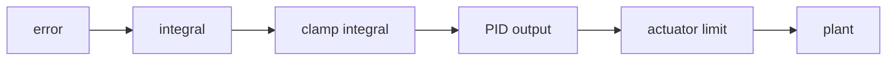
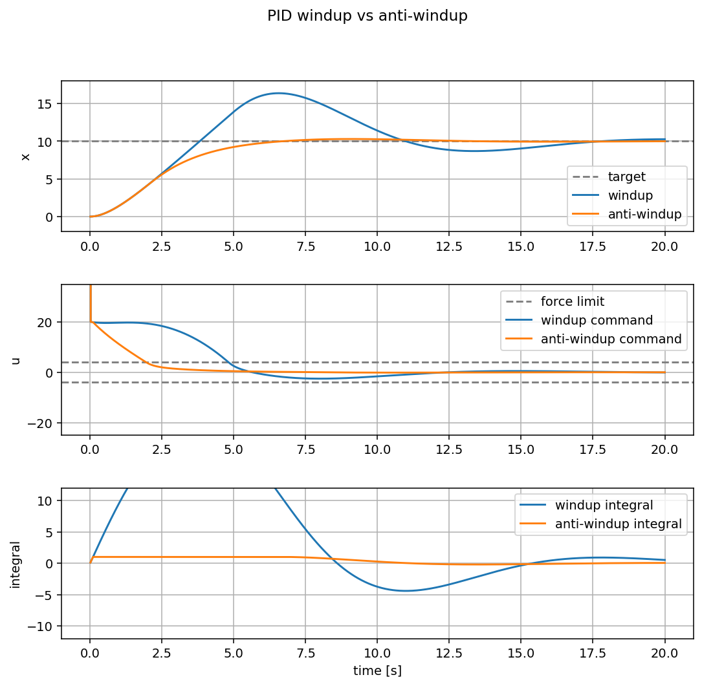

{{ page_folder_links() }}

---

## What is integral windup

Integral windup happens when the integral term keeps growing while the actuator
is already saturated.

For example, a motor command might be limited to:

```text
-10 N
```

If the PID controller asks for `40 N`, the real system still receives only
`10 N`. The error remains large, so the integral term keeps accumulating. Later,
when the system gets close to the target, the large stored integral still pushes
the plant too hard. This can create overshoot, oscillation, and slow recovery.

Windup is not the part that helps. The useful part is **anti-windup**: limiting
or correcting the integral term so the controller does not store more error than
the actuator can use.

---

## Where windup appears

This is common in robotics because actuators are limited:

- a motor has maximum torque
- a drone has maximum thrust
- a wheel has limited traction
- a servo has a maximum speed

The controller may compute a command that is physically impossible. If the
integral term does not know about that limit, it can grow in the wrong direction
for too long.

---

## Simple anti-windup idea

A simple approach is to clamp the integral term:

```python
self.integral += error * dt
self.integral = max(-integral_limit, min(integral_limit, self.integral))
```

This keeps the integral term useful for removing steady-state error, but prevents
it from dominating the response after saturation.



---

## Demo

Run the demo:

```bash
python3 docs/Robotics/control/pid/windup/code/windup_demo.py
```

Use the `Windup` button to run the controller without integral limiting. Use
the `Anti-windup` button to run the same controller with a clamped integral
term. `Reset` clears the graph.

The example compares two controllers on the same mass system:

- `without anti-windup`: the integral term can grow without a limit
- `with anti-windup`: the integral term is clamped

Both controllers use the same actuator limit, so neither one can push harder
than the plant allows. The difference is what happens to the integral term while
the actuator is saturated.

Expected result:

```text
without anti-windup: more overshoot and slower settling
with anti-windup: less overshoot and faster settling
```

The anti-windup controller is more stable because it does not keep a large
stored integral after the plant gets close to the target.


