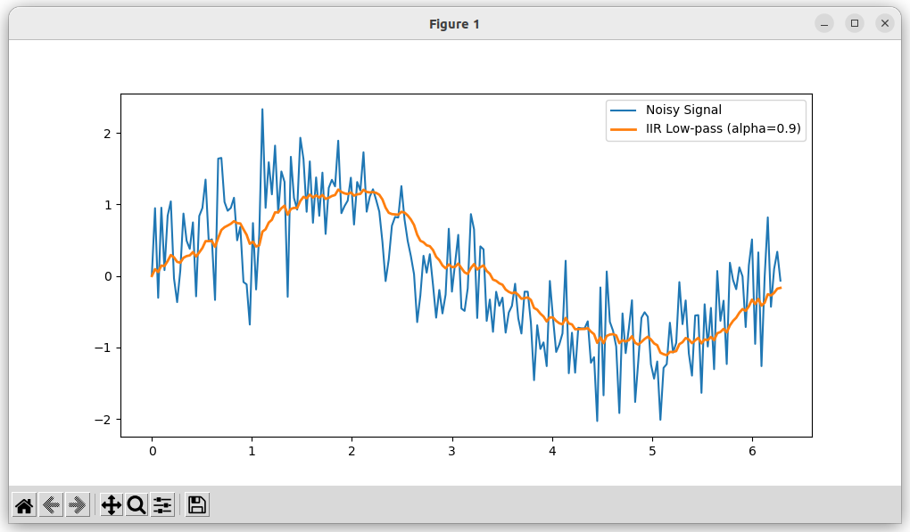
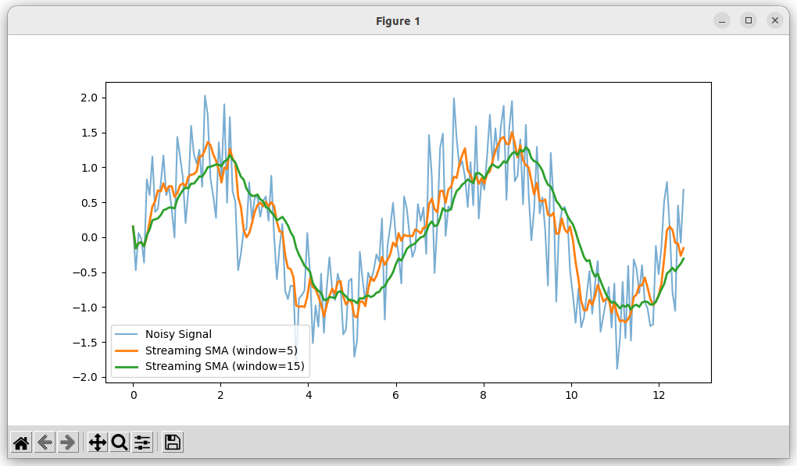

{{ page_folder_links() }}

## IIR low past filter
first-order IIR low-pass filter, also called an exponential moving average
It keeps mostly the slow trend (low frequencies) and suppresses fast changes (high frequencies).


$$y[n] = (1 - \alpha) \cdot x[n] + \alpha \cdot y[n-1]$$

- x[n] → new input sample
- y[n] → filtered output
- y[n−1] is the previous output
- α → smoothing factor (0–1)


### alfa
smoothing factor between (0–1)

- If **α is small** (e.g. 0.1), the filter reacts quickly to new changes (less smoothing).
- If **α is large** (e.g. 0.9), the filter reacts slowly, producing a smoother result.


### Demo
```python
--8<-- "docs/Robotics/filter_and_estimator/filters/code/iir.py"
```





---

## Simple moving average
It smooths a signal by taking the average of the last N samples:

$$y[n] = \frac{1}{N} \sum_{k=0}^{N-1} x[n-k]$$

!!! tip ""
    SMA is great for smoothing sensor readings like distance sensors or temperature, but not ideal for real-time fast response (since it introduces delay).
     
### Demo
```python
--8<-- "docs/Robotics/filter_and_estimator/filters/code/simple_moving_average.py"
```



!!! note ""
    The code implementation return the average event if the window buffer not **full**
     
---

## Resource
- [An Introduction to Digital Filters, without the mathematics](https://youtu.be/Qmd685msY-Y?list=PLbqhA-NKGP6Afr_KbPUuy_yIBpPR4jzWo)