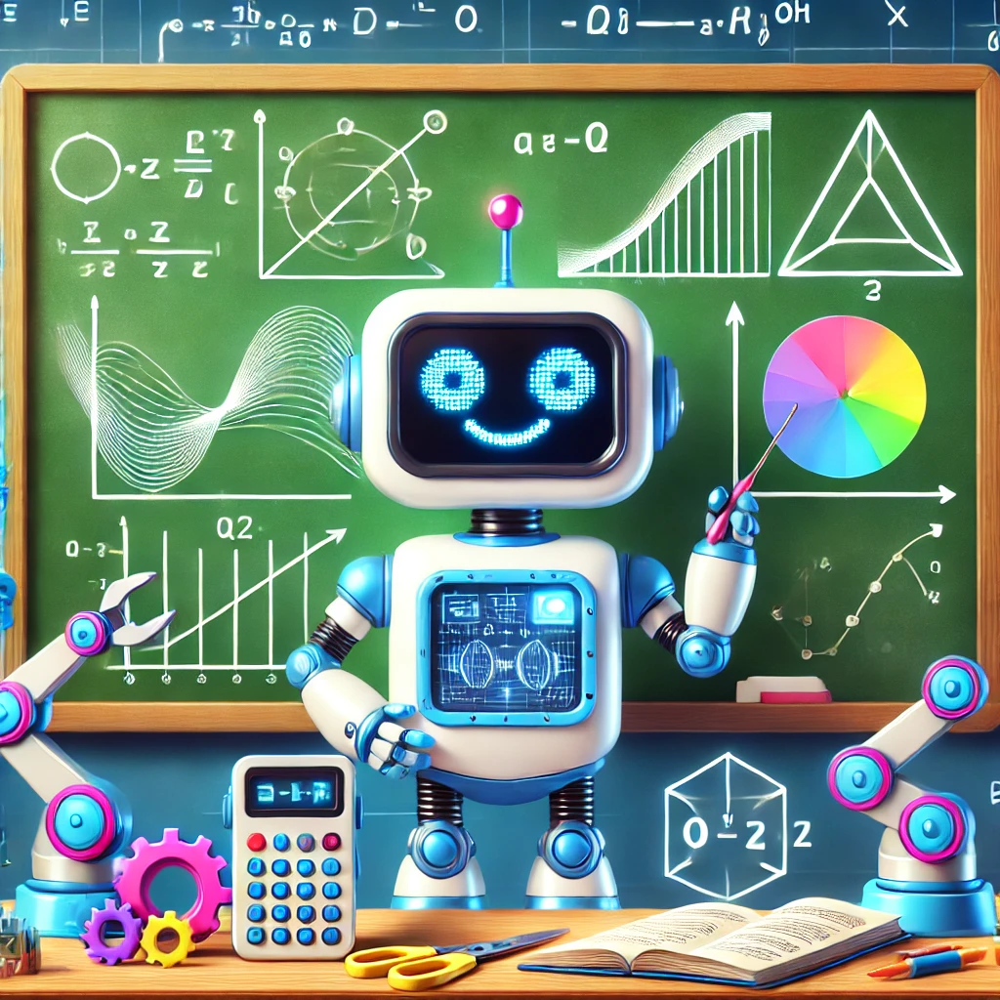
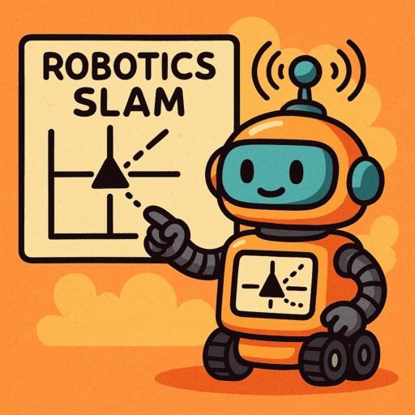
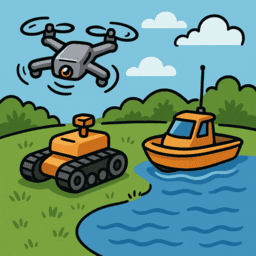
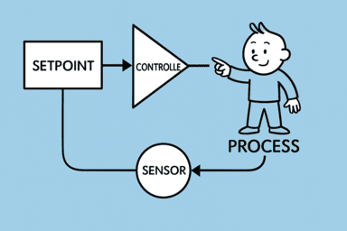
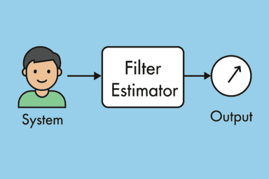

# Robotics

    

        <a href="sensors">
                
                
sensors
</a>
    

    

        <a href="math">
                
                
Math

            </a>
    

    

        <a href="slam">
                
                
SLAM

            </a>
    

    

         <a href="uav">
                
                
UxV Control

            </a>
    

    

        <a href="control">
                
                
Control

            </a>
    

    

         <a href="filter_and_estimator">
                
                
Filters and Estimators

            </a>
    

