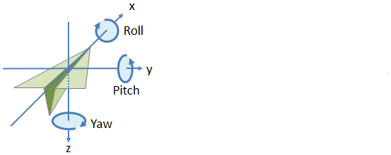
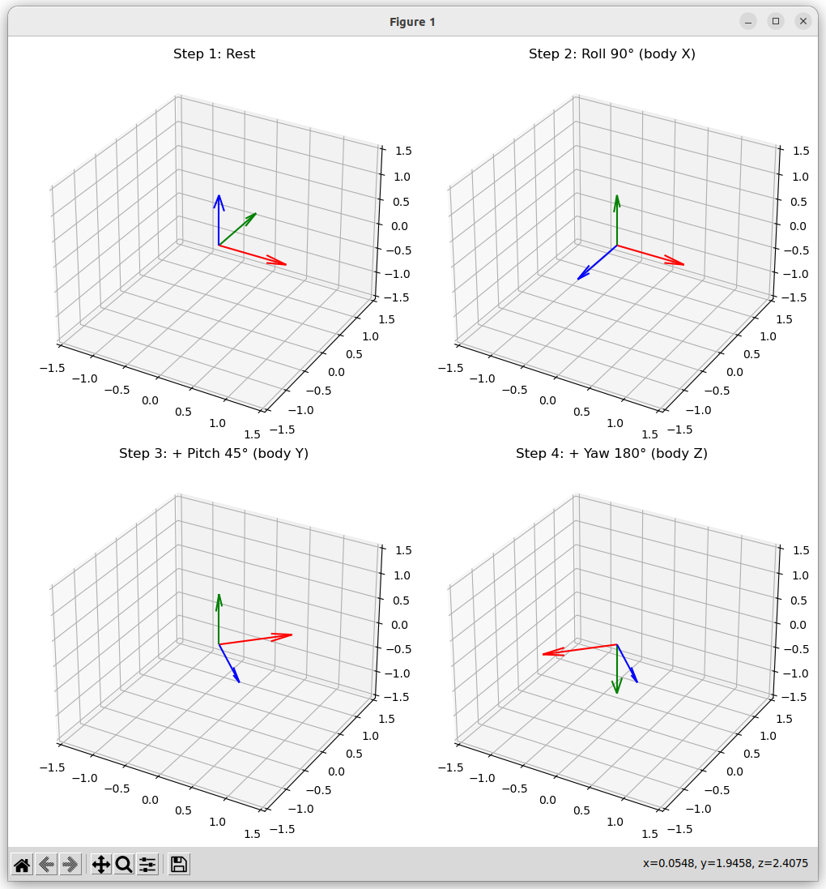
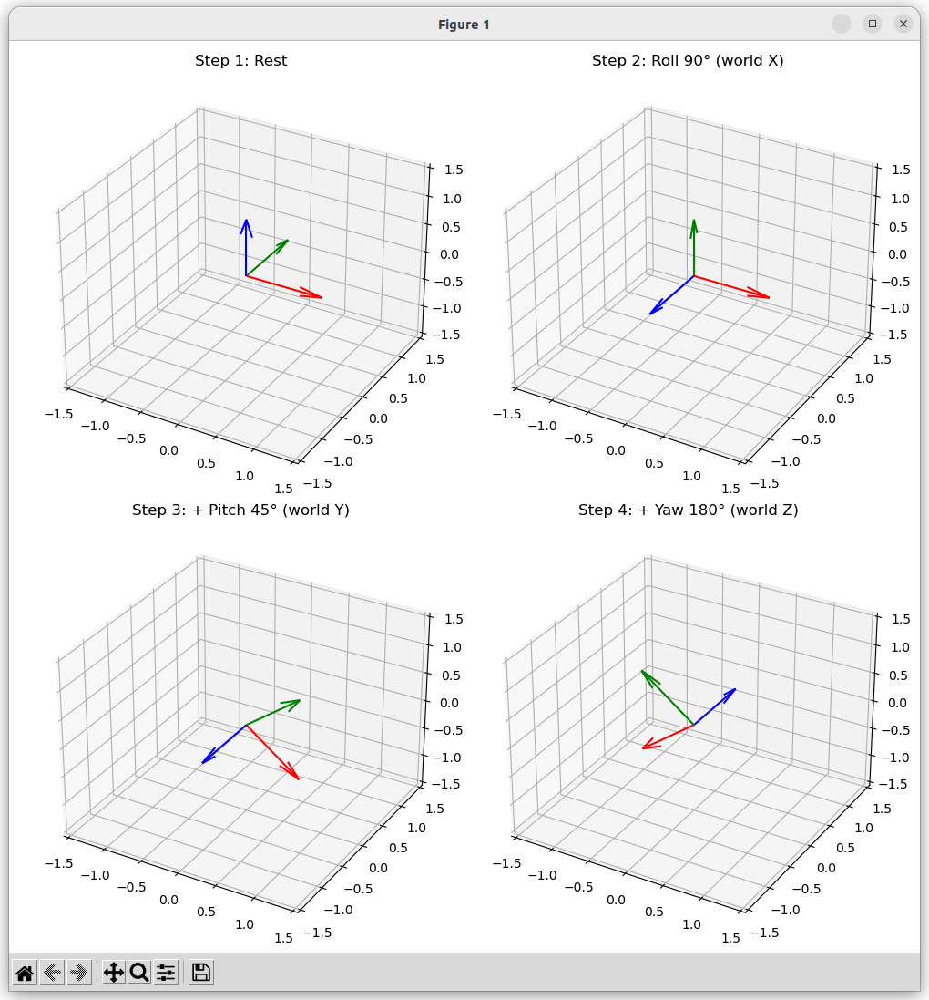
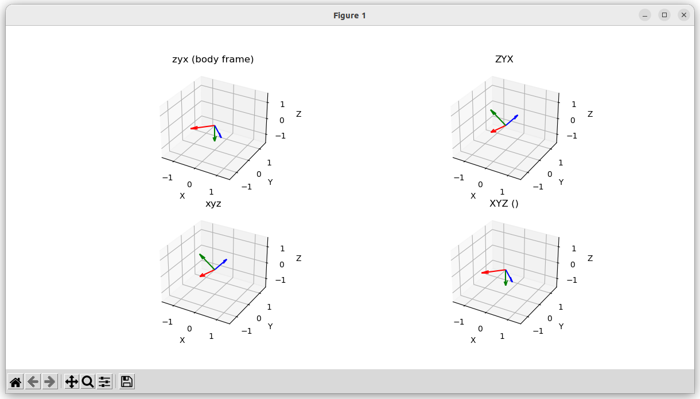

{{ page_folder_links() }}

## Tait–Bryan
Tait–Bryan angles are a way to describe orientation in 3D space using three rotations about three different axes.



- Roll (φ) → rotation about the X-axis
- Pitch (θ) → rotation about the Y-axis
- Yaw (ψ) → rotation about the Z-axis


## Intrinsic and Extrinsic

- **Intrinsic:** The rotation relative to current **body** axes , it's use in robotics and ROS
- **Extrinsic:** The rotation always relative to the fixed **world** axes

### Intrinsic
rotations are about the body axes.
$$R_{\text{intrinsic}} = R_z(\text{yaw}) \cdot R_y(\text{pitch}) \cdot R_x(\text{roll})$$

<details>
    <summary>code</summary>

```python
--8<-- "docs/Robotics/math/coordinate_system/code/intrinsic_rotation_step.py"
```
</details>





### Extrinsic
rotations are about the fixed world axes.

$$R_{\text{extrinsic}} = R_x(\text{roll}) \cdot R_y(\text{pitch}) \cdot R_z(\text{yaw})$$

<details>
    <summary>code</summary>

```python
--8<-- "docs/Robotics/math/coordinate_system/code/extrinsic_rotation_step.py"
```
</details>



---

## Rotate using scipy

- Lowercase ("xyz") = intrinsic (body-fixed).
- Uppercase ("XYZ") = extrinsic (world-fixed).


<details>
    <summary>code</summary>

```python
--8<-- "docs/Robotics/math/coordinate_system/code/rotation_with_scipy.py"
```
</details>



| Intrinsic (body axes, lowercase)      | Equivalent Extrinsic (world axes, uppercase reversed) |
| ------------------------------------- | ----------------------------------------------------- |
| `"xyz"` → roll-pitch-yaw (body x→y→z) | `"ZYX"` → yaw-pitch-roll (world z→y→x)                |
| `"xzy"`                               | `"YZX"`                                               |
| `"yxz"`                               | `"ZXY"`                                               |
| `"yzx"`                               | `"XZY"`                                               |
| `"zxy"`                               | `"YXZ"`                                               |
| `"zyx"`                               | `"XYZ"`                                               |

---
## Reference
- [Correct Explanation of Yaw, Pitch, and Roll Euler Angles with Rotation Matrices and Python Code ](https://youtu.be/R5CpG1eq5uQ)