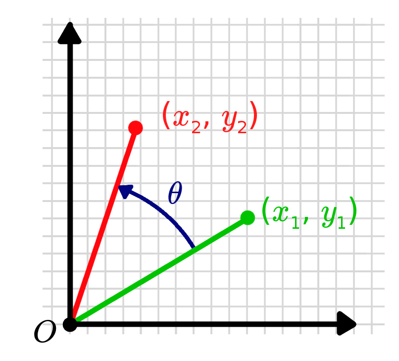
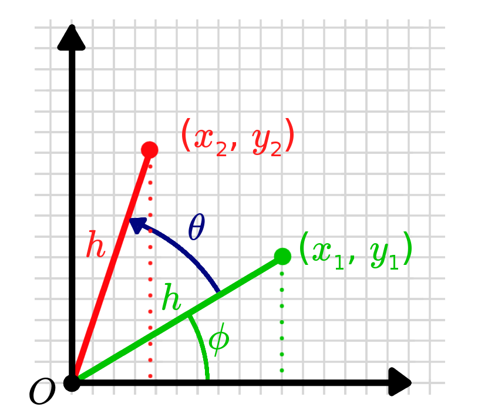
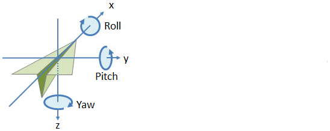
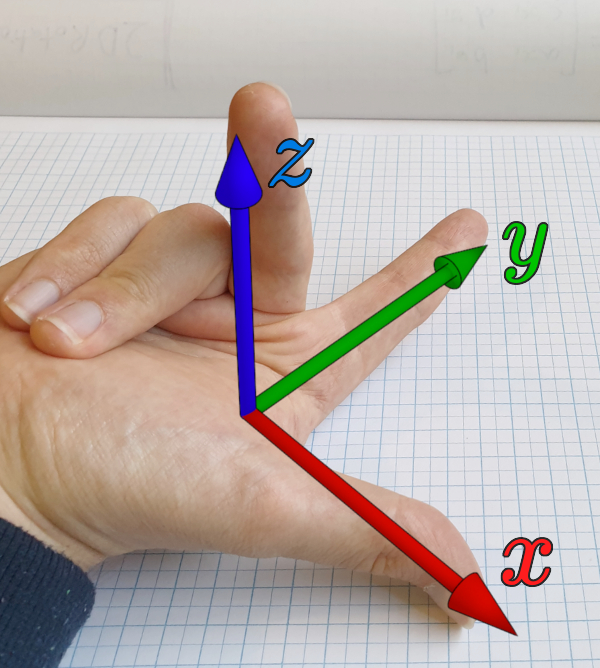
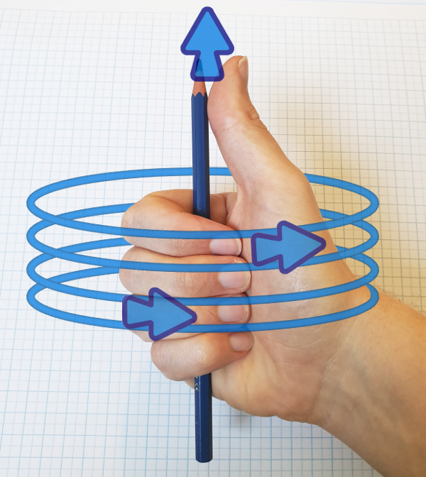
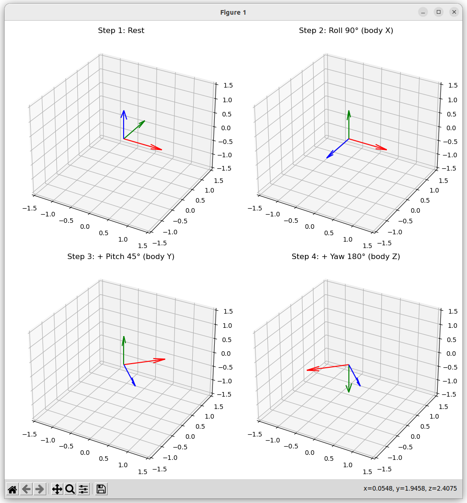
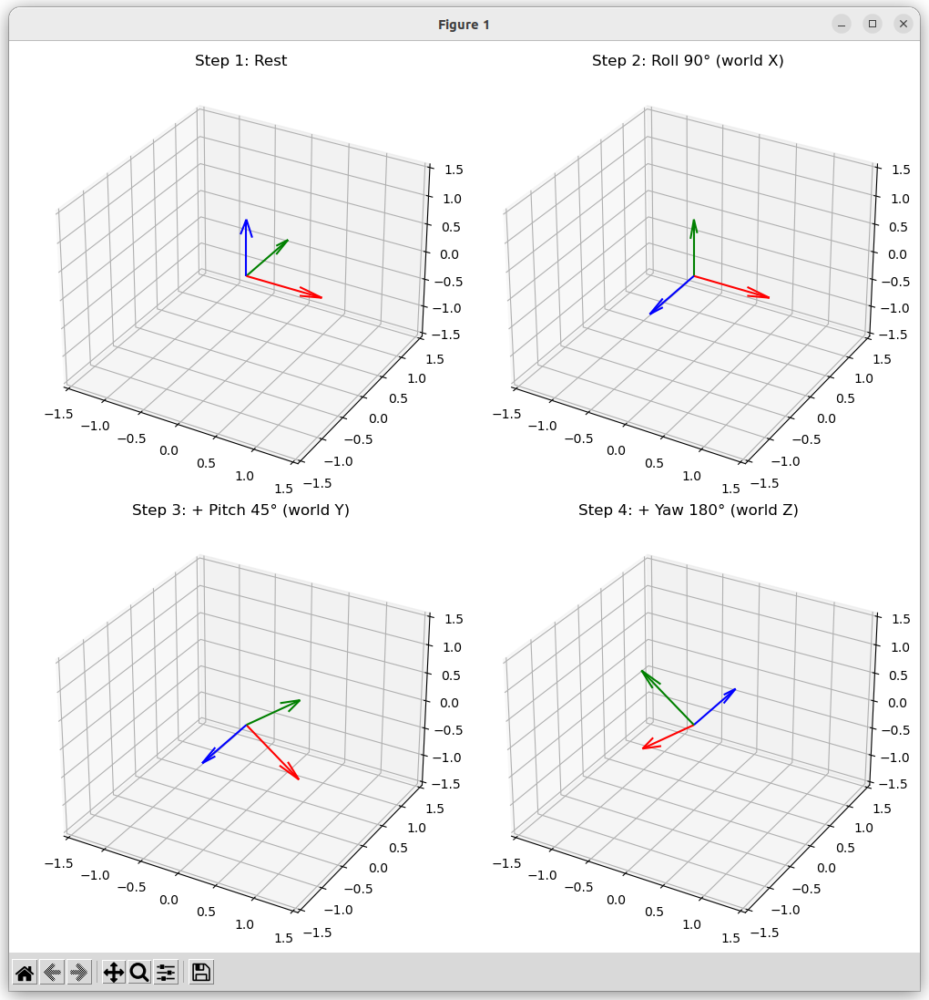
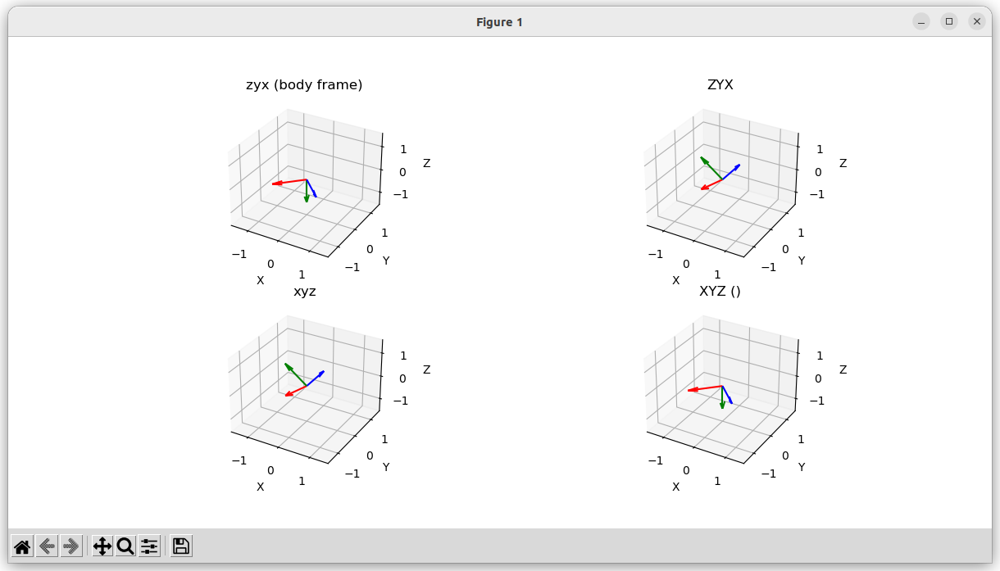

{{ page_folder_links() }}

## 2D Rotation
[articulate robotics 2D rotation](https://articulatedrobotics.xyz/tutorials/coordinate-transforms/rotation-matrices-2d)





$$
\begin{bmatrix}
x_1 \\
y_1
\end{bmatrix}=
\begin{bmatrix}
h\cos\phi  \\
h\sin\phi 
\end{bmatrix}
$$

$$
\begin{bmatrix}
x_2 \\
y_2
\end{bmatrix}=
\begin{bmatrix}
h\cos(\phi + \theta)  \\
h\sin(\phi + \theta) 
\end{bmatrix}
$$

using Trigonometric identity

$$
\cos(a+b)=\cos a\cos b-\sin a\sin b
$$


$$
\sin(a+b)=\sin a\cos b+\cos a\sin b
$$

$$
\begin{bmatrix}
x_2 \\
y_2
\end{bmatrix}=
\begin{bmatrix}
h\cos \phi\cos \theta-h\sin \phi\sin \theta  \\
h\sin \phi\cos \theta+h\cos \phi\sin \theta 
\end{bmatrix}
$$

substitute x1, y1

$$
\begin{bmatrix}
x_2 \\
y_2
\end{bmatrix}=
\begin{bmatrix}
x_1\cos\theta & -y_1\sin\theta \\
x_1\sin\theta & y_1\cos\theta
\end{bmatrix}
$$

### Matrix form
$$
\begin{bmatrix}
x_2 \\
y_2
\end{bmatrix}=
\begin{bmatrix}
\cos\theta & -\sin\theta \\
\sin\theta & \cos\theta
\end{bmatrix}
\begin{bmatrix}
x_1 \\
y_1
\end{bmatrix}
$$

### Demo


<details>
<summary>Python demo code using numpy</summary>
```python
--8<-- "docs/Robotics/math/coordinate_system/code/2d_rotation.py"
```
</details>


---

## Tait–Bryan
Tait–Bryan angles are a way to describe orientation in 3D space using three rotations about three different axes.

!!! info "euler"
    Roll–Pitch–Yaw angles are specifically called Tait–Bryan angles, which are a special case of Euler angles.



- Roll (φ) → rotation about the X-axis
- Pitch (θ) → rotation about the Y-axis
- Yaw (ψ) → rotation about the Z-axis

## 3D rotation
[articulate robotics 2D rotation](https://articulatedrobotics.xyz/tutorials/coordinate-transforms/rotations-3d)

A common convention in robotics and aerospace is the ZYX order:

$$
R = R_z(\psi)\,R_y(\theta)\,R_x(\phi)
$$

This means:

- rotate around X (roll)
- then around Y (pitch)
- then around Z (yaw)

### How to use
If you have a vector in the **body frame**

$$v =
\begin{bmatrix}
x \\
y \\
z
\end{bmatrix}$$

you rotate it to the **world frame** by

$$v' = R v$$

---

### Rotation matrix

**ROLL (X - axis)**

$$
R_x(\phi)=
\begin{bmatrix}
1 & 0 & 0 \\
0 & \cos\phi & -\sin\phi \\
0 & \sin\phi & \cos\phi
\end{bmatrix}
$$

**PITCH (Y - axis)**

$$R_y(\theta)=
\begin{bmatrix}
\cos\theta & 0 & \sin\theta \\
0 & 1 & 0 \\
-\sin\theta & 0 & \cos\theta
\end{bmatrix}$$

**YAW (Z - axis)**

$$R_z(\psi)=
\begin{bmatrix}
\cos\psi & -\sin\psi & 0 \\
\sin\psi & \cos\psi & 0 \\
0 & 0 & 1
\end{bmatrix}$$

---

## Right hand rule

- x axis: red
- y axis: green
- z axis: blue

<figure>
  
  <figcaption>
    © articulated robotics
  </figcaption>
</figure>

### Right hand grip rule
the rule tells us what direction a positive rotation around an axis goes.

<figure>
  
  <figcaption>
    © articulated robotics
  </figcaption>
</figure>


---


## Intrinsic and Extrinsic

- **Intrinsic:** The rotation relative to current **body** axes , it's use in robotics and ROS
- **Extrinsic:** The rotation always relative to the fixed **world** axes

### Intrinsic
rotations are about the body axes.

$$
R_{\text{intrinsic}} = R_z(\text{yaw}) \cdot R_y(\text{pitch}) \cdot R_x(\text{roll})
$$

<details>
    <summary>code</summary>

```python
--8<-- "docs/Robotics/math/coordinate_system/code/intrinsic_rotation_step.py"
```
</details>





### Extrinsic
rotations are about the fixed world axes.

$$R_{\text{extrinsic}} = R_x(\text{roll}) \cdot R_y(\text{pitch}) \cdot R_z(\text{yaw})$$

<details>
    <summary>code</summary>

```python
--8<-- "docs/Robotics/math/coordinate_system/code/extrinsic_rotation_step.py"
```
</details>



---

## Rotate using scipy

- Lowercase ("xyz") = intrinsic (body-fixed).
- Uppercase ("XYZ") = extrinsic (world-fixed).


<details>
    <summary>code</summary>

```python
--8<-- "docs/Robotics/math/coordinate_system/code/rotation_with_scipy.py"
```
</details>



| Intrinsic (body axes, lowercase)      | Equivalent Extrinsic (world axes, uppercase reversed) |
| ------------------------------------- | ----------------------------------------------------- |
| `"xyz"` → roll-pitch-yaw (body x→y→z) | `"ZYX"` → yaw-pitch-roll (world z→y→x)                |
| `"xzy"`                               | `"YZX"`                                               |
| `"yxz"`                               | `"ZXY"`                                               |
| `"yzx"`                               | `"XZY"`                                               |
| `"zxy"`                               | `"YXZ"`                                               |
| `"zyx"`                               | `"XYZ"`                                               |

---
## Reference
- [Correct Explanation of Yaw, Pitch, and Roll Euler Angles with Rotation Matrices and Python Code ](https://youtu.be/R5CpG1eq5uQ)