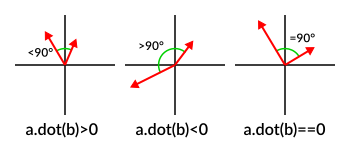
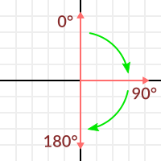
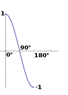

---
tags:
    - math
    - linear algebra
---


{{ page_folder_links() }}

## Unit vector
Any vector with magnitude of length 1 is considered a unit vector.

## Normalize
scale down a vector to magnitude of 1, while preserving the direction

$$
\left\| v \right\| = \sqrt{x^{2}+y^{2}+z^{2}}
$$

$$
u=\frac{v}{\left\| v \right\|}
$$

```python
import numpy as np

v = np.array([1,1])
magnitude = np.linalg.norm(v)
normalize_v = v / magnitude
print(normalize_v)
```

## Dot product
[stackoverflow](https://stackoverflow.com/questions/10002918/what-is-the-need-for-normalizing-a-vector)
[godot vector math](https://docs.godotengine.org/en/stable/tutorials/math/vector_math.html)
The dot product takes two vectors and returns a scalar:

```
var s = a.x*b.x + a.y*b.y + a.z*b.z
```

```
var s = a.dot(b)
```



- If the number is greater than zero, both are looking towards the same direction (the angle between them is < 90° degrees). 
- If the number is less than zero, both are looking towards opposite direction (the angle between them is > 90° degrees). 
- If the number is zero, vectors are shaped in L (the angle between them is 90° degrees).

### dot product on unit vector

- If both vectors are facing towards the exact same direction (parallel to each other, angle between them is 0°), the resulting scalar is 1. 
- If both vectors are facing towards the exact opposite direction (parallel to each other, but angle between them is 180°), the resulting scalar is -1. 
- If their angle is 90°, then dot product is 0




This means that dot product between unit vectors is always between the range of 1 and -1



The dot product between two unit vectors is the **cosine** of the **angle** between those two vectors. So, to obtain the angle between two vectors.

```
angle_in_radians = acos( a.dot(b) )
# a and b are unit vector
```