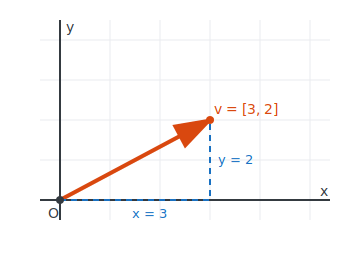
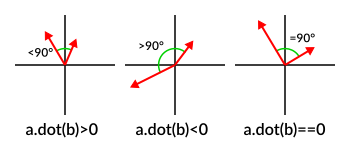
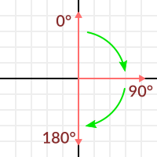
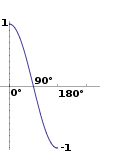

{{ page_folder_links() }}

## Vector
A vector is a quantity with both magnitude and direction, often written as a list of components such as `[x, y]` or `[x, y, z]`.



In 2D, the vector `[3, 2]` starts at the origin, moves 3 units on the x-axis, then 2 units on the y-axis. The arrow shows the vector's direction and length.

### Create vector using numpy

```python
import numpy as np

v = np.array([3, 2])

print(type(v))
print(v.shape)   # vector dimensions, for example (2,)
print(v.ndim)    # number of dimensions, for a vector usually 1
print(v.dtype)   # data type, for example int64 or float64
print(v.size)    # number of elements

#
<class 'numpy.ndarray'>
(2,)
1
int64
2
```

### Common ndarray method

#### reshape

reshape() changes the shape of a NumPy array without changing its values.

```python
import numpy as np

v = np.array([3, 2])
print("data: ", v)
print("1D array ", v.shape)
v = v.reshape(1,2)
print("data: ", v)
print("2D array (matrix) ", v.shape)
```

```
data:  [3 2]
1D array  (2,)
data:  [[3 2]]
2D array (matrix)  (1, 2)
```

---

## Unit vector
Any vector with magnitude of length 1 is considered a unit vector.

## Normalize
scale down a vector to magnitude of 1, while preserving the direction

$$
\left\| v \right\| = \sqrt{x^{2}+y^{2}+z^{2}}
$$

$$
u=\frac{v}{\left\| v \right\|}
$$

```python
import numpy as np

v = np.array([1,1])
magnitude = np.linalg.norm(v)
normalize_v = v / magnitude
print(normalize_v)
```

## Dot product
[stackoverflow](https://stackoverflow.com/questions/10002918/what-is-the-need-for-normalizing-a-vector)
[godot vector math](https://docs.godotengine.org/en/stable/tutorials/math/vector_math.html)
The dot product takes two vectors and returns a scalar:

```
var s = a.x*b.x + a.y*b.y + a.z*b.z
```

```
var s = a.dot(b)
```



- If the number is greater than zero, both are looking towards the same direction (the angle between them is < 90° degrees). 
- If the number is less than zero, both are looking towards opposite direction (the angle between them is > 90° degrees). 
- If the number is zero, vectors are shaped in L (the angle between them is 90° degrees).

### dot product on unit vector

- If both vectors are facing towards the exact same direction (parallel to each other, angle between them is 0°), the resulting scalar is 1. 
- If both vectors are facing towards the exact opposite direction (parallel to each other, but angle between them is 180°), the resulting scalar is -1. 
- If their angle is 90°, then dot product is 0




This means that dot product between unit vectors is always between the range of 1 and -1



The dot product between two unit vectors is the **cosine** of the **angle** between those two vectors. So, to obtain the angle between two vectors.

```
angle_in_radians = acos( a.dot(b) )
# a and b are unit vector
```

---

## Cross product
[3Blue1Brown - cross product](https://youtu.be/eu6i7WJeinw)

---

## Inverse matrix

### Inverse 2*2 Matrix
[Inverse of a 2*2 Matrix](https://youtu.be/aiBgjz5xbyg)

$$A =
\begin{bmatrix}
a & b \\
c & d
\end{bmatrix}$$

#### Check determinate

$$
\det(A) = ad - bc
$$

Inverse (if determinate != 0)

$$
A^{-1} = \frac{1}{ad - bc}
\begin{bmatrix}
d & -b \\
-c & a
\end{bmatrix}
$$

### Inverse 3*3 matrix
[Inverse of a 3*3 Matrix](https://youtu.be/Fg7_mv3izR0)


```python
import numpy as np

A = np.array([
    [1, 2, 3],
    [0, 1, 4],
    [5, 6, 0]
])

A_inv = np.linalg.inv(A)

print("A inverse:\n", A_inv)
```
