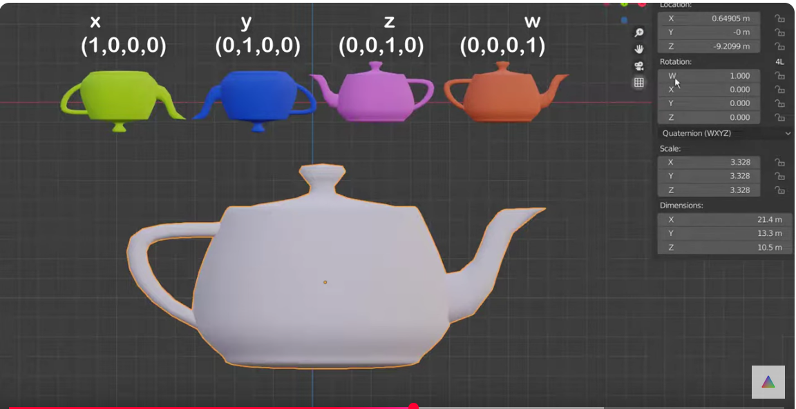

{{ page_folder_links() }}

Quaternions are an alternate way to describe **orientation** or **rotations** in 3D space using an ordered set of four numbers. They have the ability to uniquely describe any three-dimensional rotation about an arbitrary axis and do not suffer from gimbal lock

[Quaternions without math](https://youtu.be/1yoFjjJRnLY)

### Unit quaternion
A unit quaternion used for representing 3D rotation

### Slerp

### Inverse

### Multiple
- by vector
- by quaternion

Quaternion multiplication is used to combine rotations in 3D space

[watch again](https://youtu.be/jTgdKoQv738)