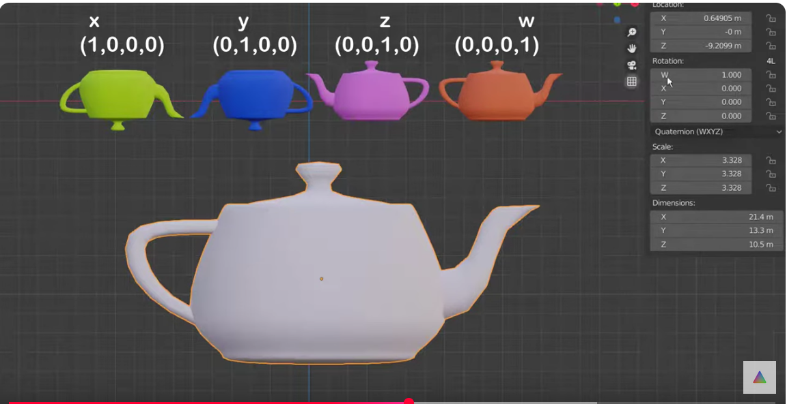
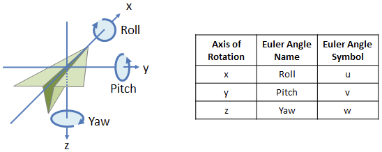
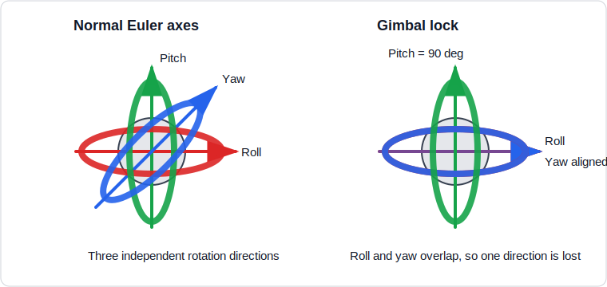
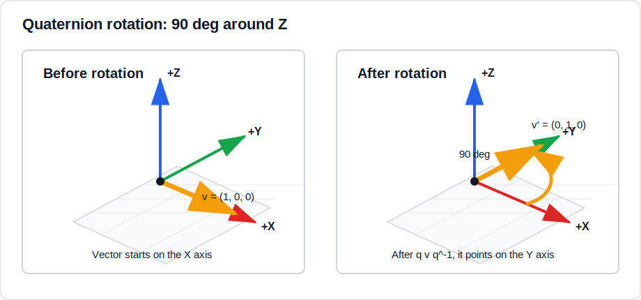

{{ page_folder_links() }}

Quaternions are an alternate way to describe **orientation** or **rotations** in 3D space using an ordered set of four numbers. They have the ability to uniquely describe any three-dimensional rotation about an arbitrary axis and do not suffer from gimbal lock

- [Video:  How to Use Quaternions ](https://youtu.be/bKd2lPjl92c)
- [Video: Quaternions without math](https://youtu.be/1yoFjjJRnLY)




## Euler angels

Euler angles describe a 3D orientation as **three ordered rotations** around
axes. A common order is:

- **Roll**: rotate around `X`
- **Pitch**: rotate around `Y`
- **Yaw**: rotate around `Z`

The important detail is that the **order matters**. `roll -> pitch -> yaw` is
not always the same result as `yaw -> pitch -> roll`.



### Gimbal lock

Gimbal lock happens when two rotation axes become aligned, so one degree of
freedom is lost. With Euler angles this can happen when the pitch reaches
`90 deg`.



Short example:

```text
roll  = 30 deg
pitch = 90 deg
yaw   = 20 deg
```

At `pitch = 90 deg`, changing roll and changing yaw can produce the same kind
of movement. The system can no longer clearly represent all three independent
rotations. This is one reason robotics, graphics, and 3D engines often use
quaternions internally.

---

## Quaternion idea

- Instead of **Euler** saying "Rotate X, then Y, then Z"
- a **quaternion** says "Rotate by θ degrees around this axis."


#### Example: rotate 90 deg around Z

Start with a vector that points on the `X` axis:

$$
v = (1, 0, 0)
$$

Rotate it `90 deg` around the `Z` axis:

$$
axis = (0, 0, 1), \quad \theta = 90^\circ
$$

The quaternion for an axis-angle rotation is:

$$
q = (w, x, y, z)
$$

Where:

$$
w = \cos\frac{\theta}{2}
$$

$$
x = a_x \sin\frac{\theta}{2}
$$

$$
y = a_y \sin\frac{\theta}{2}
$$

$$
z = a_z \sin\frac{\theta}{2}
$$

`a = (a_x, a_y, a_z)` is the rotation axis. It should be a **unit vector**,
meaning its length is `1`:

$$
\|a\| = \sqrt{a_x^2 + a_y^2 + a_z^2} = 1
$$

For example, the `Z` axis is already a [unit](#unit-quaternion) vector:

$$
a = (0, 0, 1)
$$

So the compact form is:

$$
q = \left(\cos\frac{\theta}{2},\ axis_x\sin\frac{\theta}{2},\ axis_y\sin\frac{\theta}{2},\ axis_z\sin\frac{\theta}{2}\right)
$$

For `90 deg` around `Z`:

$$
q = \left(\cos45^\circ,\ 0,\ 0,\ \sin45^\circ\right)
$$

$$
q \approx (0.707,\ 0,\ 0,\ 0.707)
$$

To rotate a vector with a quaternion, first write the vector as a **pure
quaternion**. A pure quaternion has `w = 0`:

$$
v = (1, 0, 0) \quad \Rightarrow \quad v_q = (0,\ 1,\ 0,\ 0)
$$

Here we use the order `(w, x, y, z)`.

The rotation formula is:

$$
v' = q v_q q^{-1}
$$

Because this is a unit quaternion, the [inverse](#inverse) is:

$$
q^{-1} = (0.707,\ 0,\ 0,\ -0.707)
$$

Now multiply in two steps:

$$
q v_q =
(0.707,\ 0,\ 0,\ 0.707)(0,\ 1,\ 0,\ 0)
= (0,\ 0.707,\ 0.707,\ 0)
$$

Then multiply by the inverse:

$$
(q v_q)q^{-1}
= (0,\ 0.707,\ 0.707,\ 0)(0.707,\ 0,\ 0,\ -0.707)
= (0,\ 0,\ 1,\ 0)
$$

Drop the `w` part and keep only `(x, y, z)`:

$$
v' = (0,\ 1,\ 0)
$$

So:

$$
(1, 0, 0) \rightarrow (0, 1, 0)
$$

!!! tip "How to multiply two quaternions"
    Use the same order everywhere. In this page the order is `(w, x, y, z)`.

    For:

    ```text
    q1 = (w1, x1, y1, z1)
    q2 = (w2, x2, y2, z2)
    ```

    The multiplication is:

    ```text
    q1 * q2 = (
      w1*w2 - x1*x2 - y1*y2 - z1*z2,
      w1*x2 + x1*w2 + y1*z2 - z1*y2,
      w1*y2 - x1*z2 + y1*w2 + z1*x2,
      w1*z2 + x1*y2 - y1*x2 + z1*w2
    )
    ```

    Example from the `90 deg` Z rotation:

    ```text
    q = (0.707, 0, 0, 0.707)
    v = (0, 1, 0, 0)

    q * v = (0, 0.707, 0.707, 0)
    ```

    Then multiply by the inverse:

    ```text
    q^-1 = (0.707, 0, 0, -0.707)

    (q * v) * q^-1 = (0, 0, 1, 0)
    ```

    Drop `w`, so the rotated vector is `(0, 1, 0)`.

The vector that pointed along `X` now points along `Y`.




---

## Interactive 3D demo

This example embeds a small Three.js scene in the markdown page. Use the
sliders to change **roll**, **pitch**, and **yaw**.

The blue arrow is the forward direction. The orange wing and green up marker
show why direction alone is not enough for full 3D orientation: after pitch and
yaw aim the vector, roll still controls which side of the body is up.

<iframe
    src="threejs/quaternion_demo.html"
    width="100%"
    height="520"
    frameborder="0"
    loading="lazy">
</iframe>

The embedded page is a normal HTML file:

```text
docs/Robotics/math/quaternion/threejs/quaternion_demo.html
```

---

<div class="grid-container">
    <div class="grid-item">
        <a href="slerp">
                <p>slerp</p>
        </a>
    </div>
</div>

---

## Quaternion

### Unit quaternion
A unit quaternion like unit vector is simply a vector with length (magnitude) equal to 1, but pointing in the same direction as the original vector.

quaternion:
$$q = w + xi + yj + zk$$

as a vector
$$q = (w, x, y, z)$$

calc the **norm**
$$\|q\| = \sqrt{w^2 + x^2 + y^2 + z^2}$$

calc **unit quaternion**
$$q_{unit} = \frac{q}{\|q\|} = \left(\frac{w}{\|q\|}, \frac{x}{\|q\|}, \frac{y}{\|q\|}, \frac{z}{\|q\|}\right)$$


<details>
    <summary>code example</summary>

```python
--8<-- "docs/Robotics/math/quaternion/code/unit_quaternion.py"
```
</details>


---

### Conjugate
A quaternion is:

$$
q = (x, y, z, w)
$$

The conjugate is:

$$
q^* = (-x, -y, -z, w)
$$

!!! note "flip the signs of x, y, z, keep w the same."
     
---


---

### Inverse

!!! tip "unit quaternion"
     If q is a unit quaternion (∥q∥=1), then the **conjugate** is also the **inverse**.


when not unit length

$$q^{-1} = \frac{q^*}{\|q\|^2}$$

$$q \cdot q^{-1} = 1$$

---

### Multiple
#### by vector

$$\mathbf{v}' = q \, \mathbf{v} \, q^{-1}$$

we treat the vector as pure quaternion

$$\mathbf{v} = (0, v_x, v_y, v_z)$$


<details>
    <summary>Numpy Example</summary>

```python
--8<-- "docs/Robotics/math/quaternion/code/multiple.py"
```
</details>


#### by quaternion

Quaternion multiplication is used to combine rotations in 3D space


$$q_1 = (w_1, x_1, y_1, z_1), \quad q_2 = (w_2, x_2, y_2, z_2)$$

$$q = q_2 \cdot q_1 = 
\Big( 
w_2 w_1 - x_2 x_1 - y_2 y_1 - z_2 z_1, \;
w_2 x_1 + x_2 w_1 + y_2 z_1 - z_2 y_1, \;
w_2 y_1 - x_2 z_1 + y_2 w_1 + z_2 x_1, \;
w_2 z_1 + x_2 y_1 - y_2 x_1 + z_2 w_1
\Big)$$


!!! warning 
    $$q_2 q_1 \neq q_1 q_2$$
     
---

## Reference
[watch again](https://youtu.be/jTgdKoQv738)
