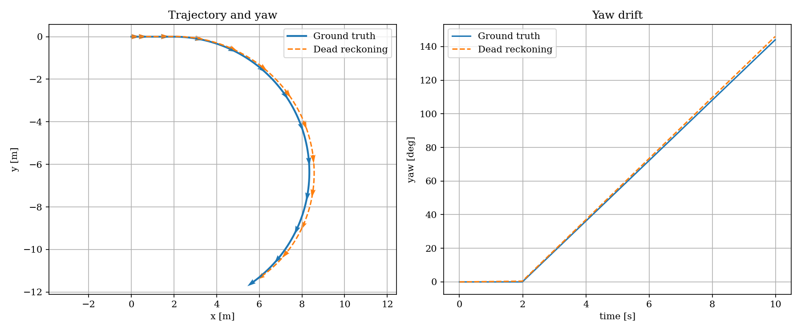

**Estimating your current position from a previously known position, using how you have moved since then.**

$$
\text{new position}
=
\text{old position}
+
\text{estimated movement}
$$

Dead reckoning with an IMU means estimating where you are now by starting from a known state and continuously integrating the IMU measurements.

```
Gyroscope ──► Orientation
                  │
Accelerometer ────┤
                  ▼
          Remove gravity
                  │
                  ▼
             Acceleration
                  │ integrate
                  ▼
               Velocity
                  │ integrate
                  ▼
               Position
```


## IMU

- **Gyroscope** → angular velocity [rad/s]
- **Accelerometer** → specific force [m/s²]
- Sometimes a **magnetometer** → magnetic heading

The important complication is that the accelerometer measurements are in the **IMU/body coordinate frame**, while navigation usually needs acceleration in a fixed **world/navigation frame**.

## Orientation estimate
Using gyro to update orientation

$\theta_{k+1} = \theta_k + \omega_k\Delta t$

!!! info "Quaternion"


## Transform acceleration

- Rotate acceleration from body frame to world frame
- Remove gravity
- Integrated acceleration to velocity
- Integrated velocity to position
- 
$a_{world} = R_{body\rightarrow world}a_{imu}$
    

```
IMU measurement
      │
      │ rotate
      ▼
 World frame
      │
      │ remove gravity ≈ 9.81 m/s²
      ▼
 Linear acceleration ≈ 0
```

### Acceleration to velocity
$v_{k+1}=v_k+a_k\Delta t$


### Velocity to position
$p_{k+1}=p_k+v_k\Delta t+\frac12a_k\Delta t^2$


$\boxed{\text{IMU} \rightarrow \text{orientation} \rightarrow
\text{linear acceleration} \rightarrow \text{velocity} \rightarrow
\text{position}}$


---

## Drift noise and integrator

The most influence imu error on dead reckoning

| Priority | Error                        | Sensor       | What happens                             | Main compensation                    |
| -------- | ---------------------------- | ------------ | ---------------------------------------- | ------------------------------------ |
| 🔴 **1** | **Bias**                     | Accel + Gyro | Constant/slow offset gets integrated     | Calibration + EKF bias estimation    |
| 🔴 **2** | **White noise**              | Accel + Gyro | Random measurement variation accumulates | Filtering + sensor fusion            |
| 🔴 **3** | **Bias drift / random walk** | Accel + Gyro | Bias slowly changes over time            | EKF + external measurements          |
| 🟠 **4** | **Temperature drift**        | Accel + Gyro | Bias changes as IMU temperature changes  | Temperature calibration/compensation |


### Accelerometer bias

The sensor might report:

$$
a_{measured} = a_{true} + b_a
$$

For example, when true acceleration is zero:

$$
a_{true} = 0
$$

but the IMU reports:

$$
a_{measured} = 0.02\;m/s^2
$$

Dead reckoning integrates it twice:

$$
\boxed{0.02 \xrightarrow{\int} \text{velocity error}
\xrightarrow{\int} \text{position error}}
$$

Position error grows roughly with:

$$
e_p \propto t^2
$$

So this is very important.

### Gyro bias

The gyro might say:

$$
\omega_z = 0.1^\circ/s
$$

even though the robot is not rotating.

Because you integrate the gyro:

$$
\omega \xrightarrow{\int} q
$$

your quaternion slowly rotates even while the robot is stationary.

This produces an even more dangerous chain:

```text
gyro bias
    ↓
wrong quaternion
    ↓
wrong body → world rotation
    ↓
gravity points slightly wrong
    ↓
gravity looks like acceleration
    ↓
wrong velocity
    ↓
wrong position
```

For a first simulator, simplify the entire IMU error model to:

$$
\boxed{\text{measurement} = \text{truth} + \text{bias} + \text{white noise}}
$$

For the accelerometer:

$$
a_m = a_{true} + b_a + n_a
$$

and the gyro:

$$
\omega_m = \omega_{true} + b_g + n_g
$$

Once you understand what those four terms—truth, bias, white noise, and
integration—do to dead reckoning, add slowly changing bias. That is enough to
understand most of the fundamental IMU navigation problem.

### Can bias be calibrated?

Bias can be calibrated, but it can also change while the IMU is operating.

- **Constant bias:** Keep the IMU stationary, measure its average output, and
  subtract that offset.
- **Temperature-dependent bias:** Calibrate at several temperatures or use the
  IMU temperature measurement for compensation.
- **Bias drift:** Time, temperature, vibration, and sensor aging can slowly
  change the bias, so initial calibration cannot remove it completely.
- **In-run estimation:** An EKF can continuously estimate bias using references
  such as GNSS, wheel odometry, cameras, or known stationary periods.

A simple changing-bias model is:

$$
b_{k+1} = b_k + w_b
$$

where $w_b$ is a small random change. The measurement model becomes:

$$
z_k = x_k + b_k + n_k
$$

In practice, calibrate the initial bias and then estimate how it changes during
operation. Without an external reference or a known stationary period, bias and
real motion can be difficult or impossible to distinguish.

---

## Demo

!!! tip "install c4dynamics"
    
    ```bash
    pip install c4dynamics
    ```

This demo uses C4Dynamics to model the robot as a rigid body and simulate noisy,
biased IMU measurements. The dead-reckoning calculations remain explicit so the
resulting position and heading drift can be compared with the simulated ground truth.

### Scenario

The robot accelerates from rest for two seconds. It then travels at a constant
speed while turning left at $18^\circ/s$. The simulated IMU adds white noise and
constant accelerometer and gyroscope biases to the true motion.

The dead-reckoning estimate knows only its initial state. It integrates the noisy
gyroscope measurement to estimate yaw, rotates the measured acceleration into the
world frame, and integrates acceleration twice to estimate position.

<details>
<summary>hello_dead.py</summary>

```python
--8<-- "docs/Robotics/navigation/dead_reckoning/code/hello_dead.py"
```

</details>

### Result

The estimates begin close to the ground truth, then separate as noise and bias are
integrated. The heading arrows show how gyro bias changes the estimated orientation;
that orientation error also rotates acceleration into the wrong world direction and
increases the position error.


