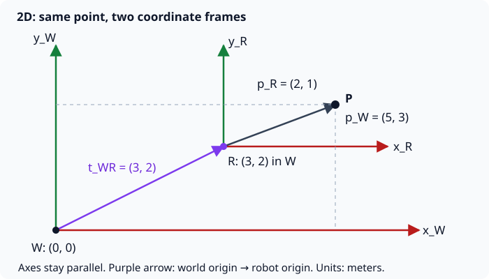
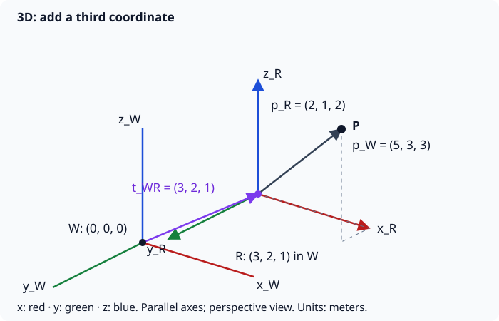

# Geometry and coordinate frames

[Back to the SLAM learning path](index.md)

## Geometry study order

→ Coordinate frames
→ translation 
→ rotation matrices 
→ homogeneous transforms 
→ composing and inverting transforms 
→ SE(2) (2D rigid poses and transforms) 
→ SE(3) (3D rigid poses and transforms) 
→ quaternions (a representation of 3D rotation).

Begin with the translation examples below. Then work through rotation and transforms in 2D before extending them to 3D.

## 1. Coordinate frames and translation in 2D

A **coordinate frame** is an origin (the zero point) plus ordered, perpendicular axes. In 2D, a point has two coordinates: how far along **x** and **y** it lies from that origin. Coordinates need a frame and units to mean anything.

For SLAM, imagine two frames:

- **World frame W:** fixed to the map.
- **Robot frame R:** attached to the robot and moves with it.

The same landmark P has different coordinates in each frame. We write these as $p_W$ and $p_R$; the subscript tells us **which frame measures the point**.

### Translate: add the origin offset

**Translation is a shift without rotation.** For this first example, both frames use meters and their axes point in the same directions. Let $t_{WR}$ be the position of the robot origin measured in the world frame. Then:

$$
p_W = p_R + t_{WR}
$$

The robot is at $(3, 2)$ in the world. It measures a landmark at $(2, 1)$ relative to itself:

$$
p_W = \begin{bmatrix}2\\1\end{bmatrix}
    + \begin{bmatrix}3\\2\end{bmatrix}
    = \begin{bmatrix}5\\3\end{bmatrix}\text{ m}
$$

To go back to robot coordinates, **subtract the same offset**:

$$
p_R = p_W - t_{WR} = (5-3,\;3-2) = (2,\;1)\text{ m}
$$

The landmark has not moved: we have described the same point from two origins. If the robot actually moves, its attached frame moves too, changing the coordinates it measures for a stationary landmark.

## 2. Coordinate frames and translation in 3D

In 3D, add a **z-axis** perpendicular to x and y. A point is now $(x, y, z)$. We use a **right-handed frame**: curl your right-hand fingers from +x toward +y; your thumb points along +z. The drawing projects these three perpendicular directions onto a flat page.

The rule is unchanged: **with aligned axes and matching units, add each component**.

$$
p_W = p_R + t_{WR}
    = \begin{bmatrix}2\\1\\2\end{bmatrix}
    + \begin{bmatrix}3\\2\\1\end{bmatrix}
    = \begin{bmatrix}5\\3\\3\end{bmatrix}\text{ m}
$$

The inverse is still $p_R = p_W - t_{WR} = (2, 1, 2)$ m. Translation changes position but preserves distances and orientation.

## 3. Why this matters for SLAM

Sensors report observations in their own frames. To place an observation on a shared map, we transform it into the world frame. These examples assume the sensor frame coincides with the robot frame; a separately mounted sensor needs its own transform first.

Here, the robot's position was given. **In SLAM, the robot must estimate its pose and the map together from noisy measurements.** A pose includes position **and orientation**: $(x, y, \theta)$ in 2D, and three position plus three rotational degrees of freedom in 3D.

When the robot turns, addition alone is insufficient. The next lesson is [rotation](../../math/coordinate_system/index.md#2d-rotation), leading to:

$$
p_W = R_{WR}\,p_R + t_{WR}
$$

$R_{WR}$ rotates robot-frame coordinates into world-axis directions; then $t_{WR}$ shifts the origin. It is a $2\times2$ matrix in 2D and a $3\times3$ matrix in 3D. With aligned axes, it is the identity matrix, giving the translation rule above.

**Quick check:** aligned frames, robot at $(1, 2)$ m, landmark measured at $(4, -1)$ m. Where is the landmark in the world? **Answer:** $(5, 1)$ m.

