A camera turns points in a three-dimensional world into pixels on a flat
two-dimensional image. This page builds that process one step at a time—from a
light ray passing through a tiny hole to the matrices used by OpenCV and
robotics software.

No previous computer-vision or matrix knowledge is required.

<figure markdown="span">
  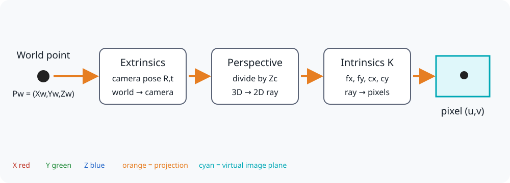
  <figcaption align="center">
  <span style="font-size:12px;">
  <b>The complete pipeline that this lesson will unpack.</b></span></figcaption>
</figure>

The three main operations are:

1. **Extrinsics** describe where the camera is and which direction it faces.
2. **Perspective projection** turns a 3D camera point into a 2D direction.
3. **Intrinsics** convert that direction into pixel coordinates.

In compact form:

$$
P_w \xrightarrow{R,t} P_c
\xrightarrow{\text{divide by }Z_c} (x,y)
\xrightarrow{K} (u,v)
$$

---

## 1. The physical pinhole camera

Imagine a closed box with a tiny hole in one side. Light travels in straight
lines. Only a narrow ray from each point can pass through the hole, so the rays
cross and form an upside-down image on the sensor behind it.

<figure markdown="span">
  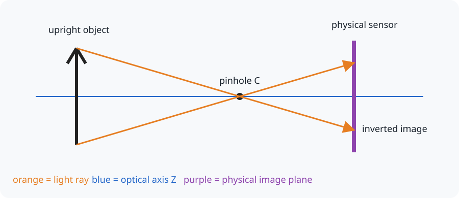
  <figcaption align="center">
  <span style="font-size:12px;">
  <b>Rays cross at the pinhole and create an inverted physical image.</b></span></figcaption>
</figure>

The pinhole is called the **camera center** or **optical center**, written as
$C$. The straight line pointing out of the camera is the **optical axis**.

Real cameras use lenses because a pinhole admits very little light. The
pinhole model is still useful because it approximates the geometry of an ideal
calibrated camera.

---

## 2. Why computer vision uses a virtual image plane

Working with an upside-down image behind the camera is inconvenient. We draw an
imaginary plane in front of the camera instead. It intersects the same ray and
produces an upright diagram.

<figure markdown="span">
  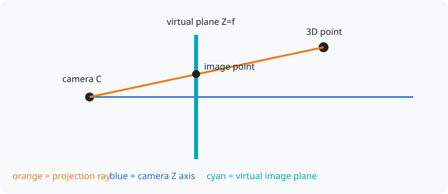
  <figcaption align="center">
  <span style="font-size:12px;">
  <b>The virtual plane changes the drawing, not the measured pixel.</b></span></figcaption>
</figure>

The plane is placed at $Z_c=f$, where $f$ is the focal length. This is a
mathematical tool; the physical sensor remains behind the lens.

!!! tip "Keep this mental model"
    A pixel is where a ray crosses the virtual image plane. Projection records
    the ray's direction, so it loses the point's distance from the camera.

---

## 3. Coordinate frames are different viewpoints

A coordinate frame is an origin plus three axes. The same point has different
numbers when described from different frames—just as directions from your desk
differ from directions from the classroom door.

This tutorial uses realistic conventions:

- **Robot/world frame**: $X_w$ forward, $Y_w$ left, $Z_w$ up.
- **OpenCV optical frame**: $X_c$ right, $Y_c$ down, $Z_c$ forward.
- **Image frame**: $u$ right and $v$ down, starting at the top-left pixel.

<figure markdown="span">
  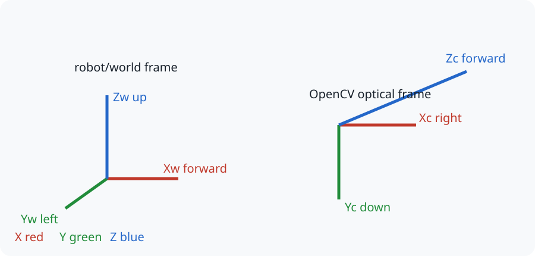
  <figcaption align="center">
  <span style="font-size:12px;">
  <b>Robotics and OpenCV commonly use different axis directions.</b></span></figcaption>
</figure>

The subscripts tell us which frame owns the coordinates: $P_w$ is a point in
the world frame and $P_c$ is the same point in the camera frame.

---

## 4. Extrinsics: move from world to camera coordinates

Extrinsic parameters describe the camera's **position** and **orientation** in
the world. They do not describe the lens.

### Example A: translation first

If the teaching frames temporarily point in the same directions, subtract the
camera position $C_w$ from the world point:

$$
P_c = P_w - C_w
$$

<figure markdown="span">
  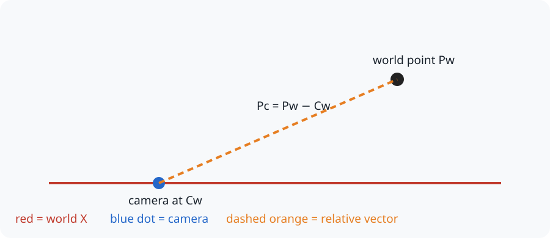
  <figcaption align="center">
  <span style="font-size:12px;">
  <b>Subtraction describes the point relative to the camera.</b></span></figcaption>
</figure>

For example, if $P_w=(5,2,4)$ and $C_w=(1,1,1)$, then:

$$
P_c=(5,2,4)-(1,1,1)=(4,1,3)
$$

### Example B: include camera orientation

A real robot camera may face a different direction from the world axes. After
subtracting its position, rotate the relative vector into the optical frame:

$$
P_c = R_{cw}(P_w-C_w)
$$

<figure markdown="span">
  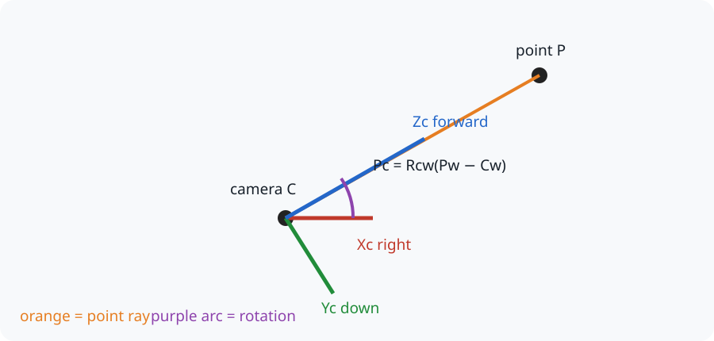
  <figcaption align="center">
  <span style="font-size:12px;">
  <b>Rotation changes the coordinates, not the physical point.</b></span></figcaption>
</figure>

$R_{cw}$ means “rotate coordinates from world to camera.” Be careful: many
systems store the opposite rotation $R_{wc}$. For a rotation matrix,
$R^{-1}=R^T$, so transposing reverses its direction.

The same transformation is often written as:

$$
P_c=R_{cw}P_w+t_{cw}, \qquad t_{cw}=-R_{cw}C_w
$$

!!! warning "Position and translation are not identical"
    $C_w$ is the camera position expressed in world coordinates. The extrinsic
    translation $t_{cw}$ is the world origin expressed in camera coordinates.
    In general, $t_{cw}\ne C_w$.

---

## 5. Perspective projection: depth makes things smaller

Suppose the camera-frame point is:

$$
P_c=(X_c,Y_c,Z_c)
$$

Similar triangles give the coordinates on the normalized image plane:

<details style="border: 2px solid #333; padding: 10px; border-radius: 6px;">
<summary>Similar triangles</summary>

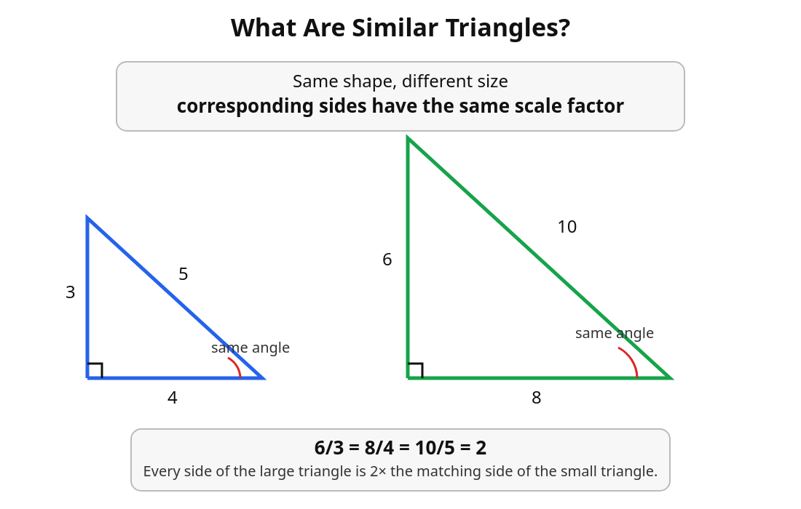
</details>


So similar triangles are the geometric reason behind normalized image coordinates

$$
x=\frac{X_c}{Z_c}, \qquad y=\frac{Y_c}{Z_c}
$$

<figure markdown="span">
  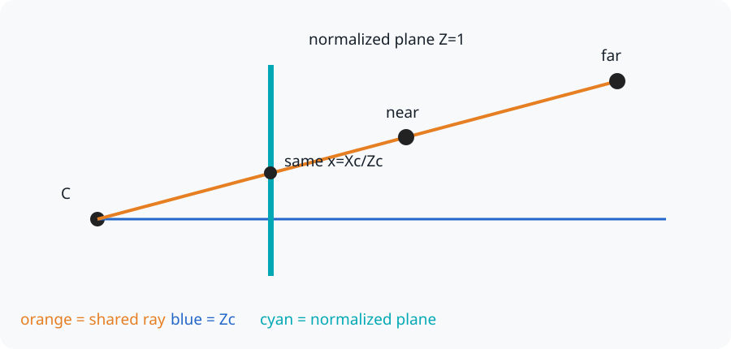
  <figcaption align="center">
  <span style="font-size:12px;">
  <b>Dividing by depth preserves direction and removes distance.</b></span></figcaption>
</figure>

For $P_c=(1,1,4)$:

$$
(x,y)=\left(\frac{1}{4},\frac{1}{4}\right)=(0.25,0.25)
$$

If every coordinate doubles to $(2,2,8)$, the normalized coordinates remain
$(0.25,0.25)$. Both points lie on the same viewing ray and therefore reach the
same pixel.

!!! warning "Points must be in front of the camera"
    In the OpenCV optical frame, a visible point must normally have $Z_c>0$.
    Projection becomes undefined at $Z_c=0$.


### Why far objects look smaller

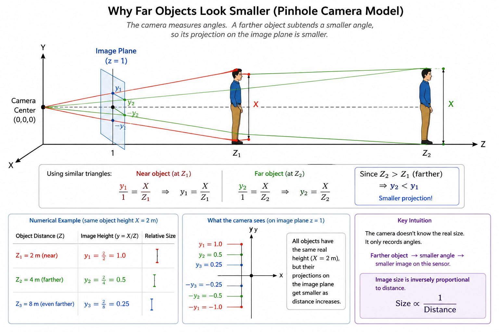


**The key idea**
- The camera measures angles, not physical size.
- A nearby object occupies a large angle, so it appears large.
- A distant object occupies a small angle, so it appears small.

---

## 6. Intrinsics: move from normalized coordinates to pixels

Normalized coordinates do not yet tell us a pixel location. The camera's
intrinsic parameters perform two operations:

- $f_x,f_y$ scale the coordinates using focal length measured in pixels;
- $c_x,c_y$ shift the origin to the principal point, normally near the image
  center.

$$
u=f_xx+c_x, \qquad v=f_yy+c_y
$$

<figure markdown="span">
  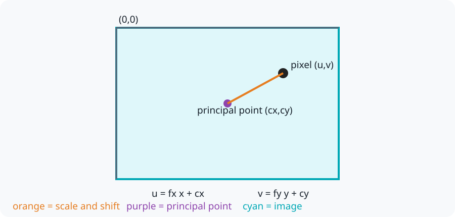
  <figcaption align="center">
  <span style="font-size:12px;">
  <b>Intrinsics scale a direction and shift it into the pixel grid.</b></span></figcaption>
</figure>

For a `640 x 480` camera, let:

$$
f_x=f_y=500, \qquad (c_x,c_y)=(320,240)
$$

Our normalized point $(0.25,0.25)$ becomes:

$$
u=500(0.25)+320=445
$$

$$
v=500(0.25)+240=365
$$

So the world point appears at pixel $(445,365)$.

The intrinsic matrix stores the same operation:

$$
K=\begin{bmatrix}
f_x&s&c_x\\
0&f_y&c_y\\
0&0&1
\end{bmatrix}
$$

The skew $s$ is normally zero for modern cameras.

---

## 7. Put the geometry into matrices

The ordinary equations explain the geometry. Matrices let software perform the
same operations consistently.

### Why add a fourth coordinate?

Rotation is easy to express with a $3\times3$ matrix, but translation is an
addition. **Homogeneous coordinates** add a final `1`, allowing one matrix to
represent both:

$$
\tilde P_w=\begin{bmatrix}X_w\\Y_w\\Z_w\\1\end{bmatrix}
$$

$$
T_{cw}=\begin{bmatrix}
 & & & t_x\\
 & R_{cw} & & t_y\\
 & & & t_z\\
0&0&0&1
\end{bmatrix}, \qquad
\tilde P_c=T_{cw}\tilde P_w
$$

The full ideal projection can be written compactly as:

$$
\lambda
\begin{bmatrix}u\\v\\1\end{bmatrix}
=
K
\begin{bmatrix}R_{cw}&t_{cw}\end{bmatrix}
\begin{bmatrix}X_w\\Y_w\\Z_w\\1\end{bmatrix}
$$

The unknown scale $\lambda$ is related to depth. After multiplication, divide
the first two homogeneous image values by the third to obtain $(u,v)$.

This ideal lesson intentionally leaves out lens distortion. Distortion acts
between normalized projection and pixel mapping and will be covered in a more
advanced post.

---

## 8. Reverse projection: pixel to a 3D ray

Start from a pixel in homogeneous form:

$$
\tilde p=\begin{bmatrix}u\\v\\1\end{bmatrix}
$$

Undo the intrinsics to recover a camera-frame direction:

$$
d_c=K^{-1}\tilde p
$$

This is a ray, not a complete 3D point:

$$
P_c(Z)=Z d_c
$$

<figure markdown="span">
  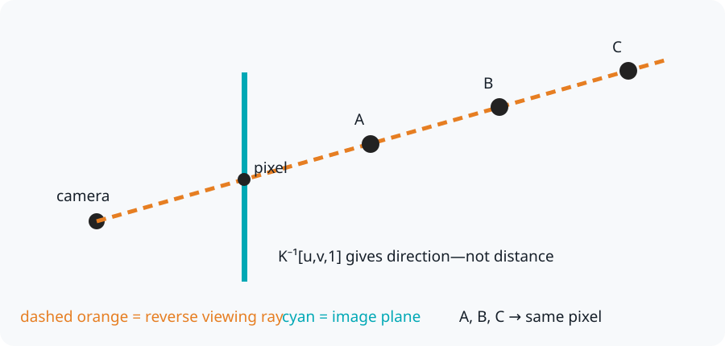
  <figcaption align="center">
  <span style="font-size:12px;">
  <b>Many 3D points along one ray produce exactly the same pixel.</b></span></figcaption>
</figure>

Once a depth $Z$ is known, transform the camera point back to the world:

$$
P_w=R_{cw}^{T}P_c+C_w
$$

Depth can come from stereo cameras, a depth camera, LiDAR, a rangefinder,
multiple views, a known plane, or a known object size. Without such information,
one image pixel cannot identify one unique 3D point.

---

## 9. Run the complete example

The manual NumPy example follows the complete forward pipeline and then
reverse-projects the pixel into a unit camera ray.

[Download `pinhole_projection.py`](code/pinhole_projection.py)

```python title="pinhole_projection.py"
--8<-- "docs/Robotics/sensors/camera/code/pinhole_projection.py"
```

Run it with:

```bash
python3 code/pinhole_projection.py
```

OpenCV can perform the projection using `cv2.projectPoints`:

[Download `opencv_projection.py`](code/opencv_projection.py)

```python title="opencv_projection.py"
--8<-- "docs/Robotics/sensors/camera/code/opencv_projection.py"
```

The two programs should report pixel `(445, 365)`.

---

## 10. Check your understanding

??? question "If an object's depth doubles, what happens to its pixel size?"
    Its pixel size becomes approximately half as large because projected size
    is proportional to $1/Z_c$.

??? question "Can one pixel identify a unique 3D point without depth?"
    No. It identifies a viewing ray. Every point along that ray projects to the
    same pixel.

??? question "What happens when the principal point cx increases?"
    Every projected horizontal pixel coordinate $u$ shifts to the right by the
    same amount. Changing $c_y$ similarly shifts pixels downward.

---

## Complete pipeline summary

```text
Forward:
Pw --extrinsics--> Pc --divide by Zc--> (x,y) --K--> pixel (u,v)

Reverse:
pixel (u,v) --K inverse--> camera ray --add depth--> Pc
             --inverse extrinsics--> Pw
```

The [distance-estimation demo](distance_estimation.md) is a practical example
of recovering depth by supplying the known physical width of an object.

<!-- post-content-skill: 1.0.0 -->
