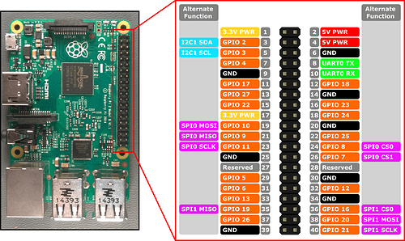
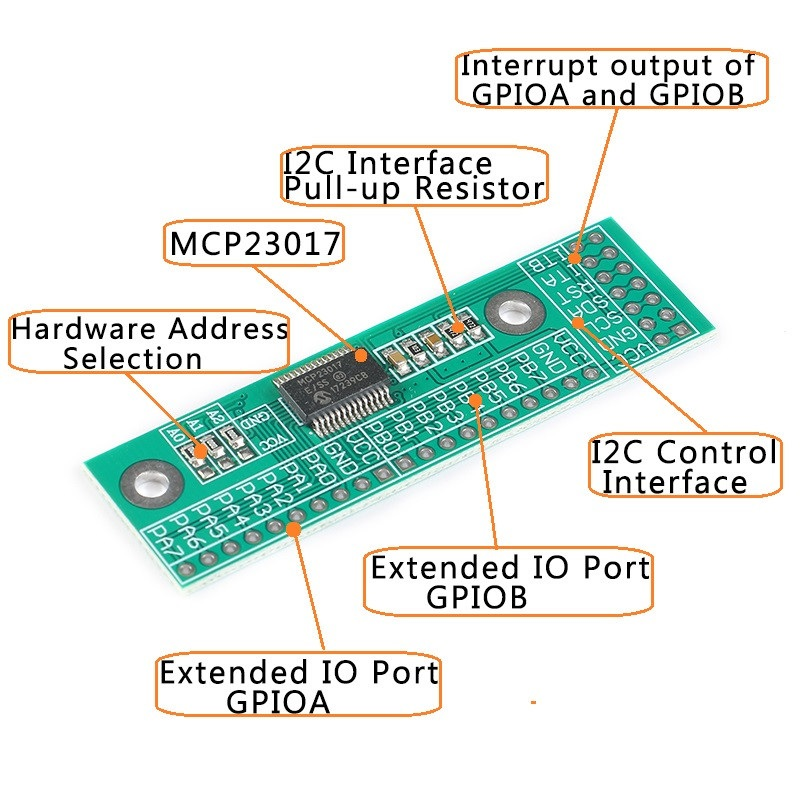
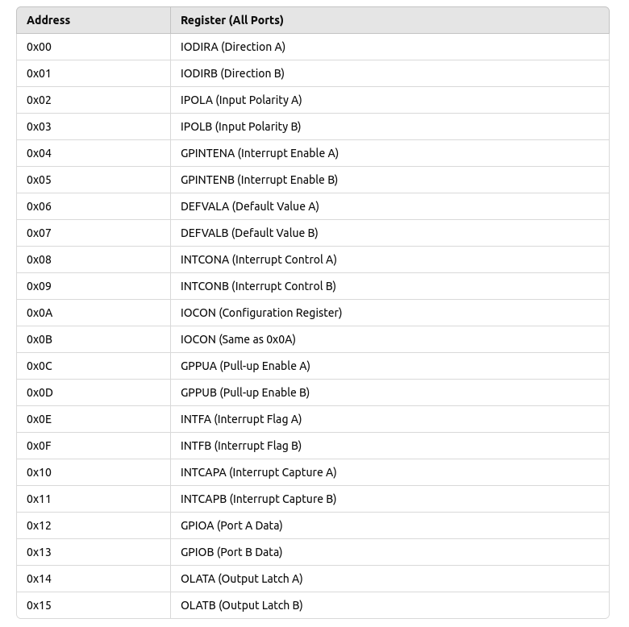
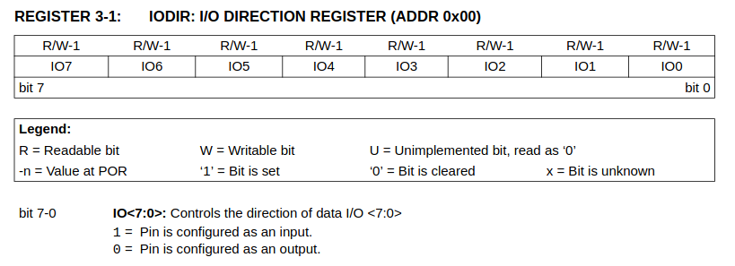
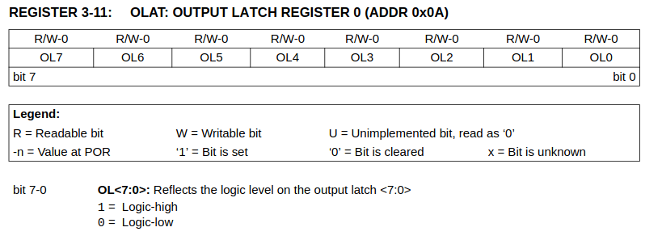

---
tags:
  - tag
---

# MCP23017 gpio i2c extension

## Connect to RPi

### Pinout




{width=400}

### Wiring

| MCP23017 | RPi |  note    |
| -------- | --- | ---- |
| VCC      |  1   | 3.3v |
| GND      |  6   |   |
| SDA      |  3   |      |
| SCL      |  5   |      |
| RESET    |  1   | 3.3v  |


### i2c

```bash title="install"
sudo apt install i2c-tools
```

#### detect
```bash
sudo i2cdetect -y 1
     0  1  2  3  4  5  6  7  8  9  a  b  c  d  e  f
00:                         -- -- -- -- -- -- -- -- 
10: -- -- -- -- -- -- -- -- -- -- -- -- -- -- -- -- 
20: 20 -- -- -- -- -- -- -- -- -- -- -- -- -- -- -- 
30: -- -- -- -- -- -- -- -- -- -- -- -- -- -- -- -- 
40: -- -- -- -- -- -- -- -- -- -- -- -- -- -- -- -- 
50: -- -- -- -- -- -- -- -- -- -- -- -- -- -- -- -- 
60: -- -- -- -- -- -- -- -- -- -- -- -- -- -- -- -- 

```

#### Demo
Connect LED to port PA0

```bash
# set all portA pin as output
sudo i2cset -y 1 0x20 0x00 0x00 

# set gister 0x0c
sudo i2cset -y 1 0x20 0x14 0x01
sudo i2cset -y 1 0x20 0x14 0x00
```

---

### Registers

The MCP23017 supports two register addressing modes:

    Bank 0 (Sequential Addressing - Default Mode)
    Bank 1 (Split Addressing Mode)




!!! note "demo"
    The demo above use register

    - register 0x00(IODIRA) as set portA all pin to output
    - register 0x14(OLATA) set as 0x00/0x01 to set port `PA0` low/high
     

---

### Datasheet

#### **3.5.1 I/O DIRECTION REGISTER**
Controls the direction of the data I/O.
When a bit is set, the corresponding pin becomes an
input. When a bit is clear, the corresponding pin
becomes an output.




#### **3.5.11 OUTPUT LATCH REGISTER (OLAT)**
The OLAT register provides access to the output
latches. A read from this register results in a read of the
OLAT and not the port itself. A write to this register
modifies the output latches that modifies the pins
configured as outputs.



!!! note "register address"
    The data sheet use bank1 address mode
    The address is **0x14** for **OLATA** register in bank0 mode
     
---

## Reference

- [Datasheet](https://ww1.microchip.com/downloads/en/devicedoc/20001952c.pdf)
