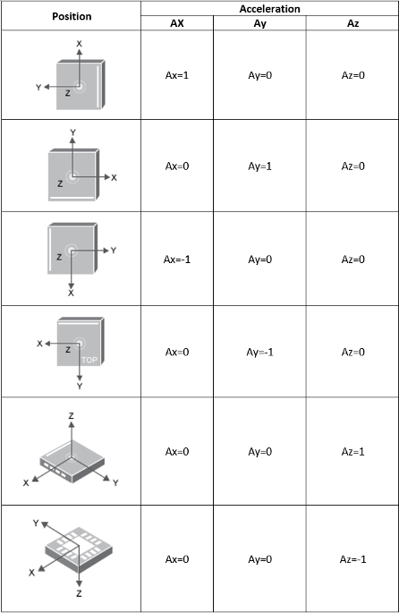
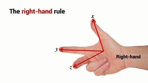

<!-- # IMU Sensor -->
An IMU sensor (Inertial Measurement Unit) is a device that measures a robot or object's motion and orientation using:

| Sensor                    | Measures                             | Unit  |
| ------------------------- | ------------------------------------ | ----- |
| Accelerometer             | Linear acceleration                  | m/s²  |
| Gyroscope                 | Angular velocity (rotational speed)  | rad/s |
| Magnetometer *(optional)* | Magnetic field for heading (compass) | µT    |

- **6 DOF** IMU, combining a 3-axis accelerometer and a 3-axis gyroscope.
- **9 DOF** IMU, adding a 3-axis magnetic compass.
- **10 DOF** IMU, which adds a barometer for estimating the sensor’s altitude.

| Rotation  | Meaning              | Greek symbol  | Axis |
| --------- | -------------------- | ------------- | ---- |
| **Roll**  | rotation about **X** | **$\phi$  (phi)**   | X    |
| **Pitch** | rotation about **Y** | **$\theta$  (theta)** | Y    |
| **Yaw**   | rotation about **Z** | **$\psi$  (psi)**   | Z    |

---

## Accelerometer
An accelerometer is a sensor that measures acceleration — how fast something speeds up, slows down, or changes direction — along one or more axes.
- It cannot distinguish gravity from acceleration during motion
- It cannot measure change in yaw (z axis) Yaw is rotation around the gravity axis, and an accelerometer **only measures gravity—so** yaw doesn’t change what it sees
- At rest the accelerometer measures gravity, not “zero”.
- Tilt it: gravity is **split across axes**
- tilt angles : pitch and roll

---

$$\phi = \text{atan2}(a_y, a_z)$$
$$\theta = \text{atan2}(-a_x, \sqrt{a_y^2 + a_z^2})$$

- $\phi$ → roll
- $\theta$ → pitch
- $\psi$ → yaw (not observable from accel)

---

## Gyroscope
Gyro read angular velocity (red/sec) meaning "how fast am i rotation **right now** around each axis", to get orientation we **integrate** over time

#### basic idea
$$\text{roll}(t) = \text{roll}(t-\Delta t) + \omega_x \cdot \Delta t$$

---

### Gyro drift

Gyro have **bias**

$$\omega_{measured} = \omega_{true} + b + noise$$

for example

- Bias = 0.05°/s
- After 60s → 3° error
- After 10 min → 30° error

---

## Orientation

| Sensor            | What it measures              | Orientation info you get               | Absolute reference | Main strengths                         | Main limitations                       | Typical role in fusion             |
| ----------------- | ----------------------------- | -------------------------------------- | ------------------ | -------------------------------------- | -------------------------------------- | ---------------------------------- |
| **Accelerometer** | Linear acceleration + gravity | **Roll & Pitch** (tilt)                | ✅ Yes (gravity)    | No drift, simple, stable when still    | Fails during motion, noisy, **no yaw** | Long-term tilt correction          |
| **Gyroscope**     | Angular velocity (°/s)        | **Roll, Pitch, Yaw** (via integration) | ❌ No               | Smooth, fast response, works in motion | Drift due to bias, needs integration   | Short-term orientation propagation |
| **Magnetometer**  | Earth magnetic field          | **Yaw (heading)**                      | ✅ Yes (north)      | Fixes yaw drift, global heading        | Disturbed by metal/electric fields     | Long-term yaw correction           |

---

## To read and watch
- 

- [complementary filter](https://www.luisllamas.es/en/measure-imu-tilt-arduino-complementary-filter/)
- [madgwick_py: A Python implementation of Madgwick's IMU and AHRS algorithm.](https://github.com/morgil/madgwick_py?tab=readme-ov-file)
- [madgwick algorithm](https://x-io.co.uk/open-source-imu-and-ahrs-algorithms/)
- [Kalman Filter for 6DOF IMU Implementation](https://www.youtube.com/watch?v=Os6V1lnUPZo)