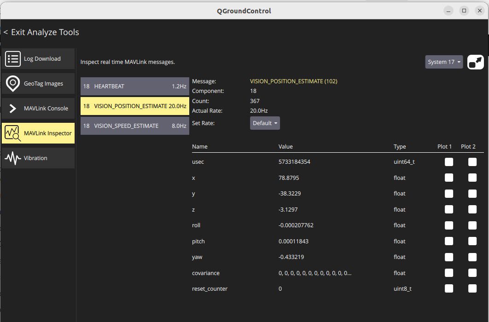
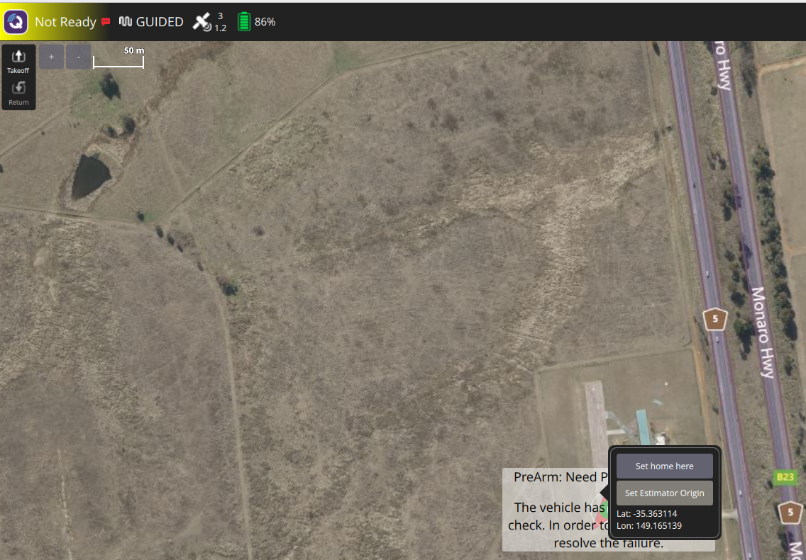
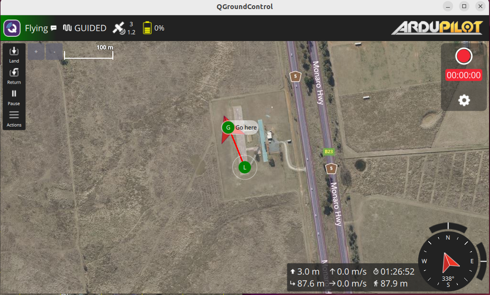

{{ page_folder_links() }}

Simulate using ardupilot SITL gps and none gps environment using vicon and switch between ekf sources
The simulate generate VISION_POSITION_ESTIMATE and VISION_VELOCITY_ESTIMATE

```bash title="run sitl with vicon simulation"
Tools/autotest/sim_vehicle.py -v ArduCopter --map --console -A "--serial5=sim:vicon:"
```


!!! tip "Ena/Dis sim GPS"
    SIM_GPS1_ENABLE
    0: Disabled
    1: Enabled
     

### Parameters
| name  | value  |
|---|---|
| VISO_TYPE  | 2 (intelT265) |
| SERIAL5_PROTOCOL2  | 2 (mavlink2)  |
| **EK3_SRC1** |
| EK3_SRC1_POSXY  | 3 (GPS)  |
| EK3_SRC1_POSZ  | baro  |
| EK3_SRC1_VELXY  | 3  |
| EK3_SRC1_VELZ  | 3  |
| EK3_SRC1_YAW  | 1 (Compass)  |
| **EK3_SRC2** |
| EK3_SRC2_POSXY  | 6 (ExternalNav)  |
| EK3_SRC2_POSZ  | baro  |
| EK3_SRC2_VELXY  | 6 (ExternalNav) |
| EK3_SRC2_VELZ  | 6  |
| EK3_SRC2_YAW   | 1 (Compass) |


!!! warning "switch sources"

    [MAV_CMD_SET_EKF_SOURCE_SET (42007)](https://mavlink.io/en/messages/ardupilotmega.html#MAV_CMD_SET_EKF_SOURCE_SET)

    ```
    ```
    
     




!!! tip "set param"

    ```bash
    # enabled
    param set SIM_GPS1_ENABLE 1
    # disabled
    param set SIM_GPS1_ENABLE 0
    ```
     





---

## EKF 

### Ardupilot
EKF_STATUS_REPORT (193) 

!!! warning "ESTIMATOR_STATUS (230)"
    Ardupilot not implement this message
     

#### Switch source
Mavlink command [MAV_CMD_SET_EKF_SOURCE_SET](https://mavlink.io/en/messages/ardupilotmega.html#MAV_CMD_SET_EKF_SOURCE_SET) from ardupilot dialect

```bash title="using mavros to switch"
# param1: 1-3
ros2 service call /mavros/cmd/command mavros_msgs/srv/CommandLong \
"{command: 42007, param1: 2}"
```