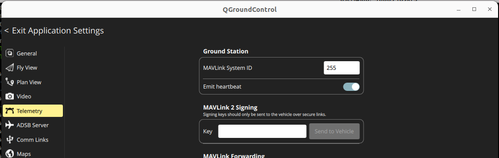

---
tags:
    - ardupilot
    - SYSID_MYGCS
    - SYSID_ENFORCE
    - SYSID_THISMAV
---

{{ page_folder_links() }}

| Parameter       | Role                                                          |
| --------------- | ------------------------------------------------------------- |
| `SYSID_MYGCS`   | Defines the expected GCS `SYSID` (default: `255`)             |
| `SYSID_ENFORCE` | If `1`, only MAVLink msgs from `SYSID_MYGCS` will be accepted |
| `SYSID_THISMAV` | The autopilot’s own system ID (default: `1`)                  |

!!! warning "SYSID_ENFORCE"
    If SYSID_ENFORCE=1 the SYSID_MYGCS and  Ground Station System ID must be the same to allow this station send command to FCU
     