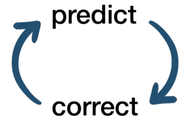

{{ page_folder_links() }}

 

        <a href="sitl">
                
                
SITL and Simulation
</a>
    

    

        <a href="ekf3">
                
                
EKF3

            </a>
    

    

        <a href="mavlink">
                
                
mavlink

            </a>
    

    

        <a href="debug">
                
debug

            </a>
    

    

        <a href="gcs">
                
SYSID/GCS config 
</a>
    

     

        <a href="optical_flow">
            
Optical flow 

        </a>
    

## ArduCopter Modes

| Mode  | Desc  | Notes  |
|---|---|---|
| LOITER  | Vehicle to hold its current **position** using a position source such as GPS or visual odometry.  | - Allows pilot to nudge position with the RC sticks; vehicle holds new position.  |
| GUIDED | autonomous mode where the vehicle accepts real-time movement commands from a mavlink messages like go to GPS coordinate , velocity or attitude commands |  |
| AUTO | AUTO mode is a fully autonomous flight mode where the vehicle executes a predefined mission composed of waypoints and commands  |   |
| STABILIZE | manual flight mode in which the pilot has direct control over the roll, pitch, and yaw of the vehicle, while ArduPilot automatically keeps the vehicle level and stable using data from the IMU  | - throttle: direct motor control (no stick to power ?)   |
| ALT_HOLD | automatically maintains altitude, while the pilot retains full control over pitch, roll, and yaw. | - control vertical speed  |
| GUIDED_NOGPS | Guided mode does not require a GPS but it only accepts attitude targets |  |