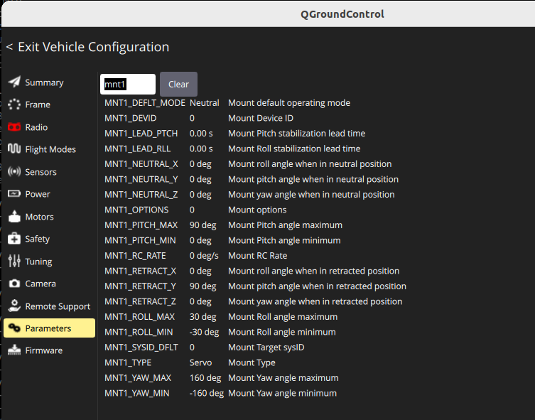

{{ page_folder_links() }}

## Gazebo

### topics

- /gimbal/cmd_roll
- /gimbal/cmd_pitch
- /gimbal/cmd_yaw

### pub example

```bash title="pitch/tilt 90 degree down"
gz topic -t /gimbal/cmd_pitch -m gz.msgs.Double -p 'data: 1.575'
```

```bash title="pitch/tilt horizon"
gz topic -t /gimbal/cmd_pitch -m gz.msgs.Double -p 'data: 0'

gz topic -t /gimbal/cmd_pitch -m gz.msgs.Double -p 'data: -0.2'
```

```bash title="yaw"
# flu position ccw
gz topic -t /gimbal/cmd_yaw -m gz.msgs.Double -p 'data: 1.0'
gz topic -t /gimbal/cmd_yaw -m gz.msgs.Double -p 'data: 0'
gz topic -t /gimbal/cmd_yaw -m gz.msgs.Double -p 'data: -1.0'
```

```bash title="roll"
gz topic -t /gimbal/cmd_roll -m gz.msgs.Double -p 'data: 1.0'
gz topic -t /gimbal/cmd_roll -m gz.msgs.Double -p 'data: 0'
gz topic -t /gimbal/cmd_roll -m gz.msgs.Double -p 'data: -1.0'
```

---

### Ardupilot plugin

Convert Ardupilot channel to gazebo command

```xml
<control channel="8">
    <jointName>gimbal::roll_joint</jointName>
    <multiplier>1.047197551196</multiplier>
    <offset>-0.5</offset>
    <servo_min>1100</servo_min>
    <servo_max>1900</servo_max>
    <type>COMMAND</type>
    <cmd_topic>/gimbal/cmd_roll</cmd_topic>
    <p_gain>2</p_gain>
</control>
```


raw_cmd = (pwn-pwn_min) / (pwm_max-pwm_min)
raw_cmd -> [0, 1]

cmd = multiplier \* (raw_cmd+offset)

#### roll

- multiplier = π ≈ 3.14159
- offset = -0.5

| cmd |     |
| --- | --- |
| -pi/2 | 0   |
| 0   | 0.5 |
| pi/2  | 1   |

#### pitch

- multiplier	≈ 1.7708
- offset	≈ -0.11296

| cmd |     |
| --- | --- |
| -0.2 | 0   |
| pi/2  | 1   |

#### yaw
- multiplier = π ≈ 3.14159
- offset = -0.5

| cmd |     |
| --- | --- |
| -pi/2 | 0   |
| 0   | 0.5 |
| pi/2  | 1   |


### Ardupilot

#### Ardupilot plugin channels
| GZ_CH (0) |   |   |
|---|---|---|
| 8  | ROLL  | servo_9  |
| 9  | PITCH  | servo_10  |
| 10  | YAW  | servo_11  |

#### Ardupilot param
|   |   |
|---|---|
| SERVO9_FUNCTION  | 8 (1-roll)  |
| SERVO10_FUNCTION  | 7 (1-pitch)  |
| SERVO11_FUNCTION  | 6 (1-yaw)  |





---

```bash
  ros2 service call /mavros/set_message_interval mavros_msgs/srv/MessageInterval "{\"message_id\": 285, \"message_rate\": 2 }"
  ```