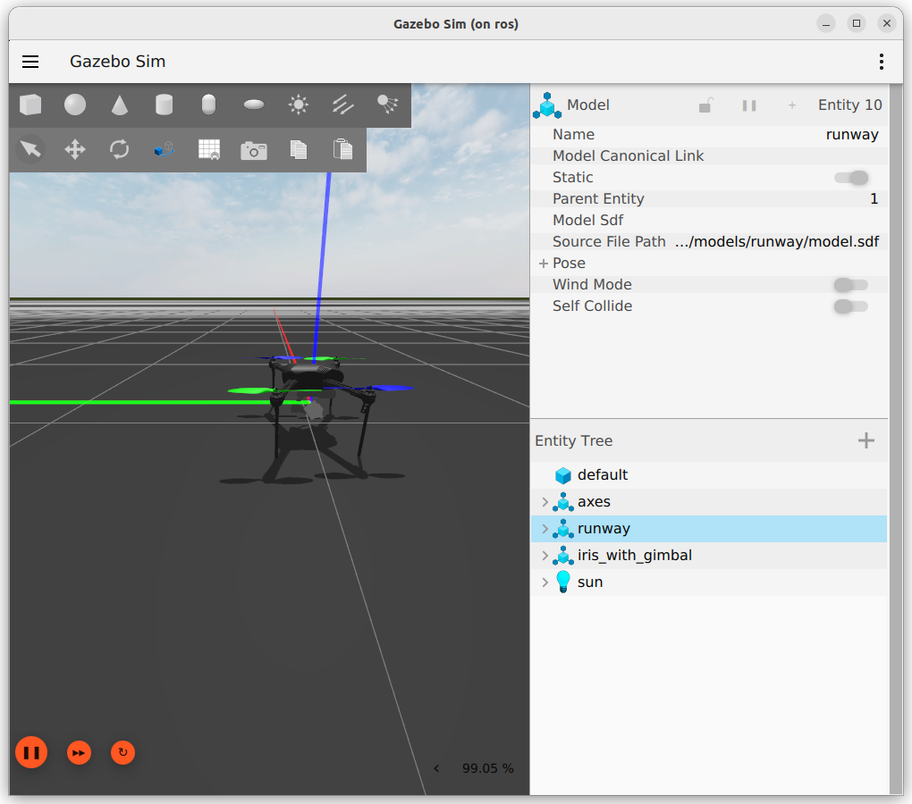

{{ page_folder_links() }}

Run Ardupilot SITL (ver 4.6.1) with mavros and gazebo simulation (harmonic)

## SITL
- [Ardupilot firmware download](https://firmware.ardupilot.org/)
- [Download Copter 4.6.1 SITL ](https://firmware.ardupilot.org/Copter/stable-4.6.1/SITL_x86_64_linux_gnu/arducopter)


## Run without gazebo 

```bash title="run sitl"
./arducopter --model copter --defaults copter.parm  -I0

```

```ini title="copter.param"
FRAME_CLASS 1
FRAME_TYPE 1

SIM_GPS_DISABLE 0
AHRS_EKF_TYPE 2
INS_ACCOFFS_X 0.001
INS_ACCOFFS_Y 0.001
INS_ACCOFFS_Z 0.001
INS_ACCSCAL_X 1.001
INS_ACCSCAL_Y 1.001
INS_ACCSCAL_Z 1.001
INS_ACC2OFFS_X 0.001
INS_ACC2OFFS_Y 0.001
INS_ACC2OFFS_Z 0.001
INS_ACC2SCAL_X 1.001
INS_ACC2SCAL_Y 1.001
INS_ACC2SCAL_Z 1.001
INS_GYR_CAL 0

RNGFND1_TYPE 100        # 100 = simulated
RNGFND1_ORIENT 25     # 25 = Downward (typical for landing)
RNGFND1_MIN_CM 20     # 20 cm minimum range
RNGFND1_MAX_CM 400    # 400 cm max range
SIM_SONAR_SCALE 100   # Scaling for simulated range data
RNGFND1_SCALING 1     # Optional: default scaling
```

!!! note "INS_XXX"
     Set INS_XXX for skip the accelerometer calibration 

---

## Mavros

```dockerfile title="mavros docker snippet"
# region install mavros
RUN apt-get update \
&& apt-get -y install --no-install-recommends \
    ros-jazzy-mavros \
    ros-jazzy-mavros-extras \
&& apt-get clean -y \
&& rm -rf /var/lib/apt/lists/*

RUN ros2 run mavros install_geographiclib_datasets.sh

# endregion install mavros
```

```bash
ros2 launch mavros apm.launch fcu_url:=tcp://:5760@

# forward
ros2 launch mavros apm.launch \
fcu_url:=tcp://localhost:5760 \
gcs_url:=udp://@localhost:14550
```

---

## Gazebo (harmonic)

Clone [ardupilot_gazebo](https://github.com/ArduPilot/ardupilot_gazebo) into workspace, 
- install dependencies 
- build with colcon
- source 
- and run 


```bash title="dependencies"
sudo apt update
sudo apt install libgz-sim8-dev rapidjson-dev
sudo apt install libopencv-dev libgstreamer1.0-dev libgstreamer-plugins-base1.0-dev gstreamer1.0-plugins-bad gstreamer1.0-libav gstreamer1.0-gl
```



!!! tip "simulation RTF"
    The simulation real time factor Usually fix after connect with mavros or other GCS to sitl
     

---

## Usage

```ini title="copter-gz.param"
FRAME_CLASS 1
FRAME_TYPE 1
```

```bash title="terminal 1"
./arducopter --model JSON  --defaults copter-gz.param -I0
```

```bash title="terminal 2"
gz sim -v4 -r iris_runway.sdf
```

```bash title="terminal 3"
ros2 launch mavros apm.launch fcu_url:=tcp://localhost:5760 gcs_url:=udp://@localhost:14550
```

### Guide ARM and takeoff

```bash title="set mode"
ros2 service call /mavros/set_mode mavros_msgs/srv/SetMode "{base_mode: 0, custom_mode: 'GUIDED'}"
```

```bash title="arm"
ros2 service call /mavros/cmd/arming mavros_msgs/srv/CommandBool "{value: True}"
```

```bash title="take off"
 ros2 service call /mavros/cmd/takeoff mavros_msgs/srv/CommandTOL "{
  min_pitch: 0.0,
  yaw: 0.0,
  latitude: 0.0,
  longitude: 0.0,
  altitude: 5.0
}"
```